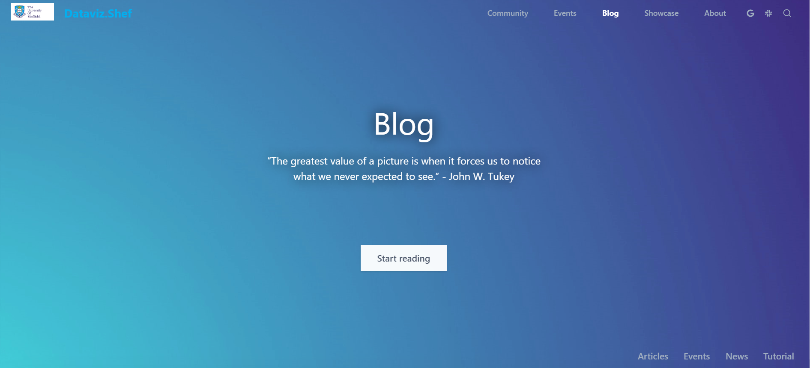

[](https://travis-ci.com/researchdata-sheffield/dataviz-hub2)

<center>
<h1 style="color: #00aeef"> Dataviz.Shef </h1>
<h5 style="font-weight: 500">Data visualisation community website for The University of Sheffield, exists to provide tools, training and build a community around interactive data visualisation at TUoS.</h5>
</center>
<!-- <div style="display: flex; flex-wrap: wrap; justify-content: center; align-items: center;">
  <a href="https://shef-dataviz.slack.com" target="_blank" rel="noopener noreferrer">
    
  </a>
  <a href="https://groups.google.com/a/sheffield.ac.uk/forum/?hl=en#!forum/shef_dataviz-group" target="_blank" rel="noopener noreferrer">
    
  </a>
  <a href="mailto:rdm@sheffield.ac.uk" target="_blank" rel="noopener noreferrer">
    
  </a>
</div> -->
<br />



<br />

We are constantly looking for new ideas and suggestions for events, workshops or tutorials. Feel free to get in touch with us through the [google group](https://groups.google.com/a/sheffield.ac.uk/forum/?hl=en#!forum/shef_dataviz-group), [slack team](https://shef-dataviz.slack.com) or [email](mailto:rdm@sheffield.ac.uk) with any suggestions. We encourage you to contribute to our online resources directly through **this repository** including blogposts and turtorials!


<br />

## Table of Contents

 - <a href="#contribute-blog-post">Contribute blog post</a>
 - <a href="#contribute-to-the-website">Contribute to developments of the website</a>
 - <a href="#code-of-conduct">Code of conduct</a>

## Contribute blog post
To contribute, please visit the [guide](https://dataviz.shef.ac.uk/blog/22/03/2020/contribute_blog_post) for more information, if you have any questions raise an [issue](https://github.com/researchdata-sheffield/dataviz-hub2/issues) under this repository.


## Contribute to the website
This website is built from <a href="https://www.gatsbyjs.org/">Gatsby</a> framework.

### Installation
  1. For Windows users, Download and install the latest Node.js version from <a href="https://nodejs.org/en/">the official Node.js website</a>. 
  For other OS visit <a href="https://www.gatsbyjs.org/tutorial/part-zero/#install-nodejs-for-your-appropriate-operating-system">here</a>. (You might also need to download Visual Studio installer to install node.js development tools).
  
  2. Install <a href="https://gitforwindows.org/">Git</a>. 
  
  3. Install Gatsby CLI by running  `npm install -g gatsby-cli`

  4. Fork this repository and open up your Git Bash (and navigate to a directory you want to place the site) and run:
    
    ```
    git clone https://github.com/yourusername/dataviz-hub2.git
    cd dataviz-hub2
    npm install                                                 //install dependencies
    cd plugins/gatsby-source-eventbrite-multi-accounts
    npm install                                                 //install plugin dependencies
    ```

  5. (optional) Create a new local branch with commands **git checkout development** (make sure you're in development branch), **git branch newBranchName** (create a new branch from development), and **git checkout newBranchName** (switch to new branch).
    Now make any commits you wish to.

#### Note
  At step 4, If you have write permission for the origin repository, then you could just create a new branch in the origin repository and clone it. 
  If you have <b>Github Desktop</b> installed then just clone the repository into your computer and under the repository you would need to use Git Bash to run **npm install** etc.


```
If you have cloned the repository a while a ago, 
fetch the latest commits from origin repository:

git checkout development
git pull upstream development
```

### Useful resources

EventBrite API 
+ https://www.eventbriteapi.com/v3/users/me/?token=YOURTOKEN
+ https://www.eventbriteapi.com/v3/organizations/OrgId/venues/?token=YOURTOKEN

[Gatsby plugins](https://www.gatsbyjs.org/plugins/)

[TailwindCSS](https://tailwindcss.com/docs/preflight)

[React-Icons](https://react-icons.netlify.com/#/)

[Unplash](https://unsplash.com/)

### IDE/Code Editor
Visual Studio Code was used for development.
A list of extensions installed:
  - Bracket Pair Colorizer
  - ES7 React/Redux/GraphQL/React-Native snippets
  - ESLint
  - HTML Snippets
  - MDX
  - Prettier - Code formatter
  - Tailwind CSS IntelliSense
  - vscode-icons
  - HTML CSS support
  - npm Intellisense
  - Babel JavaScript
  - Color Highlight
  - Color Info
  - Color Pick
  - CSS Peek

## Code of Conduct
We has adopted a Code of Conduct that we expect participants to adhere to. Please read the [full text](./CODE_OF_CONDUCT.md) so that you can understand what actions will and will not be tolerated.