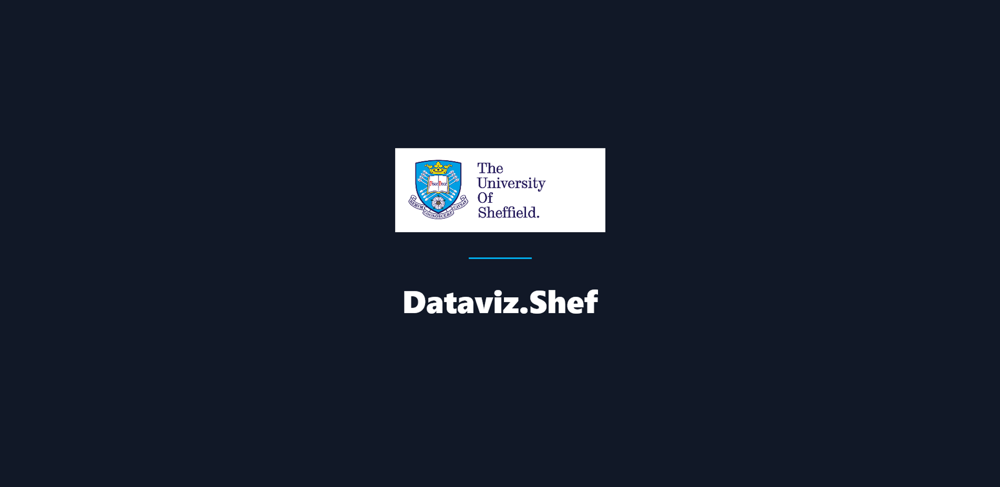

<h1 align="center">Dataviz.Shef</h1>

  <i>Data visualisation community website for The University of Sheffield, exists to provide tools, training and build a community around interactive data visualisation at TUoS.</i>
     
  
  

    
    &nbsp; &nbsp;
    
      &nbsp; &nbsp;
    
  

 

  <a href="https://dataviz.shef.ac.uk"><strong>dataviz.shef.ac.uk</strong></a>

  <a href="CONTRIBUTING.md">Contributing</a>
  ·
  <a href="https://github.com/researchdata-sheffield/dataviz-hub2/issues">Submit an Issue</a>
  ·
  <a href="https://dataviz.shef.ac.uk/blog">Blog</a>
   
   

  &nbsp;
  &nbsp;
  &nbsp;
  &nbsp;
  &nbsp;
  

  <a href="https://dataviz.shef.ac.uk/#learning-path">Learning path</a>
  ·
  <a href="https://dataviz.shef.ac.uk/events">Events</a>
  ·
  <a href="https://dataviz.shef.ac.uk/rss.xml">RSS feed</a>
   

We are constantly looking for new ideas and suggestions for events, workshops or tutorials. Feel free to get in touch with us through the [google group][datavizgoogle], [slack team][datavizslack] or [email][datavizemail] with any suggestions. We encourage you to contribute to our online resources directly through **this repository** including blogposts and tutorials!

 

## Contributing

### Contributing guidelines

Read through our [contributing guidelines][contributing] to find out different ways you can contribute to the website.

## Code of Conduct

We has adopted a Code of Conduct that we expect participants to adhere to. Please read the [full text][codeofconduct] so that you can understand what actions will and will not be tolerated.

## Community

Join the conversation and have fun in the community.

- [Slack][datavizslack]
- [Google Group][datavizgoogle]

[contributing]: CONTRIBUTING.md
[codeofconduct]: CODE-OF-CONDUCT.md
[changelog]: https://dataviz.shef.ac.uk/docs/
[datavizslack]: https://shef-dataviz.slack.com
[datavizgoogle]: https://groups.google.com/a/sheffield.ac.uk/forum/?hl=en#!forum/shef_dataviz-group
[datavizemail]: mailto:rdm@sheffield.ac.uk
