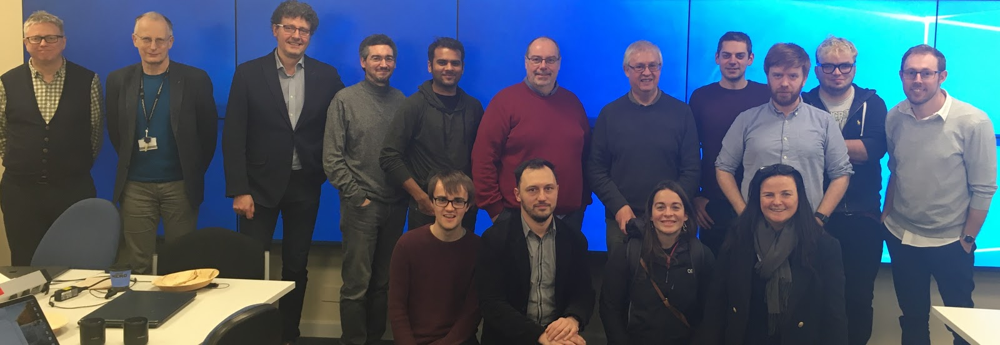
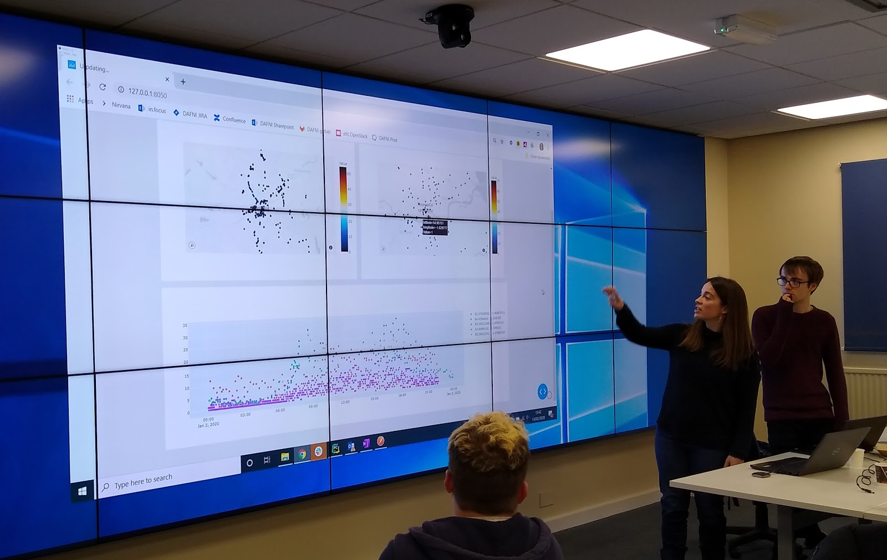
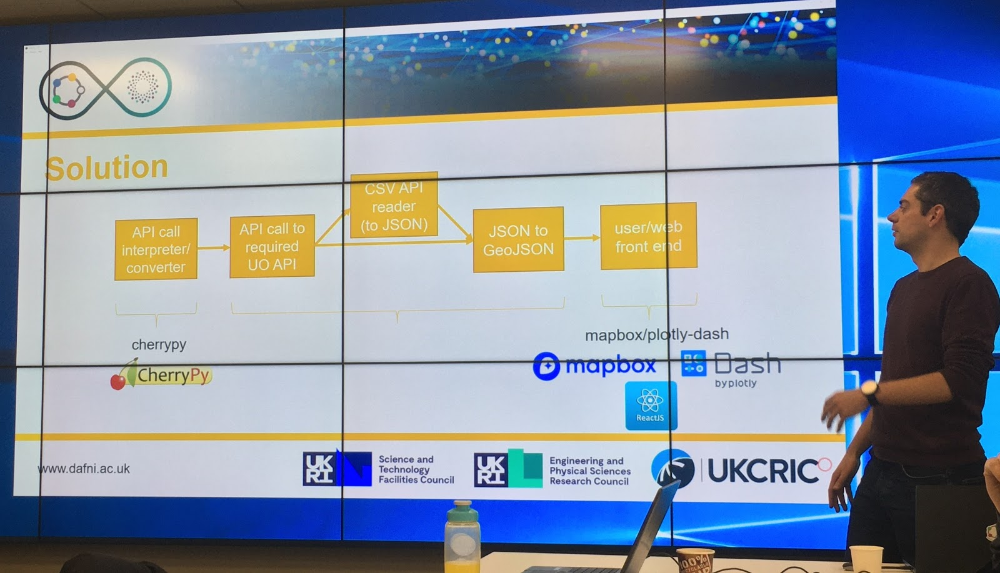

 
*This post was originally posted on <a href="https://sites.google.com/a/sheffield.ac.uk/rcg/my-blog/urbanobservatorieshackathon">Research & Innovation blog</a>.*

---

In February, The University of Sheffield hosted a three-day hackathon, an intensive collaborative software development event organised by the <a href="https://www.dafni.ac.uk/">Data & Analytics Facility for National Infrastructure</a> (DAFNI). 
The event aimed to begin tackling the complex challenges involved in coordinating analytics using data from urban observatories across the UK. DAFNI provides an analytics platform to enable innovative data analysis solutions 
for infrastructure research.

An urban observatory is a network of sensors capturing atmospheric and energy flow data from across a city. Several <a href="https://urbanobservatory.ac.uk/">such projects</a> are being set up nationally aiming to offer the largest set of 
publicly available real-time urban data in the country by UKRIC (UK Collaboratorium for Research on Infrastructure and Cities).

The Research & Innovation team supports the Sheffield observatory being run by the <a href="https://urbanflows.ac.uk/">Urban Flows</a> project by providing data engineering work. IT Services provide infrastructure and security support.

Many of those present from The University of Sheffield, The University of Newcastle, DAFNI and elsewhere are shown below.

The code produced during the three days is available at this public <a href="https://github.com/dafnifacility/sheffield-urban-observatory-hackathon">Git repository</a> and is separated into three folders, one for each theme addressed by the hackathon. Each theme was addressed 
by a separate team comprising participants from all attending institutions.

One of the teams addressed the problem of visualising data from two cities, Newcastle and Sheffield, by comparing traffic data taken from each observatory. This was approached using two 
different technologies: javascript and Python.

The screenshot shows the two city maps, with Newcastle on the left and Sheffield on the right. The position of each road congestion sensor is indicated by a car icon. A web form below the maps 
is used to select the date range. When the user selects a location on each map, the line graph updates to display the requested traffic flow value as it varies over time.

The team built a tool to retrieve data from two different APIs using a unified interface. The sensor readings were then converted to GeoJSON, an open format for representing geographic data based 
on JavaScript Object Notation (JSON.) This provided the front-end discussed above with a usable data feed.

Another team focussed on integrated data from the different platforms in each city. It developed data pipelines using Python to extract and transform data from the Newcastle and Sheffield observatories, respectively. 
These data were then loaded into a PostgreSQL database that ran in a Docker container hosted on a cloud container service provider. The database used a Postgres foreign data wrapper called <a href="https://github.com/citusdata/cstore_fdw">cstore</a> 
to store the data in columnar form to facilitate faster analytics queries.

A system was developed that allowed the end-user to use a simple web-based form to select the data they are interested in, run a query against this database and spawn a small container 
running another PostgreSQL database containing only the data they selected. The container technology allows this analytics workload to be scaled, transported or replicated easily. 
A web-based microservice was developed in Python using the Flask web framework to facilitate data retrieval from the master database and spinning up the new containers.

The teams discussed the complex problems of describing the data (meta-data such as units, type of measurement, geolocation, etc.) to make the data searchable and usable and providing data lineage so that 
research users of the platform are able to access transparent documentation of how data were gathered and processed to make them ready for use. Various file formats and metadata standards were compared, 
such as <a href="https://www.w3.org/TR/vocab-ssn/">Semantic Sensor Network Ontology</a>, <a href="https://www.w3.org/TR/vocab-dcat-2/">Data Catalog Vocabulary</a>, <a href="https://schema.org/Dataset">schema.org dataset</a> 
and <a href="https://json-ld.org/">JSON for Linked Data</a>.

The third team worked on the problems of quality assurance of sensor data, including detecting faulty sensors, anomalous values and erroneous data such as measurement drift. They started work on 
algorithms to compare recent data to long-term trends from nearby sensors to identify surprising measurements.