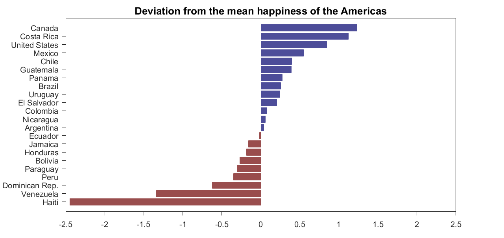
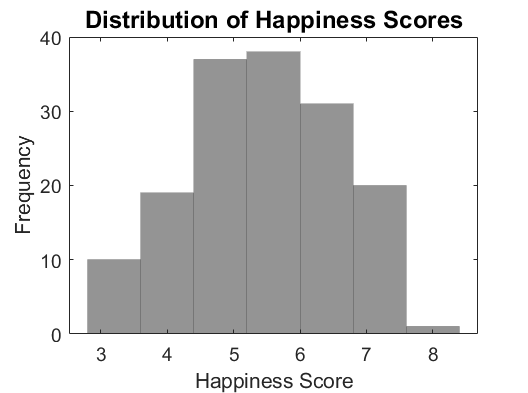

  
 When we visualise data, we present it in a form that is more engaging and easier to digest than plain numbers.
  Charts are the most common form of data visualisation and there are many different types to choose from.
  The charts that are most common are bar charts, scatterplots, horizontal bar charts, pie charts, histograms and line graphs.
 
 
  

  </img>

  
 The most effective use of these charts are those that are <strong>clear, simple</strong> and <strong>intentional.</strong> 

  <ul>
    <li><strong>Clear:</strong> Charts are used to inform. If the chart is overly complicated or unfamiliar to the target audience then it is not fit for purpose. </li>
    <li><strong>Simple:</strong> Good chart design lets the data speak for itself. The inclusion of unnecessary flair like 3D columns, shaded or outlined bars can all detract from you are trying to convey with the chart. </li>
    <li><strong>Intentional:</strong> You should know what story you are trying to tell with your data and what you want your reader to take from it before embarking on the visualisation.  </li>
  </ul>

 Good chart design should accentuate the data itself and the story you are trying to tell, unnecessary clutter, or overly complicated charts can often detract from the intended message. 

  <h1 className="mart">Choosing Your Chart</h1>
  
 Your choice of chart will be constrained the <strong>type of data</strong> you are working with,
  <a href="https://www.data-to-viz.com/"> this excellent decision tree</a>,
  created by 'from data to viz', lets you take a look at some of the most common data visualisations and their suitability for different data types.
  

  
 Knowing your data type and the number of varibales that you are visualising can help you to chose the most effective chart. Data can fall into the following categories: 

   
  </img>

    
 In addition to the type of data, your choice of chart will also influenced by the <strong>story you are telling</strong> with your data. Often, such stories fall into the following four categories: 

    <ul>
      <li><strong>Comparison: </strong> These stories allow the reader to visually compare two or more points of data.  </li>
      <li><strong>Deviation:</strong> These charts provide a visual representation of the variation of the data about a standard reference point. </li>
      <li><strong>Distribution:</strong> These provide a visual summary of the frequency which values occur within a variable or dataset. </li>
      <li><strong>Relationship:</strong> These stories focus on visualising the relationship or correlation between two or more variables. </li>
    </ul>

    
 You may want to tell more than one story with a single dataset. To demonstrate each of the four stories in action we can use the data collected for
    <a href="https://worldhappiness.report/ed/2019/"> the World Happiness Report 2019</a>. 

    
 If we wanted to <strong>compare</strong> the average happiness of continents, we might use a bar chart.
    A horizontal bar chart is a good choice for this, the orientation allows you to label each element on the y axis efficiently, without rotation.
    For maximum clarity, bars are ordered prior to plotting. 

     
    </img>
     
    
 We could also look at the <strong>deviation</strong> of each country in the Americas from the continent-wide average.
    A diverging bar chart is a good choice for this.
    In this instance the use of colour can accentuate positive and negative values.

     
    </img>
     
    
 If we wanted to look at the <strong>relationship</strong> between two variables which contribute to the happiness of a country we could use a scatter plot.
    The examples below plot each country’s Gross Domestic Product (GDP) per capita against the healthy life expectancy and the level of social support against the freedom to make life choices. 

     
    </img>
    
 Finally, if we wanted to look at the distribution of global happiness we could use a histogram, histograms are one of the most common ways to represent the shape of a variable. 

     
    </img>

