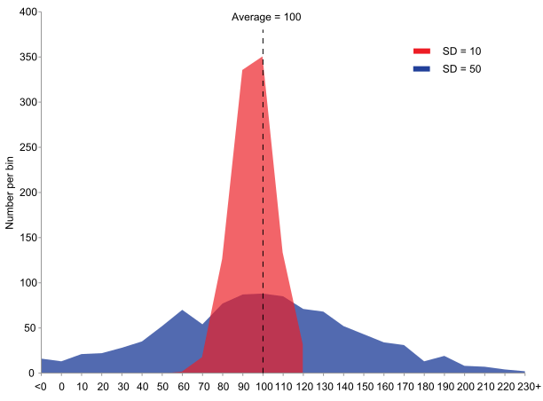

import { Link } from "gatsby"

# Descriptive statistics
Statistics is the science of the collection, analysis, interpretation and presentation of data. Statistics can be applied to various areas such as education, biology, engineering, 
chemistry, psychology, sports etc. Statistics is mainly divided into <b>descriptive statistics</b> and <b>inferential statistics</b> (statistical inference).  
  
Given a set of data, the usage of descriptive statistics is to summarise and describe the data. For example, Use specific numbers or charts to reflect the concentration and dispersion of data. 
The average score, the highest score, the distribution of the number of people in each segment, etc., also belong to the scope of descriptive statistics.
On the other hand, the usage of the observer establishes a mathematical model to explain randomness and uncertainty of data and uses it to infer the steps in the research is called inferential statistics. 
For example, infer the overall data characteristics based on the sample data. Product quality inspection is generally conducted by random inspection, and the overall quality qualification rate is estimated based on the quality qualification rate of the sample.  

Since **descriptive statistics** is one of the ingredients in exploring a dataset (data exploratory analysis), this article covers commonly used tools when analysing and summarising data. 
If you are looking for specific charts or want to choose an appropriate chart for your findings, check out this <Link to="/blog/06/04/2020/chart-choice">article</Link>.  

 

# Measures of Central Tendency

The central tendency describes the concentration situation of collected data (and its subgroup) and is also a value describing the central position of a group.
There are many types of concentration, including arithmetic average (mean), median, mode, weighted average, geometric average, harmonic average. However, 
the central tendency is mostly represented by mean, median and mode.  

### Mean  
**Mean** is the arithmetic average of a dataset; the calculation is simple and suitable for further calculation and is less affected by sampling changes. 
At the same time, there are certain disadvantages that limit its use. The arithmetic mean is susceptible to extreme data where every change in the data will affect the final result.
If the data appears blurred, an average cannot be calculated.  
> Application principles for **mean**:   
  1. Homogeneous data  
  2. Consider the combination of average and individual values  
  3. The average is considered by combining variance and standard deviation  
  
### Median
After sorting a group of numbers, **median** is the number in the middle (the number of numbers is odd); or the average of the middle two numbers (the number of numbers is even).
This number may be one of the data, or it may not be the original number at all. Similar to mean, median is simple to calculate and easy to understand and is less affected by extreme values. 
However, median is often not sensitive enough and is greatly affected by sampling. In most cases, algebraic operations no longer use median.
> Application principles for **median**:   
1. When you need to quickly estimate the concentration value  
2. When there is extreme data  
3. When there is ambiguous data

### Mode
The most frequent value in a set of data is called the **mode**. Mode is unstable, affected by grouping and sample changes. Same as median, mode is not sensitive and do not participate in further algebraic operations.
> Application principles for **mode**:   
1. When you need to quickly estimate a set of data values  
2. When the data is not homogeneous  
3. When the extremes have extreme values  
4. A quick estimation of the distribution shape
  
 

# Measures of Variation

The measure of variation is also known as the tendency of dispersion. It is one of the basic concepts of statistics. 
It is the quantity that represents the trend of the sample data deviating from the intermediate value, or it reflects the degree of dispersion of the sample frequency distribution.
Common tools of variation are **mean absolute deviation**, **variance**, **standard deviation**, **range**, and **interquartile range**.

  
*Comparison of standard deviations (source: Wikipedia commons)*

A large number of differences indicates that the distribution of various values is wide and uneven; a small number of differences indicates that the values are relatively 
concentrated and the range of fluctuations is small. Therefore, the representativeness of the central tendency can be reflected by the dispersion tendency. 
The larger the dispersion tendency, the smaller the representativeness of the central tendency; vice versa.

### Mean absolute deviation
Mean absolute deviation of a set **${x_{1}, x_{2}, ..., x_{n}}$** contains $n$ samples is given as:  
$$
\frac{1}{n} \sum_{i=1}^{n} \left|x_{i} - m(X) \right|
$$
where $m(X)$ is the choice of measure of central tendency of the dataset, in this case, the mean of the dataset. 
It is the average of the arithmetic average and the distance of each data point and can directly reflect the degree of difference of data. 
However, due to the use of absolute values, it is difficult to carry out algebraic operations and conduct theoretical analysis, so it is rarely used.

### Variance
Variance is obtained by changing the distance in **mean absolute deviation** to the square of the distance, use the same dataset above:  
$$
\sigma^2 = \frac{\sum_{i=1}^{n}(x_i - \bar{X})^2}{n}
$$
Variance can effectively use information from data and can reflect the degree of difference. Although it is not as direct as the mean absolute deviation in 
reflecting the difference, it is more verstile than the absolute value which is typically avoided within algebraic operations, therefore variance is more widely used. 

### Standard deviation
The standard deviation is defined as the **square root of the variance**, reflecting the degree of dispersion between individuals within the group. 
It effectively avoids the measurement problem caused by the unit square.
$$
\sigma = \sqrt{\frac{\sum_{i=1}^{n}(x_i - \bar{X})^2}{n}}
$$

### Range
It is the difference between the maximum value and the minimum value, that is, the value $R$ obtained after the maximum value minus the minimum value. 
It applies to isometric variables, ratio variables, not to nominal variables or order variables.

### Interquartile range
The interquartile range (IQR) is defined as $IQR = Q_{3} - Q_{1}$, where $Q_{3}$ and $Q_{1}$ is 75th and 25th percentiles respectively.
The interquartile range is usually used to construct box plots and a brief graphical overview of the probability distribution. IQR only uses part of the information of the data. 
Generally, it is used when the data information is incomplete and the mean difference and variance and their improvement cannot be used.  
  

# Next
To understand more about your dataset and how to choose a chart for your findings, see this <Link to="/blog/06/04/2020/chart-choice">article</Link>.