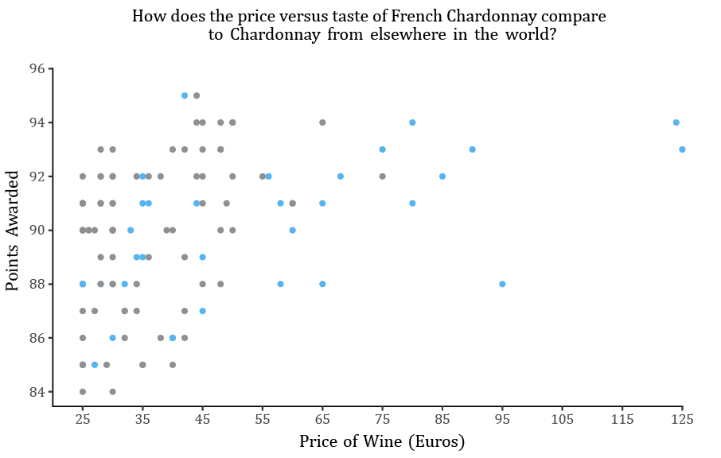

  
 Colour can be a valuable tool when creating engaging and informative visualisations of your data.
  However, if used ineffectively, it could detract from the message you are trying to present to the reader.
  When considering colour for your visualisation, you might ask yourself.
  

  <ol>
  <li> What purpose does the colour serve? </li>
  <li> Does the inclusion of colour improve the delivery of the overall message of the visualisation? </li>
</ol>

  <h1 className="mart">Using colour to accentuate and differentiate</h1>
  
 A pop of colour can draw the eye of the reader to specific data points, however, be sure that this the primary message of your visualisation as the coloured points will take centre stage.
  For example, let's say I have a <a href="https://www.kaggle.com/zynicide/wine-reviews/"> dataset </a>
  containing the price of Chardonnay from around the world, with an associated score for the taste.
  Using this data I could create an informative scatterplot showing the relationship between price and taste.
  However, in the figure below I have added colour to the data points representing wines from France, as such, additional emphasis is placed on the origin of particular wines, which changes the overall message.
  

   
  </img>

 
  
 Colour can also be used effectively to distinguish different groups or categories when plotting.
  The chart below looks at the average Kickstarter campaign goal between 2009 and 2017; here, colour is used to differentiate between different categories of Kickstarter campaigns.
  Colours should be easy to distinguish from one another to maximise the effect, however, do ensure that they are not garish or uncomfortable to the eye.
  Just to note, when using colour to distinguish between two groups, you may wish to ensure that each has a similar visual attraction; for example, when combining red and grey, the eye will likely be drawn to the red, which may imply that those values are of higher importance to the message.
  

 
  </img>
 
  
 As addressed by <a href="https://serialmentor.com/dataviz/color-pitfalls.html#encoding-too-much-or-irrelevant-information/"> Claus O. Wilke</a>, when using colour to distinguish categories, it is important that you don’t give colour too great of a task.
  If the number of categories becomes too large, it can overwhelm the possibility of perceptually different colours, meaning the reader cannot effectively and reliably distinguish differences in categories.
  

  <h1 className="mart">Colour palettes</h1>
  
 When working with colour palettes is important to choose ones that are fit for purpose.
  Typically, categorical data favours a palette of colours that are independent of one another whereas scale data is generally represented by continuous or diverging scales.
  

 
  

    
  

  
 Effective colour palettes can be challenging to create, thankfully, tools like
  <a href="https://colorbrewer2.org/"> ColorBrewer</a>,
  <a href="http://vrl.cs.brown.edu/color"> Colorgorical </a> and
  <a href="https://projects.susielu.com/viz-palette"> Viz Palette </a>
 are available to help create and optimise colour palettes for data visualisation.
 

 <strong> Colour Vision Deficiency </strong>

 When using colour, it is important to take into account that some readers may have Colour Vision Deficiency (CVD).
By including a perceptible change in contrast, you can maximise the clarity of your palette for those with CVD.
Alternatively, Viz Palette offers the opportunity to easily check the clarity of your colour scheme for those with CVD, and tools like ColorBrewer allow you to choose only palettes whose changes in colour will be perceptible to those with CVD.

 <strong> Colour Expectations </strong>

 Often, readers will have an expectation of certain colours. To list some of the most common examples; blue for water and green for land,
red for warm anomalies and blue for cold anomalies, each of the colours of prominent political parties.
When you invert these expectations, it removes the simplicity of the graph.
For example, the figure below shows global temperature anomalies, the non-standard continuous colour scale - where the warmest anomalies are represented by a pale yellow, and the coolest anomalies by dark green, makes the interpretation of the graph far more challenging than necessary.
 
 
</img>
 

 <strong> Consistency </strong>

 One final note, when creating multiple figures, you could consider a colour scheme for your document.
Particularly if you plan to use the same categories in different contexts.

