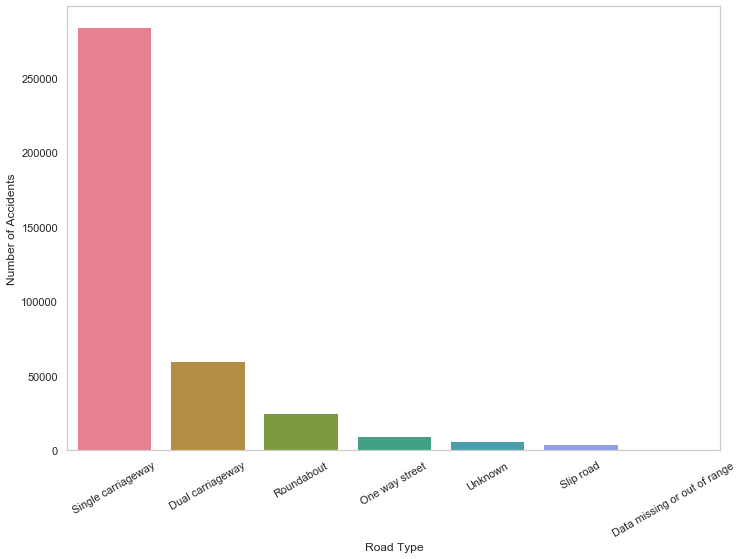

# Objectives
The last article introduced some basic descriptive statistics such as measures of central tendency and measures of variation. In this article, we will apply some measures to get a 
better understanding of selected datasets. Datasets we're using are Road Safety Data for accidents between 2016-2018, 
it can be download on <a href="https://data.gov.uk/dataset/cb7ae6f0-4be6-4935-9277-47e5ce24a11f/road-safety-data">data.gov.uk</a>. You'll probably want to look at *Variable lookup data guide* on the website as well 
since some of the variables are coded and represented by numbers.

<br />

# Setup
One of quickest way to use python and packages is to install <a href="https://www.anaconda.com/products/individual" target="_blank" rel="noreferrer noopener">Anaconda</a>. 
Then go to **Environments** and change the dropdown menu from *installed* to *all*, search and install packages <a href="https://pandas.pydata.org/" target="_blank" rel="noreferrer noopener">pandas</a>, <a href="https://docs.scipy.org/doc/numpy/reference/" target="_blank" rel="noreferrer noopener">numpy</a> and <a href="https://seaborn.pydata.org/index.html" target="_blank" rel="noreferrer noopener">seaborn</a>.
 Once you've done this, open either **JupyterLab** or **Notebook** at the home page and create a new *ipynb* file. Make sure datasets are placed in the same directory as the file.


```python
import pandas as pd
import numpy as np
import matplotlib
import matplotlib.pyplot as plt
import seaborn as sns

sns.set_style("whitegrid", {'axes.grid' : False})
%matplotlib inline
plt.rcParams['figure.figsize'] = [11.7, 8.17]
```

Datasets were renamed to *acc_2016.csv*, *acc_2017.csv*, and *acc_2018.csv*. In here, we can concatenate them into one single dataframe.


```python
years = [2016, 2017, 2018]
file_list = []
for year in years:
    df = pd.read_csv("acc_" + str(year) + ".csv", parse_dates=[9, 11])
    df["Year"] = year
    file_list.append(df)

df_acc = pd.concat(file_list)
df_acc.columns
```  
  
  
The dataset has columns:  
['Accident_Index', 'Location_Easting_OSGR', 'Location_Northing_OSGR',
'Longitude', 'Latitude', 'Police_Force', 'Accident_Severity',
'Number_of_Vehicles', 'Number_of_Casualties', 'Date', 'Day_of_Week', 
'Time', 'Local_Authority_(District)', 'Local_Authority_(Highway)', 
'1st_Road_Class', '1st_Road_Number', 'Road_Type', 'Speed_limit', 
'Junction_Detail', 'Junction_Control', '2nd_Road_Class', '2nd_Road_Number', 
'Pedestrian_Crossing-Human_Control', 'Pedestrian_Crossing-Physical_Facilities', 
'Light_Conditions', 'Weather_Conditions', 'Road_Surface_Conditions', 
'Special_Conditions_at_Site', 'Carriageway_Hazards', 'Urban_or_Rural_Area', 
'Did_Police_Officer_Attend_Scene_of_Accident', 'LSOA_of_Accident_Location', 
'Year'].  
To see more details about the dataset, use **df_acc** and **df_acc.dtypes**.

If you look at dataset closely, you'll find some variables such as *Weather_Conditions* and *Road_Type* are coded in numbers; here, we transform numbers back to text according to *Variable lookup data guide* mentioned at the beginning. Backward slashes are used to indent code in new lines.


```python
df_acc['Weather_Conditions'] = df_acc['Weather_Conditions'] \
    .map({1: "Fine no high winds", 2: "Raining no high winds", \
          3: "Snowing no high winds", 4: "Fine + high winds", \
          5: "Raining + high winds", 6: "Snowing + high winds", \
          7: "Fog or mist", 8: "Other", 9: "Unknown", \
          -1: "Data missing or out of range"})

df_acc['Road_Type'] = df_acc['Road_Type'] \
    .map({1: "Roundabout", 2: "One way street", 3: "Dual carriageway", \
          6: "Single carriageway", 7: "Slip road", 9: "Unknown", \
          12: "One way street/Slip road", -1: "Data missing or out of range"})
```

<br />

# Accidents by year, week, and day

Start with time and date; we can use barplot to visualise the number of accidents by year, week, and day. From the plot below, we can see that the number of accidents decreases over three years period.


```python
# count number of accident for each year, sort by year, make index a new column
df_byYear = pd.DataFrame(df_acc.Year.value_counts().sort_index()).reset_index()
df_byYear.columns = ["Year", "Number of accidents"]

# plot, add seperator for thousands, add title
plot = sns.barplot(x="Year", y="Number of accidents", palette="rocket", data=df_byYear)
plot.get_yaxis()
    .set_major_formatter(matplotlib.ticker.FuncFormatter(lambda x, p: format(int(x), ',')))
plot.set_title("Number of accidents for each year 2016-2018")
```
  
  

The distribution of accidents by day of the week looks a bit more interesting - more accidents occurred on days at the end of the week, closer to the weekend. Typically working days have a higher number of accidents, and over a sixth of overall accidents occurred on Friday.  

```python
# calculate proportion of accidents for each day of the week.
Week_Days = df_acc["Day_of_Week"].value_counts().sort_index()/len(df_acc)*100
Week_Days.index = ["Sun", "Mon", "Tue", "Wed", "Thu", "Fri", "Sat"]
sns.barplot(Week_Days.index, Week_Days.values, alpha=0.8, color="black")
plt.title("Distribution of Accidents by Day of the Week")
for i, val in enumerate(Week_Days.values):
    plt.text(i-0.1, val-1,  str( "{:.{}f}".format( val, 1 )), color='white', fontweight='bold')
```  

  

Most accidents occurred during typical commuter times.  

```python
acc_by_time = df_acc.Time.value_counts()
acc_by_hour = acc_by_time.groupby(acc_by_time.index.hour).sum()
sns.barplot(acc_by_hour.index, acc_by_hour.values, alpha=0.86, palette="husl") \
    .get_yaxis()
    .set_major_formatter(matplotlib.ticker.FuncFormatter(lambda x, p: format(int(x), ',')))
plt.xlabel("Hour of Day")
plt.ylabel("Number of Accidents")
```  

  


What if we sort it by hour?  

```python
acc_by_hour_sorted = acc_by_hour.sort_values()
sns.barplot(acc_by_hour_sorted.index, acc_by_hour_sorted.values, order=acc_by_hour_sorted.index , alpha=0.86, palette="husl") \
    .get_yaxis().set_major_formatter(matplotlib.ticker.FuncFormatter(lambda x, p: format(int(x), ',')))
plt.xlabel("Hour of Day")
plt.ylabel("Number of Accidents")
```  

  


Now we look at density distributions to see the average, median and standard deviation of the number of accidents for each year. The plot also includes the day on which the highest number of accidents occurred (mostly on Friday).  

```python
fig, ax = plt.subplots(nrows=1, ncols=3, figsize=(16,7))
sns.set_color_codes()

for i, col in enumerate(df_acc["Year"].unique()):

    acc_per_year = df_acc["Date"].loc[col == df_acc["Year"]].value_counts()
    acc_per_year_value = acc_per_year.sort_values()[-1]
    acc_per_year_index = acc_per_year.sort_values().index[-1].strftime("%A %d/%m/%y")

    ax[i].set_ylim([0.0,0.008])
    sns.distplot(acc_per_year.values,  ax=ax[i], color="y")
    ax[i].title.set_text("Year:" + str(col))
    ax[i].text(70, 0.0076,'Highest value:'+ str( " {} on {} ".format( acc_per_year_value, acc_per_year_index )), fontsize=12)
    ax[i].text(70, 0.0072,'Mean:'+ str( "{: .{}f}".format( acc_per_year.mean(), 1 )), fontsize=12)
    ax[i].text(70, 0.0068,'Median:'+ str( "{: .{}f}".format( acc_per_year.median(), 1 )), fontsize=12)
    ax[i].text(70, 0.0064,'SD:'+ str( "{: .{}f}".format( acc_per_year.std(), 1 )), fontsize=12)
    
plt.show()
```  

  

We can also use a boxplot to illustrate the outliers, minimum, maximum, median and quartiles.  

```python
sns.set(style="whitegrid")
df_box = []
for i, col in enumerate(df_acc["Year"].unique()):

    acc_per_year = pd.DataFrame(df_acc["Date"].loc[col == df_acc["Year"]].value_counts().reset_index())
    acc_per_year.columns = ["Date", "Count"]
    acc_per_year["Year"] = col
    df_box.append(acc_per_year)
    
box_data = pd.concat(df_box)
sns.boxplot(x="Year", y="Count", data=box_data)
plt.title("Box plots - a different representation for distribution of number of accidents occured each year")
```  

  

<br />

# Conditions

Now we look at some categorical variables such as *Weather_Conditions*, *Road_Type* and *Accident_Severity*.  

Count the number of accidents under each weather condition.  
  
  
```python
sns.set_style("whitegrid", {'axes.grid' : False})
df_wc = df_acc.Weather_Conditions.value_counts()
df_wc[0]/len(df_acc)*100
```

    81.22845148726486


*Fine no high winds* condition appeared in over 80% of all accidents; what about other conditions?  
  
  
```python
df_wc = df_wc.drop("Fine no high winds")
plot_wc = sns.barplot(df_wc.index, df_wc.values)
plt.xlabel("Weather Conditions")
plt.ylabel("Number of Accidents")
plot_wc.set_xticklabels(plot_wc.get_xticklabels(), rotation=30)
```

  

Let's do the same for road types.  

```python
df_rt = df_acc.Road_Type.value_counts()
plot_rt = sns.barplot(df_rt.index, df_rt.values, palette="husl")
plt.xlabel("Road Type")
plt.ylabel("Number of Accidents")
plot_rt.set_xticklabels(plot_rt.get_xticklabels(), rotation=30)
```



Based on *Road_Type*, let's find out about accident severity for each road.  

```python
acc_sev = { 1: "Fatal", 2: "Serious", 3: "Slight" }
category_colors = plt.get_cmap('PiYG')(np.linspace(0.7, 0.9, 3))

for i in range(1, 4):
    df_rt_sev = df_acc["Road_Type"].loc[df_acc["Accident_Severity"]==i].value_counts()
    df_rt_sev = (df_rt_sev/df_rt_sev.sum())*100
    plt.barh(df_rt_sev.index.astype(str), df_rt_sev.values, alpha=0.40, label=acc_sev[i], color=category_colors[(i-1)])
    
plt.legend()
plt.show()
```


# Scatterplot


```python
cmap = sns.cubehelix_palette(dark=.3, light=.8, as_cmap=True)
plt.figure(figsize=(15,8))
data = df_acc[df_acc["Year"] == 2018]
sns.scatterplot(y="Number_of_Vehicles", x="Number_of_Casualties", hue="Speed_limit", \
                data=df_acc, size="Speed_limit", sizes=(20, 100), palette=cmap)
```


