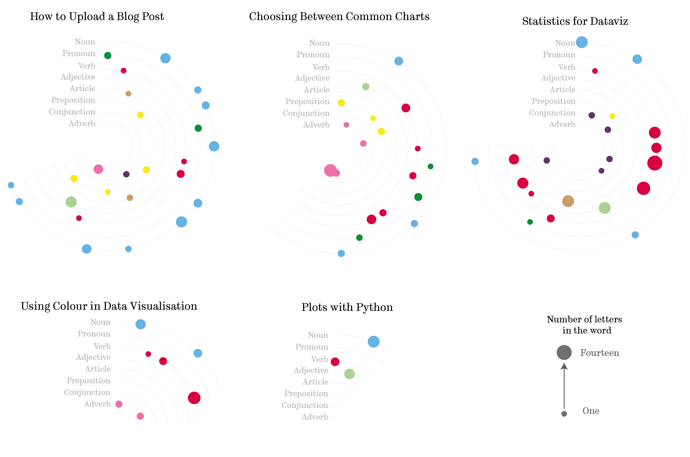

Often when we think of data visualisations, we think of familiar plots like scatter plots, line graphs and bar charts; we think of numbers.
This can lead to the underutilisation of visualisation techniques in non-numerical research.
This is unfortunate as the benefits of visualisation are numerous and by no means exclusive to numerical data.

When we visualise any set of data, many of their characteristics, such as patterns, clusters and anomalies, can all become far more prominent when compared with looking at the raw data.
In this respect, it is often more effective to tell a story with a visualisation than with text or plain numbers.
A clearer understanding of the structure of datasets is not the only benefit of data visualisation; 
they are also particularly efficient at presenting complex messages, they are eye-catching and engaging, and they can also make your message or even your research more memorable.

### Non-numeric data viz from around The University of Sheffield
Dr Kate Davison explains how the uptake of digital resources in the field of history,
has seen an increase in those exploring the use of social network analysis,
a technique prevalent within the social sciences. <a href="https://www.data-to-viz.com/graph/network.html"> Social networks</a>
are effectively translated into engaging visualisations, and in doing so;

> Can accentuate the temporality of relationships and highlight patterns within the data; most importantly,
 can allow us to *see* the characteristics of communities – Davison (2019:465)

Charlotte Tomkins, Dr Tom Stafford and Dr Charles West used data visualisation to
bring the itinerary of King Edward the 1st to life. Translating historical text into an engaging, dynamic map that has
been shared on multiple platforms. Both the data and code are stored on <a href="https://doi.org/10.15131/shef.data.8948699.v1"> ORDA</a>, meaning
you can explore the project and take a deeper dive into the transition from text to visualisation.

  

### What else?
There are many examples of novel data visualisations created from qualitative data.
For example, taking inspiration from <a href="https://www.behance.net/gallery/83315693/Italo-Calvino-text-data-data-visualization-book"> Hanna Piotrowska</a>,
we can digest and visualise the content of our blog posts. The figure below depicts the parts of speech within each blog's description.
Colours accentuate the different categories, verbs, nouns etc., and each dot represents a word; those dots are sequential, reflecting the position of the word in the text.
Additional information is also provided about the length of the word using the area of the dot. It is important to remember that area is particularly
challenging to decipher when used as a scale; therefore, precise information will most likely not be extracted from the size of the dot; instead, it provides a general impression.
If exact word length was crucial to my story, I might want to consider an alternative way of presenting it.

  

### Looking for inspiration?

If you think your data isn’t suited to visualisation, I would encourage you to explore sites
such as <a href="https://informationisbeautiful.net/beautifulnews/">Beautiful News</a>, Tableau's
public <a href="https://public.tableau.com/en-gb/gallery/?tab=viz-of-the-day&type=viz-of-the-day">gallery </a>
or sites such as Twitter and Reddit.
You can also use our dedicated <a href="https://join.slack.com/t/shef-dataviz/signup">Slack channel </a>to connect with the data visualisation community at The University of Sheffield,
you might like to share stories, links to useful tools or examples of great data visualisation.
