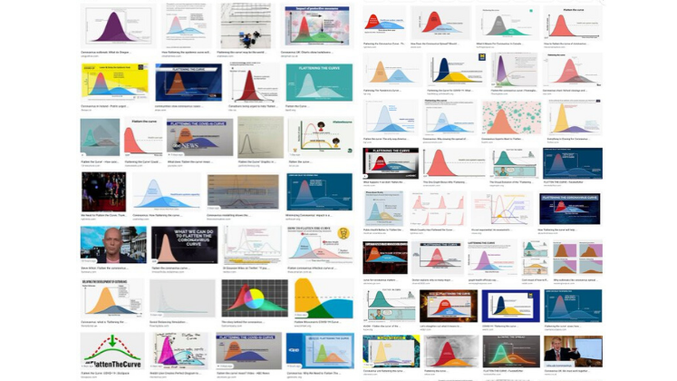

*If you had mentioned 'flattening the curve' in 2019, chances are you would have been met with a blank stare. However, almost halfway through 2020, the language of data visualisation has become 
commonplace, and data visualisations are widely used to communicate about the pandemic to the public. However, as Helen Kennedy observes, their power to influence the public is still little understood.*

 

*Credit: This post by Helen Kennedy was originally published on the <a href="https://blogs.lse.ac.uk/impactofsocialsciences/2020/05/04/simple-data-visualisations-have-become-key-to-communicating-about-the-covid-19-pandemic-but-we-know-little-about-their-impact/">LSE Impact Blog</a> and is reproduced with their kind permission.*
  
---  

 

There have never been so many line charts, bar charts and <a href="https://en.wikipedia.org/wiki/Choropleth_map">choropleth maps</a> occupying the news, as simple data visualisations have 
become key to communicating vital information about the coronavirus pandemic to the public. Whilst these terms might not be familiar to all, the visualisations themselves certainly are.

One line chart has even become famous, entering into the everyday vocabulary of the pandemic. I'm referring to the 'flatten the curve' line chart explaining the need to slow down the 
spread of coronavirus in order not to overwhelm healthcare services. Notably, a New York Times article <a href="https://www.nytimes.com/article/flatten-curve-coronavirus.html">led with said line chart</a>, 
an unusual move in news journalism, which more frequently leads with a human interest visual like a photograph and provides data in charts and graphs below the line. Variations of the flatten the 
curve line chart have since abounded, so much that visualisation designer Andy Kirk joked: we need to '<a href="https://twitter.com/visualisingdata/status/1242420727401394176?s=20">flatten the curve of new versions of the flatten the curve chart</a>'.

  
*<a href="https://twitter.com/visualisingdata/status/1242420727401394176?s=20">Adapted from Andy Kirk, via Twitter</a>*

Other coronavirus data visualisations also proliferate. The BBC's '<a href="https://www.bbc.co.uk/news/world-51235105">visual guide to the pandemic</a>' includes bar charts, interactive 
maps and line charts showing change over time. Elsewhere, the *Financial Times* is offering <a href="https://www.ft.com/coronavirus-latest?fbclid=IwAR1jPsHbNZKMat7DVr8_5OYmQhs7yO1-kh9NZDJN2kIrJEn7PJJe4FsBcrc">free</a> 
content incorporating more challenging chart types, like stream graphs and stacked bar charts. The *New York Times* has been <a href="https://www.nytimes.com/interactive/2020/world/coronavirus-maps.html">mapping</a> 
the spread of the virus from its early days, changing what it maps and how it maps as the pandemic unfolds. 
Worldometers <a href="https://www.worldometers.info/coronavirus/?fbclid=IwAR0jawEd6Yhu2imROjZo2MV6ST09QyhqiiQ8hGjc_9F2_pcQGC2C8qKQwrk%252523countries">visualises real-time data about the 
virus</a>, and individual data visualisers are also taking it upon themselves to represent virus data, such as David McCandless's <a href="https://informationisbeautiful.net/visualizations/covid-19-coronavirus-infographic-datapack/">coronavirus datapack</a> 
at Information Is Beautiful.

At this time of massive global crisis, it feels almost trivial to write about visual representations of data, but they play a significant role, and the public's ability to make sense of 
them has never been more important. Proponents argue that visualisations promote greater understanding of data by making them <a href="https://www.perceptualedge.com/articles/visual_business_intelligence/what_people_need_from_infovis.pdf">accessible and transparent</a>, 
or that, through visualisation, it is possible to 'do good with data', the trademarked tagline of US-based visualisation agency <a href="https://periscopic.com/%252523!/">Periscopic</a>.

However, the benefits of data visualisation are only half the story. Some argue that data visualisations can do ideological work, privileging certain views of the world and hiding others, 
or perpetuating existing power relations. Visualisations are not neutral windows onto data; rather, they are the result of '<a href="https://www.taylorfrancis.com/books/e/9780203066973/chapters/10.4324/9780203066973-7">judgement, discernment and choice</a>'. 
On 29th April, for example, the UK government decided to start press pack line graphs of global death comparisons on the day each <a href="https://assets.publishing.service.gov.uk/government/uploads/system/uploads/attachment_data/file/881811/2020-04-28_COVID-19_Press_Conference_Slides__6___1___1_.pdf">country 
recorded its 2000th</a> death, where these graphs had previously started on the that 50th deaths were recorded. This decision obscured the exponential rise in UK deaths compared to other countries. Moving goalposts, as <a href="https://twitter.com/uk_domain_names/status/1255556059198038018">commentators</a> noted on Twitter.

  
*Source, <a href="https://www.gov.uk/government/collections/slides-and-datasets-to-accompany-coronavirus-press-conferences">Prime Minister's Office</a> (<a href="https://www.nationalarchives.gov.uk/doc/open-government-licence/version/3/">Open Government Licence v3.0</a>)*

The data on which visualisations are based are also not neutral. Human decisions influence and shape data, as well as their visual representation. Data are never 'raw': the very concept of raw data, 
as <a href="https://mitpress.mit.edu/books/memory-practices-sciences">Geoffrey Bowker</a> put it, is an oxymoron. Not surprisingly then, the data on which coronavirus maps, charts and dashboards are 
based are fiercely contested. Data are hard to gather – counting is difficult – but they are also political. There is widespread debate about what data is known but not shared, and who is included 
and excluded in data about death rates. The Open Data Institute's Jeni Tennison <a href="https://www.theguardian.com/commentisfree/2020/apr/02/government-publish-data-coronavirus-deaths">calls</a> 
for more openness about data in order to tackle the crisis in the UK, author Cathy O'Neil gives us <a href="https://www.bloomberg.com/amp/opinion/articles/2020-04-13/ten-reasons-to-doubt-the-covid-19-data?__twitter_impression=true">10 reasons to doubt coronavirus data</a>, and Bonnie Kristian suggests that coronavirus data visualisation is at best a '<a href="https://theweek.com/articles/906437/misleading-certainty-coronavirus-graphic">distorted little sketch</a>.'

What constitute 'good' and 'bad' data practices is subject to debate, and the topic takes on new dimensions in times of crisis. Forms of data sharing that seemed impossible last month, 
such as the sharing of <a href="https://www.theguardian.com/business/2020/apr/07/uk-supermarkets-contacting-vulnerable-patients-must-delete-data-when-crisis-abates">health data with 
supermarkets</a>, are increasingly normal. Notions of public interest, ethics and justice become ever more embattled at times like these, in relation to data and their visual 
representation as well as in other realms.

Thinking critically about these issues is an important skill for making sense of the data visualisations that are currently circulating. Research that I undertook with others 
in <a href="https://seeingdata.org/original-seeing-data-research/">2015</a> suggested that people lacked confidence in their 
own '<a href="https://blogs.lse.ac.uk/impactofsocialsciences/2015/07/22/seeing-data-how-people-engage-with-data-visualisations/">graphicacy</a>', or the combination of maths, visual 
literacy, language, computing and critical thinking skills that are needed to make sense of graphs and charts. But since that research was undertaken, data visualisations have become 
more commonplace, especially in the simple and standardised formats of bar charts and line charts that proliferate today and that were not the subject of that early research. Designers 
believe that the circulation of such visualisations on social media make people both too naïve and too skeptical about their <a href="https://www.jstor.org/stable/j.ctvzgb8c7.17?refreqid=excelsior:83ccc164f6b740c4f1652cdc32ed65c2&seq=1%252523metadata_info_tab_contents">truthfulness</a>. 
But this is speculation: we need to know more about the actual role that these 'generic visuals' play in making knowledge, engagement and action possible, and how social inequalities limit these possibilities for certain groups. 

It's possible, of course, that non-standardised visualisations about coronavirus are more effective at communicating data than simple bar and line charts. 
In <a href="https://www.aup.nl/en/book/9789463722902/data-visualization-in-society">Data Visualization in Society</a> (a book I co-edited 
with <a href="https://www.uia.no/en/kk/profil/martine">Martin Engebretsen</a>), <a href="https://www.york.ac.uk/sociology/our-staff/students/jill-simpson/">Jill Simpson</a> draws on her 
experience of producing a hand drawn data visualisation about her obsessive compulsive disorder to explore how hand drawing communicates a sense of intimacy, authenticity and honesty. 
Hand drawing evokes emotions, she argues, an important element in data visualisation, as my <a href="https://doi.org/10.1177/0038038516674675">early research</a> revealed. For me, some of the 
most effective and affecting coronavirus data visualisations are the hand-drawings of data journalist <a href="https://twitter.com/MonaChalabi">Mona Chalabi</a> and the cartoon-like animations of 
microbiologist <a href="https://thespinoff.co.nz/politics/22-03-2020/siouxsie-wiles-toby-morris-what-does-level-two-mean-and-why-does-it-matter/">Siouxsie Wiles and illustrator Toby Morris</a>. 
These have shown, amongst other things, how the virus spreads more quickly in densely populated areas, how social distancing works, who has the privilege of being able to work from home, 
and <a href="https://twitter.com/MonaChalabi/status/1248677786979643393/">the ways in which the virus is disproportionately affecting black Americans</a>. They deploy the suggested 
qualities of the hand-drawn to reveal the politics of the pandemic.

As generic visuals like bar and line charts increasingly populate the news and social media, we need more understanding of their social role. Do they bring people together around shared 
interests and concerns, activate them to care (or not) about issues, make possible (or not) various forms of engagement, facilitate or inhibit the spread of disinformation? For 
governments and researchers looking to communicate public health information, finding out how simple data visualisations influence the public is now more pressing than ever. 

 

---

*<a href="https://www.aup.nl/en/book/9789463722902/data-visualization-in-society">Data Visualization in Society</a> is available to read open access <a href="https://www.aup.nl/en/book/9789463722902/data-visualization-in-society">here</a>. 
The book is also being launched online on Wednesday 6th May, details of this event can be found on <a href="https://www.eventbrite.co.uk/e/data-visualization-in-society-virtual-book-launch-tickets-103336759028">eventbrite</a>.*  

*<a href="https://ahc.leeds.ac.uk/media/news/article/1438/professor-cw-anderson-and-dr-giorgia-aiello-awarded-ahrc-funding-to-investigate-stock-photography">Generic visuals in the news</a> 
is a research project funded by the AHRC which will commence in September 2020.*  

---

  

    

      
    

    

      

        Helen Kennedy
        

          <TwitterBtn href="https://twitter.com/intent/follow?screen_name=hmtk&tw_p=followbutton" />
        

      

      
Professor of Digital Society

      
Director of the <a href="https://www.sheffield.ac.uk/social-sciences/research/digital-society">Digital Society Network</a>

      
The University of Sheffield

    

  

  

    
Helen Kennedy is Professor of Digital Society at the University of Sheffield. Over 20+ years, she has researched how digital developments are experienced by 'ordinary people' and 
      how these experiences can inform the work of digital media practitioners. She is currently interested in the datafication of everyday life. She is researching public attitudes to 
      data mining and related issues such as trust in data, data and inequality and what 'good' data practice might look like. She is also interested in the role of visual representations 
      of data in everyday life.
    

  

