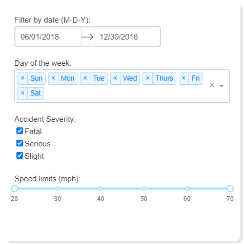
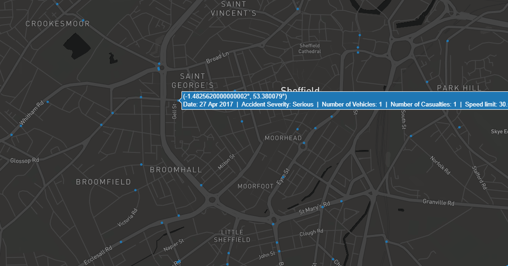

*'Dash is a web application framework that provides pure Python abstraction around HTML, CSS, and JavaScript.'*  

---

<br />

# 1. Prerequsites
This documentation assumes some prior knowledge of [Python](https://www.python.org/) and HTML/CSS. A minimum of being able to install Python, packages, and be able to execute code should 
get you a example visualisation. If you need assistance with Python, [python.org](https://docs.python.org/3/tutorial/index.html) provides documentation and tutorials.

To follow this tutorial, it is best to use [JupyterLab](https://jupyterlab.readthedocs.io/en/stable/getting_started/installation.html) (2.0 or above). If you have time, 
read <Link to="/blog/04/06/2020/dash-tutorial">Dash tutorial</Link> and <Link to="/blog/07/05/2020/dataviz-stats-2">Plot with Python</Link> (you'll find some codes are coming from 
this post). Make sure the following packages are installed:  
 - [jupyter-dash](https://github.com/plotly/jupyter-dash) - allowing apps to be run within JupyterLab
 - [Dash](https://dash.plotly.com/installation)
 - [Numpy](https://numpy.org/)
 - [Pandas](https://pandas.pydata.org/)
 - [Plotly](https://plotly.com/python/getting-started/)

In addition, datasets we're going to use are [Road Safety Data](https://data.gov.uk/dataset/cb7ae6f0-4be6-4935-9277-47e5ce24a11f/road-safety-data) for accidents 
between 2016-2018 [[1]](https://data.dft.gov.uk/road-accidents-safety-data/dftRoadSafety_Accidents_2016.zip)
[[2]](https://data.dft.gov.uk.s3.amazonaws.com/road-accidents-safety-data/dftRoadSafetyData_Accidents_2017.zip)
[[3]](https://data.dft.gov.uk/road-accidents-safety-data/dftRoadSafetyData_Accidents_2018.csv) (licensed under 
[Open Government Licence](https://www.nationalarchives.gov.uk/doc/open-government-licence/version/3/)). 

<br />

# 2. Setup
Before we can build a Dash app, import all necessary packages and prepare datasets for visualisation.

```python
from jupyter_dash import JupyterDash
import dash
import dash_core_components as dcc
import dash_html_components as html
from dash.dependencies import Input, Output
import pandas as pd
import numpy as np

from datetime import datetime as dt
import plotly.express as px

external_stylesheets = ['https://codepen.io/chriddyp/pen/bWLwgP.css']

# create an app
app = dash.Dash(__name__, external_stylesheets=external_stylesheets)

# prepare data
years = [2016, 2017, 2018]
file_list = []
for year in years:
    df = pd.read_csv("data/acc_" + str(year) + ".csv", parse_dates=[9, 11])
    df["Year"] = year
    file_list.append(df)

df_acc = pd.concat(file_list)
```

Of course you can download stylesheets of your choice but make sure it is placed under the **assets** subdirectory. By doing this you can remove 
the *external_stylesheets* parameter in **dash.Dash**. Do open the [stylesheet description](https://codepen.io/chriddyp/pen/bWLwgP) and note classes that you can utilise. The directory strcture 
you should have is:  
  - Folder
    - assets
      - style.css
    - data
		  - acc_2016.csv
		  - acc_2017.csv
		  - acc_2018.csv
    - app.ipynb

See completed files from [here](https://github.com/researchdata-sheffield/dash_widgets). 

<br />

# 3. Syntax of layout
To create a layout for our app, we should first familarise with Dash's syntax. If you have used ReactJS before, you might have noticed there's a lot of similarities between ReactJS 
and Dash's layout. Suppose I want to create a title and a subtile in HTML:  
```html
<div>
  <div>
    <h1>This is my title</h1>
    <h6>This is my subtitle written in HTML.</h6>
  </div>
</div>
```  
In Dash, these translates to:  
```python
html.Div(children=[
  html.Div(children=[
    html.H1('This is my title'),
    html.H6('This is my subtitle written in HTML.')
  ])
])
```
An example on adding styles and classes:
```python
html.Div(children=[
  html.Div(children=[
    html.H1('This is my title', style={'marginBottom': '10'}),
    html.H6('This is my subtitle written in HTML.')
  ], className="seven columns", style={'marginTop': '30'})
], className="container")
```
where *html* is the *dash_html_components* we have imported. Note there are few differences:
 - Tag name are capitalised
 - Nested elements are placed inside the children array
 - Elements are seperate by commas
 - The *style* property is wrap by curly brackets and properties in the *style* are camelCased
 - *className* is replacing *class*
 - You're no longer required to write *px* after numbers supplied to properties such as margin/padding

For more information on HTML components, visit [here](https://dash.plotly.com/dash-html-components).  
To run the app, place the following line at the end of all your codes:

```
app.run_server(mode="jupyterlab")
```

<br />

# 4. Create a layout
Now let's create a actual layout for the app. The code block shown below is the base of an app's layout.
```python
app.layout = html.Div(children=[
])
```
Then we can add content inside the *children* array. Use the following code to create a header:
```python
app.layout = html.Div(children=[
    html.Div(children=[
        html.H3(children='United Kingdom accidents data'),
        html.H6(children='Accidents overview 2016-2018', style={'marginTop': '-15px', 'marginBottom': '30px'})
    ], style={'textAlign': 'center'})
], style={'padding': '2rem'})
```
we get the header below(and I have changed the background color in html class in style.css):


Before you create a layout in Dash, it would be a good idea to have a sketch of what the app would look like, 
for example draw it on the paper (what I did) or even use powerpoint to design the layout. You could also 
look at the [Dash Gallery](https://dash-gallery.plotly.host/Portal/) for some inspration. I'm using use 
the following template for my app:


To make the app interactive, **[Dash core components](https://dash.plotly.com/dash-core-components)** are 
vita, actions of app users on these components acts as inputs and we can modify visualisations (outputs) 
accordingly. We will know more about connecting inputs and outputs in 
the <a href="#5-interactive" anchor="true">interactive section</a>, for now we just focus on the 
layout of inputs and output components. It is your choice of which components to use, of course it will 
also depends on your data. For datasets in this post, I've chosen variables *Date*, *Day of Week*, 
*Accident Severity*, and *Speed limit* as **inputs**. Inside the layout, I've added the following:

```python
html.Div(children=[
    ################### Filter box ###################### 
    html.Div(children=[
        html.Label('Filter by date (M-D-Y):'),
        dcc.DatePickerRange(
            id='input_date',
            month_format='DD/MM/YYYY',
            show_outside_days=True,
            minimum_nights=0,
            initial_visible_month=dt(2017, 1, 1),
            min_date_allowed=dt(2016, 1, 1),
            max_date_allowed=dt(2018, 12, 31),
            start_date=dt.strptime("2018-06-01", "%Y-%m-%d").date(),
            end_date=dt.strptime("2018-12-31", "%Y-%m-%d").date()
        ),

        html.Label('Day of the week:', style={'paddingTop': '2rem'}),
        dcc.Dropdown(
            id='input_days',
            options=[
                {'label': 'Sun', 'value': '1'},
                {'label': 'Mon', 'value': '2'},
                {'label': 'Tue', 'value': '3'},
                {'label': 'Wed', 'value': '4'},
                {'label': 'Thurs', 'value': '5'},
                {'label': 'Fri', 'value': '6'},
                {'label': 'Sat', 'value': '7'}
            ],
            value=['1', '2', '3', '4', '5', '6', '7'],
            multi=True
        ),

        html.Label('Accident Severity:', style={'paddingTop': '2rem', 'display': 'inline-block'}),
        dcc.Checklist(
            id='input_acc_sev',
            options=[
                {'label': 'Fatal', 'value': '1'},
                {'label': 'Serious', 'value': '2'},
                {'label': 'Slight', 'value': '3'}
            ],
            value=['1', '2', '3'],
        ),

        html.Label('Speed limits (mph):', style={'paddingTop': '2rem'}),
        dcc.RangeSlider(
                id='input_speed_limit',
                min=20,
                max=70,
                step=10,
                value=[20, 70],
                marks={
                    20: '20',
                    30: '30',
                    40: '40',
                    50: '50',
                    60: '60',
                    70: '70'
                },
        ),

    ], className="four columns",
    style={'padding':'2rem', 'margin':'1rem', 'boxShadow': '#e3e3e3 4px 4px 2px', 'border-radius': '10px', 'marginTop': '2rem'} )

    ##### HERE insert the code for four boxes & graph #########
])
```

As you can see four components are used here. *DatePickerRange* allows you to select two dates within two preset dates, *Dropdown* can be use to select day of the week, *Checkbox* for
selecting accident severity, and a *RangeSlider* for the speed limit range. Depending on your needs and datasets, the general steps of creating  a core component could be the following:
 1. Start by decide which part of datasets you want to filter and select a appropriate component from [here](https://dash.plotly.com/dash-core-components).  

 2. Create the component using **dcc.componentName()**, then specify **id** and properties inside the bracket. 
  **id** is important because you'll need this in the interactive section. Properties of components can be found 
  on the site mentioned in step 1. For example, [DatePickRange](https://dash.plotly.com/dash-core-components/datepickerrange)
  allows you to specify **min_date_allowed** and **number_of_months_shown**, corresponds to the lowest selectable 
  date for the component and the number of calendar months that are shown when calendar is opened. In addition, the **multi** 
  property allows you to select multiple values.

 3. Double check that the values you have put inside the component is same as in the dataset. As an example,
  in the options property of the Dropdown component, labels are text displays on the dashboard and the corresponding 
  value is the value we use to filter our datasets, so be sure they are matched.  

 4. Style the component and create another one if required. I've added labels just before each component for clarification.  

Once done, try run the app with `app.run_server(mode="jupyterlab")` to review your layout, here's my output:

  

<br />

Next, let's create the layout for **outputs**. I've inserted the following codes at the end of last code block:

```python
# Number statistics & number of accidents each day

html.Div(children=[
    html.Div(children=[
        html.Div(children=[
            html.H3(id='no_acc', style={'fontWeight': 'bold'}),
            html.Label('Total accidents', style={'paddingTop': '.3rem'}),
        ], className="three columns number-stat-box"),

        html.Div(children=[
            html.H3(id='no_cas', style={'fontWeight': 'bold', 'color': '#f73600'}),
            html.Label('Casualties', style={'paddingTop': '.3rem'}),
        ], className="three columns number-stat-box"),

        html.Div(children=[
            html.H3(id='no_veh', style={'fontWeight': 'bold', 'color': '#00aeef'}),
            html.Label('Total vehicles', style={'paddingTop': '.3rem'}),
        ], className="three columns number-stat-box"),

        html.Div(children=[
            html.H3(id='no_days', style={'fontWeight': 'bold', 'color': '#a0aec0'}),
            html.Label('Number of days', style={'paddingTop': '.3rem'}),
        
        ], className="three columns number-stat-box"),
    ], style={'margin':'1rem', 'display': 'flex', 'justify-content': 'space-between', 'width': '100%', 'flex-wrap': 'wrap'}),

    # Line chart for accidents per day
    html.Div(children=[
        dcc.Graph(id='acc_line_chart')
    ], className="twleve columns", style={'padding':'.3rem', 'marginTop':'1rem', 'marginLeft':'1rem', 'boxShadow': '#e3e3e3 4px 4px 2px', 'border-radius': '10px', 'backgroundColor': 'white', }),

], className="eight columns", style={'backgroundColor': '#f2f2f2', 'margin': '1rem'})
```

Here I've laid out four boxes for text and one box for a line chart, and you might have already noticed that 
there isn't any contents for components. For the layout of outputs, you only need to specify the type of component 
you need and give an id for reference (plus any styles you want to add). For example, I want the app to show the 
number of total accidents, then I use **html.H3** to render it and use **no_acc** as id.  
For graphs and charts, you will need to use the **[dcc.Graph component](https://dash.plotly.com/dash-core-components/graph)**. 
This component can be used to render any plotly-powered data visualisation, with `dcc.Graph(figure=fig)`, 
where **fig** is a plotly figure. For updating graphs & charts dynamically, `dcc.Graph(id='give_me_an_id')` is sufficient. 
There are [other components]https://dash.plotly.com/dash-core-components() you could use for different purposes, for example, 
upload files, create tabs, and pop-up windows for dialogs. But once you're familar with the graph component then you will 
find other components follows the same pattern.

# 5. Interactive
We're only one step to an interactive dash app! In order for inputs and outputs to interact with each other, we use 
**[callback](https://dash.plotly.com/basic-callbacks)** to achieve this, this section only introduce to basic callback, if 
you requires more advance usage, follow the [link](https://dash.plotly.com/basic-callbacks) to learn more. Here is the 
callback codes for four number statistics:

```python
@app.callback(
    [Output(component_id='no_acc', component_property='children'),
     Output('no_cas', 'children'),
     Output('no_veh', 'children'),
     Output('no_days', 'children'),
    ],
    [Input('input_date', 'start_date'),
     Input('input_date', 'end_date'),
     Input('input_days', 'value'),
     Input('input_acc_sev', 'value'),
     Input('input_speed_limit', 'value'),
    ])
def update_statistics(start_date, end_date, input_days, input_acc_sev, input_speed_limit):
    # filter by date
    df_update = df_acc.loc[(start_date <= df_acc['Date']) & (end_date >= df_acc['Date'])]
    # by weekdays
    if input_days:
        df_update = df_update[df_update['Day_of_Week'].isin(input_days)]
        
    # by accident severity
    if(input_acc_sev):
        df_update = df_update[df_update['Accident_Severity'].isin(input_acc_sev)]
        
    # filter by speed limits
    df_update = df_update.loc[(input_speed_limit[0] <= df_update['Speed_limit']) & (input_speed_limit[1] >= df_update['Speed_limit'])]
    
    days = dt.strptime(end_date, "%Y-%m-%d") - dt.strptime(start_date, "%Y-%m-%d")
    
    return len(df_update), sum(df_update['Number_of_Casualties']), sum(df_update['Number_of_Vehicles']), days.days
```

The first part of the callback specify inputs and outputs for your interaction. If you have only one output/input, 
do not use square bracket around it as this will cause errors. For both outputs and inputs, you'll need to specify 
**component_id** and **component_property**.  **component_id** is the id you have previously given to components, and 
**component_property** is the property of the component you would like to pass. For example, `Output('no_veh', 'children'),` 
will update the children property of the component with id *no_veh*; `Input('input_date', 'end_date'),` will take the 
*end_date* property of the component with id *input_date* as an input.  
Immediately after the callback, you'll need to define a function that handles inputs and return outputs. Make sure the number of 
parameters and the number of outputs matches the number of inputs and outputs in the callback. **Orders of parameters and outputs 
are important too!**

Together with the callback for line graphs, you should have the following:


For graph components, there are more works you'll need to do.

```python
######### Callback for accidents line chart ##############################
@app.callback(
    Output('acc_line_chart', 'figure'),
    [Input('input_date', 'start_date'),
     Input('input_date', 'end_date'),
    ])
def update_line_chart(start_date, end_date):
    # filter by date
    df_update = df_acc.loc[(start_date <= df_acc['Date']) & (end_date >= df_acc['Date'])]
    #acc_by_day = pd.DataFrame(df_update.Date.value_counts().sort_index().reset_index())
    #acc_by_day.columns=["Date", "Number"]
    acc_by_day = df_update.Date.value_counts().sort_index()
    
    return {
        'data': [dict(
            x=acc_by_day.index,
            y=acc_by_day.values,
            type='scatter',
            mode='line',
            marker={ 'size': 15, 'opacity': 0.5, 'line': {'width': 0.5, 'color': 'white'} },
            line={'color': "#7bc7ff"}
        )],
        'layout': dict(
            title={"text": "Number of accidents occured in the given date range"},
            margin={'l': 40, 'b': 40, 't': 60, 'r': 20},
            hovermode='closest',  
            height=300,
        )
    }
```

What you need to return is the same as you would for specify properties for plotly figures. The 
[Python Figure Reference](https://plotly.com/python/reference/) by *plotly* documents all properties 
of each graph object can take, this is a very useful documentation for designing your graphs/charts, 
especially it outlines the type property for each graph object that decides which graph to return:

```python {5}
return {
  'data': [dict(
      x=acc_by_day.index,
      y=acc_by_day.values,
      type='scatter',
      mode='line',
```

< br/>

It is likely that you would want to use maps in the future, and specifically, if you want to use mapbox in Dash 
then an access token is required. Fortunately, you can get it for free by register an account on 
[mapbox](https://www.mapbox.com/) and obtain your token on the account page. Here's an example:

```python
return {
    'data': [dict(
        lat=df_update['Latitude'], 
        lon=df_update['Longitude'],
        name=df_update['Date'],
        type='scattermapbox',
        text=df_update['text'],
    )],
    'layout': dict(
        title={"text": "Position of accidents"},
        margin={'l': 20, 'b': 15, 't': 60, 'r': 20},
        height=700,
        mapbox={
            "style": "dark", 
            "center": {"lon": -1.474351, "lat": 53.381173},
            "accesstoken": "pk.eyJ1IjoieWx3LXNoZWYiLCJhIjoiY2tiYXpicmNiMGFyYjMwbWJpbGE0Y29odSJ9.ygksJJTy3si1ZGcYb82DpA",
            "zoom": 8,
            
        }
    )
}
```

<br />

# 6. Conclusion
Hopefully this post has given you a gently introduction to layouts and interactive in Dash. It is impossible to include everything in a post 
but I encourage you to explore documentations that has mentioned above, especially if you requires advanced usage of Dash!




If you wish to deploy the app on web, read this <Link to="/blog/03/07/2020/Deploy-Your-Dash-App">article</Link>.
