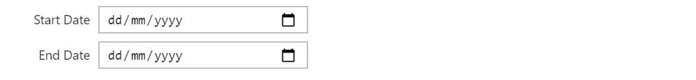
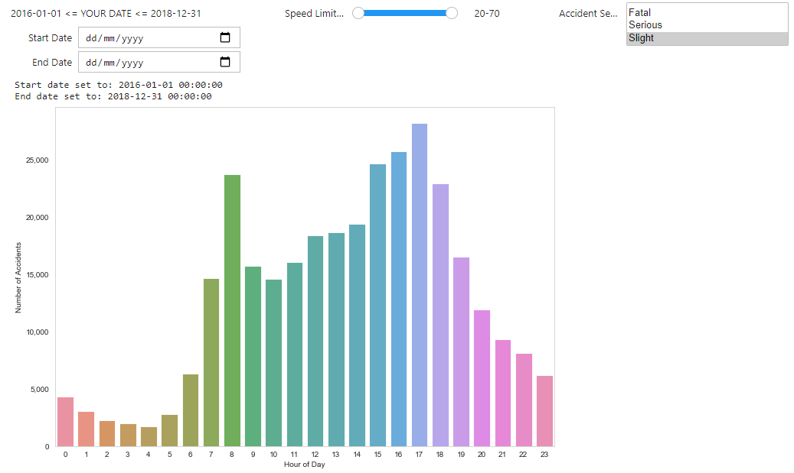

*"Widgets are eventful python objects that have a representation in the browser, often as a control like a slider, textbox, etc. You can use widgets to build interactive GUIs 
for your notebooks. You can also use widgets to synchronize stateful and stateless information between Python and JavaScript."* - Jupyter widgets

---

<br />

# 1. Prerequsites
This documentation follows from <Link to="/blog/07/05/2020/dataviz-stats-2">'Plots with Python'</Link> and 
assumes some prior knowledge of [Python](https://www.python.org/). 
If you need assistance with Python, [python.org](https://docs.python.org/3/tutorial/index.html) provides 
documentation and tutorials. While this post introduces some basic elements of *ipywidgets*, you should 
also rely on the latest documentations on [here](https://ipywidgets.readthedocs.io/en/latest/index.html).

To follow this tutorial, it is best to use [JupyterLab](https://jupyterlab.readthedocs.io/en/stable/getting_started/installation.html) (2.0 or above). If you have time, 
read <Link to="/blog/07/05/2020/dataviz-stats-2">Plot with Python</Link> (you'll find codes are coming from 
this post). Make sure the following packages are installed:  
 - [Numpy](https://numpy.org/)
 - [Pandas](https://pandas.pydata.org/)
 - [seaborn](https://seaborn.pydata.org/index.html)
 - [Jupyter Widgets](https://ipywidgets.readthedocs.io/en/latest/user_install.html)
 - You'll need to run `jupyter labextension install @jupyter-widgets/jupyterlab-manager@2.0` for JupyterLab (v2.0 or above)

In addition, datasets we're going to use are [Road Safety Data](https://data.gov.uk/dataset/cb7ae6f0-4be6-4935-9277-47e5ce24a11f/road-safety-data) for accidents 
between 2016-2018 [[1]](https://data.dft.gov.uk/road-accidents-safety-data/dftRoadSafety_Accidents_2016.zip)
[[2]](https://data.dft.gov.uk.s3.amazonaws.com/road-accidents-safety-data/dftRoadSafetyData_Accidents_2017.zip)
[[3]](https://data.dft.gov.uk/road-accidents-safety-data/dftRoadSafetyData_Accidents_2018.csv) (licensed under 
[Open Government Licence](https://www.nationalarchives.gov.uk/doc/open-government-licence/version/3/)).
<br />

# 2. Using widgets
First thing first, import all necessary packages in addtion to those in 
this <Link to="/blog/07/05/2020/dataviz-stats-2">post</Link>:

```python
from __future__ import print_function
from ipywidgets import interact, interactive, fixed, interact_manual, Layout
import ipywidgets as widgets
```

To create a widget, use the format **widgets.widgetName**, you can find all available 
widgets [here](https://ipywidgets.readthedocs.io/en/latest/examples/Widget%20List.html). Here I'm using two 
*DatePicker*, and you only need to specify one property - description of your widget to get things working. If 
you don't assign the widget to a variable then it will display automatically, however, if you wish to customise 
the layout then assign it to a variable and use whatever is available [here](https://ipywidgets.readthedocs.io/en/latest/examples/Widget%20Styling.html). 
*widgets.HBox* on the last line represents a horizontal box. 

```python
import datetime

start_date = widgets.DatePicker(
    description='Start Date',
    disabled=False
)
end_date = widgets.DatePicker(
    description='End Date',
    disabled=False
)

widgets.HBox([start_date, end_date])
```


Alternatively, use `display(...)` from **IPython.display**.

```python
from IPython.display import display
display(start_date, end_date)
```



To close a widget, use it's calling method `start_date.close()`.  
To link two widgets together so that when one of widget's value changed the other widget will change to 
the same value, use something like:
```python
linkDate = widgets.jslink((start_date, 'value'), (end_date, 'value'))
``` 
If you want to unlink, call `unlink()` method on the link.

<br />

# 3. Interact
After we have created widgets, how do we make it to interact with other components? *ipywidgets* provides 
several functions that creates user interface controls for interactive actions:  
 - **interact** - basic level function, generates and display UI for you
 - **interactive** - different to *interact*, returns a widget instance rather than display it 
 - **interact_manual** - provides restriction on execution so updates will not be trigger until permission granted by you
 - **interactive_output** - more flexibility in addition to *interact*, allows you to control layout of widgets 

This post will only includes contents on *interactive_output*, if you're interested in other functions, visit 
the [online documentation](https://ipywidgets.readthedocs.io/en/latest/examples/Using%20Interact.html).  
Let's start with an example.
```python
def f(start, end):
    print('start date: {}, end date: {}'.format(start, end))

out = widgets.interactive_output(f, {'start': start_date, 'end': end_date})

widgets.HBox([widgets.VBox([start_date, end_date]), out])
```

For all interact functions, you're required to provide a custom function for the first parameter, and specify 
widgets as inputs for your custom function. In here I defined a function called **f** that takes two arguments 
*start* and *end*, then return a message with their values onto the screen. Then in the *interactive_output* function 
we pass the **f** function and two widgets (*start_date* and *end_date*) defined earlier. Note that in the **f** function
*start* and *end* are values of two widgets rather than widget instances, that's why you can use it without calling 
`start.value`.


By following the same pattern, we can add as many widgets we want then define a function to handle values return by widgets and 
output whatever you need. Suppose we want to update the graph illustrates distribution of number of accidents for each hour through
widgets that controls **date**, **speed limit** and **accident severity**. Here's our layout (it won't run without the 
*change_parameters* function):

```python
out = widgets.interactive_output(
        change_parameters, 
          {'start': start_date, 
           'end': end_date, 
           'speed_limit': speed_limit_widget, 
           'accident_sev': accident_sev_widget
          }
      )
ui = widgets.HBox(
        [widgets.VBox(
          [widgets.Label("2016-01-01 <= YOUR DATE <= 2018-12-31"), start_date, end_date]), 
          speed_limit_widget, 
          accident_sev_widget
        ], 
        layout=Layout(display='flex', flex_flow='row wrap', justify_content='space-between')
    )
display(ui, out)
```

Before we define the function, we should create widgets for accident severity and speed limit:

```python
accident_sev_widget = widgets.SelectMultiple(
    options=['Fatal', 'Serious', 'Slight'],
    value=['Fatal', 'Serious', 'Slight'],
    description='Accident Severity',
    disabled=False,
    rows=3
)

options = [20, 30, 40, 50, 60, 70]
speed_limit_widget = widgets.SelectionRangeSlider(
    options=options,
    index=(0, 5),
    description='Speed Limits (mph)',
    disabled=False,
    style={'background-color': '#000'}
)
```

Now let's define the change_parameters function, we can copy and paste the code for creating the graph:

```python {3}
def change_parameters(start, end, speed_limit, accident_sev):

  acc_by_time = df_acc.Time.value_counts()
  acc_by_hour = acc_by_time.groupby(acc_by_time.index.hour).sum()
  sns.barplot(acc_by_hour.index, acc_by_hour.values, alpha=0.86, palette="husl") \
      .get_yaxis().set_major_formatter(matplotlib.ticker.FuncFormatter(lambda x, p: format(int(x), ',')))
  plt.xlabel("Hour of Day")
  plt.ylabel("Number of Accidents")
```

However, the graph is created using the original dataset **df_acc**, before update the graph we need to filter the dataset according to 
values from widgets. We can do so by insert some codes before the highlighted line.  
Starting with the **Date**, since the date widget doesn't have restriction on min (minimum) or max (maximum) date range, we shall do 
this manually. At the beginning, two dates are defined so that the graph is still produced while dates remain unselected. Next thing 
is to check whether selected dates are within the range (2016-2018), I've written a *check_date* function to do this. Lastly, we use these 
dates to filter the dataset (line 13). 

```python {13}
def change_parameters(start, end, speed_limit, accident_sev):
    start_date = pd.to_datetime('2016-01-01')
    end_date = pd.to_datetime('2018-12-31')

    if check_date(start):
      start_date = pd.to_datetime(start)
    if check_date(end):
      end_date = pd.to_datetime(end)

    print("Start date set to: " + str(start_date))
    print("End date set to: " + str(end_date)

    df_update = df_acc.loc[(start_date <= df_acc['Date'].dt.date) & (end_date >= df_acc['Date'].dt.date)]
    
    #### other things here #####

def check_date(my_date):
    if my_date is None:
        return False
    start_date = pd.to_datetime('2016-01-01')
    end_date = pd.to_datetime('2018-12-31')
    my_date = pd.to_datetime(my_date)
    return ((my_date >= start_date) & (my_date <= end_date))
```

Codes for speed limit and accident severity are much more straightforward. 

```python {1-2,5}
low = speed_limit[0]
high = speed_limit[1]

df_update = df_update[df_update.Speed_limit.between(low,high)]
df_update['Accident_Severity'] = df_update['Accident_Severity'].map({1: 'Fatal', 2: 'Serious', 3: 'Slight'})
df_update = df_update[df_update['Accident_Severity'].isin(accident_sev)] 
```

Since the *SelectionRangeSlider* widgets takes two values you'll get them as a tuple in the function, in line 1-2 they are assigned to 
variables. Line 5 make sure values of the accident severity column in the original dataset are the same as in the widget.  

And we get the following:




<br />

# 4. Further reading
Full codes is available [here](https://colab.research.google.com/drive/1zMeTNlrb3ImADA0BiHQADNAeEP7RU-PH?usp=sharing).
The content of this post only covers a small area of Jupyter widget's capability, I'll suggest you reading the following documentations:
 - [Jupyter widget events](https://ipywidgets.readthedocs.io/en/latest/examples/Widget%20Events.html#)
 - [bqplot](https://github.com/bqplot/bqplot) - plotting library
 - [ipyleaflet](https://github.com/jupyter-widgets/ipyleaflet) - interactive maps
 - [ipyvolume](https://github.com/maartenbreddels/ipyvolume) - 3d plotting library
 - [gmaps](https://github.com/pbugnion/gmaps) - interactive google maps
 - [Asynchronous Widgets](https://ipywidgets.readthedocs.io/en/latest/examples/Widget%20Asynchronous.html)


