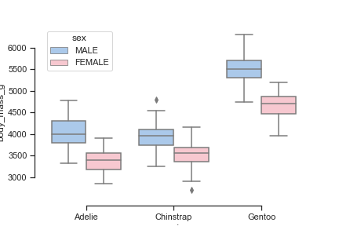
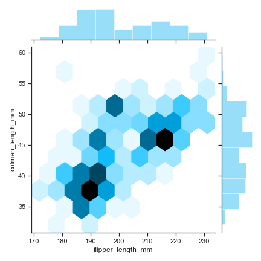

<div
  className="shadow-xl flex justify-center items-center text-center"
  style={{
    background:
      "linear-gradient(to right top, #051937, #004d7a, #008793, #00bf72, #a8eb12)",
    width: "100%",
    flexDirection: "column",
    paddingTop: "37vh",
    paddingBottom: "37vh"
  }}
>
  <div>
    <div className="text-5xl text-white font-bold">
      Visualisation templates for Python
    </div>
    <div className="text-lg text-gray-100 mt-2">
      A selection of visualisation templates for you to build a visualisation
      more quickly.
    </div>
    <div className="text-sm text-gray-100 mt-8">
      16th July 2020, Yu Liang Weng
    </div>
  </div>
</div>

<div className="flex flex-wrap container mx-auto mt-16 mb-36 px-3 lg:px-36">
  This article is updated regularly to keep up with latest Python data
  visualisation libraries, there are only limited number of templates here, for
  more examples please visit the following galleries/repositories: <br />
  <ul>
    <li>
      <a href="https://matplotlib.org/gallery/index.html">matplotlib</a>
    </li>
    <li>
      <a href="https://seaborn.pydata.org/examples/index.html">seaborn</a>
    </li>
    <li>
      <a href="https://plotly.com/python/">plotly</a>
    </li>
    <li>
      <a href="https://docs.bokeh.org/en/latest/docs/gallery.html">bokeh</a>
    </li>
    <li>
      <a href="https://github.com/ResidentMario/missingno">missingno</a> -
      Missing data visualization module
    </li>
    <li>
      <a href="https://github.com/andrea-cuttone/geoplotlib">geoplotlib</a>
    </li>
    <li>
      <a href="https://altair-viz.github.io/gallery/index.html">altair</a>
    </li>
  </ul>
</div>

<div className="flex flex-wrap container mx-auto shadow-lg my-16" style={{backgroundColor: '#f7f7f7'}}>
  <div className="md:w-2/5 relative px-3 bg-white group">
    
    <pltBtn className="absolute bottom-0 left-0 font-bold bg-gray-800 text-white w-full text-center py-3 group-hover:bg-transparent group-hover:text-transparent transition duration-500">
      Scatterplot
    </pltBtn>
  </div>
  <div className="md:w-3/5 overflow-hidden relative z-10">

```python
import seaborn as sns
import matplotlib.pyplot as plt
sns.set(style="whitegrid")

# Load the penguins dataset
penguins = sns.load_dataset("penguins")

# Set figure's size
f, ax = plt.subplots(figsize=(8, 8))

# Remove the left and bottom spines from plot
sns.despine(f, left=True, bottom=True)

# Plot
sns.scatterplot(x="culmen_length_mm", y="culmen_depth_mm",
                palette="ch:r=-.2,d=.3_r", hue="sex",
                size="species",
                linewidth=0,
                data=penguins, ax=ax)
```

  </div>
</div>

<div className="flex flex-wrap container mx-auto shadow-lg my-16" style={{backgroundColor: '#f7f7f7'}}>
  <div className="md:w-2/5 relative px-3 bg-white group">
    
    <div className="absolute bottom-0 left-0 font-bold bg-gray-800 text-white w-full text-center py-3 group-hover:bg-transparent group-hover:text-transparent transition duration-500">
      Boxplot
    </div>
  </div>
  <div className="md:w-3/5 overflow-hidden relative z-20">

```python
import seaborn as sns
sns.set(style="ticks", palette="pastel")

# Load the penguins dataset
penguins = sns.load_dataset("penguins")

# Plot body mass vs. specie types
sns.boxplot(x="species", y="body_mass_g",
            hue="sex", palette=["b", "pink"],
            data=penguins)
sns.despine(offset=10, trim=True)
```

  </div>
</div>

<div className="flex flex-wrap container mx-auto shadow-lg my-16" style={{backgroundColor: '#f7f7f7'}}>
  <div className="md:w-2/5 relative px-3 bg-white group">
    
    <div className="absolute bottom-0 left-0 font-bold bg-gray-800 text-white w-full text-center py-3 group-hover:bg-transparent group-hover:text-transparent transition duration-500">
      Barplot
    </div>
  </div>
  <div className="md:w-3/5 overflow-hidden relative z-20">

```python
import seaborn as sns

# Some data imported

df_time = df.Time.value_counts()
df_hour = df_time.groupby(df_time.index.hour).sum()
sns.barplot(df_hour.index, df_hour.values,
            alpha=0.86, palette="husl") \
    .get_yaxis().set_major_formatter(
        matplotlib.ticker.FuncFormatter(
          lambda x, p: format(int(x), ',')
        )
    )
plt.xlabel("Hour of Day")
plt.ylabel("Number of Accidents")
```

  </div>
</div>

<div className="flex flex-wrap container mx-auto shadow-lg my-16" style={{backgroundColor: '#f7f7f7'}}>
  <div className="md:w-2/5 relative px-3 bg-white group">
    
    <div className="absolute bottom-0 left-0 font-bold bg-gray-800 text-white w-full text-center py-3 group-hover:bg-transparent group-hover:text-transparent transition duration-500">
      Hexbin plot
    </div>
  </div>
  <div className="md:w-3/5 overflow-hidden relative z-20">

```python
import numpy as np
import seaborn as sns
sns.set(style="ticks")

# Load the penguins dataset
penguins = sns.load_dataset("penguins")

sns.jointplot("flipper_length_mm", "culmen_length_mm",
              kind="hex", color="#00aeef", data=penguins)
```

  </div>
</div>

<div className="flex flex-wrap container mx-auto shadow-lg my-16" style={{backgroundColor: '#f7f7f7'}}>
  <div className="md:w-2/5 relative px-3 bg-white group">
    
    <div className="absolute bottom-0 left-0 font-bold bg-gray-800 text-white w-full text-center py-3 group-hover:bg-transparent group-hover:text-transparent transition duration-500">
      Distplot
    </div>
  </div>
  <div className="md:w-3/5 overflow-hidden relative z-20">

```python
import seaborn as sns

# import some data

fig, ax = plt.subplots(nrows=3, ncols=1, figsize=(7,16))
sns.set_color_codes()

# for each unique year
for i, col in enumerate(df["Year"].unique()):
    # count number of occurences of each date and sort by date
    df_year = df["Date"].loc[col == df["Year"]].value_counts()
    df_year_value = df_year.sort_values()[-1]
    df_year_index = df_year.sort_values() \
                      .index[-1].strftime("%A %d/%m/%y")

    ax[i].set_ylim([0.0,0.008])
    sns.distplot(df_year.values,  ax=ax[i], color="y")

    # set titles and label some text
    ax[i].title.set_text("Year:" + str(col))
    ax[i].text(70, 0.0076,'Highest value:'+ str( " {} on {} "
        .format( df_year_value, df_year_index )), fontsize=12)

    ax[i].text(70, 0.0072,'Mean:'+ str( "{: .{}f}"
        .format( df_year.mean(), 1 )), fontsize=12)

    ax[i].text(70, 0.0068,'Median:'+ str( "{: .{}f}"
        .format( df_year.median(), 1 )), fontsize=12)

    ax[i].text(70, 0.0064,'SD:'+ str( "{: .{}f}"
        .format( df_year.std(), 1 )), fontsize=12)

plt.show()
```

  </div>
</div>
