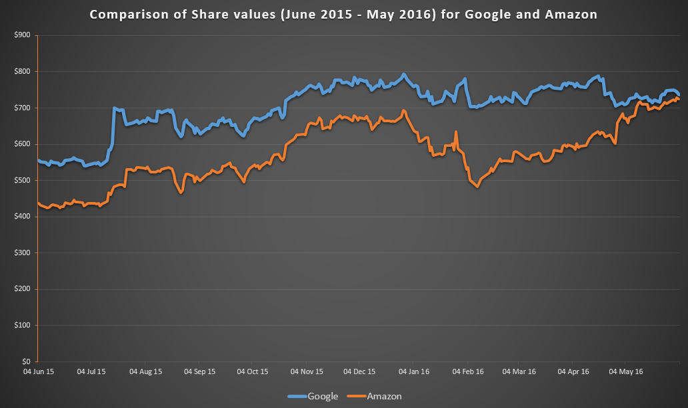
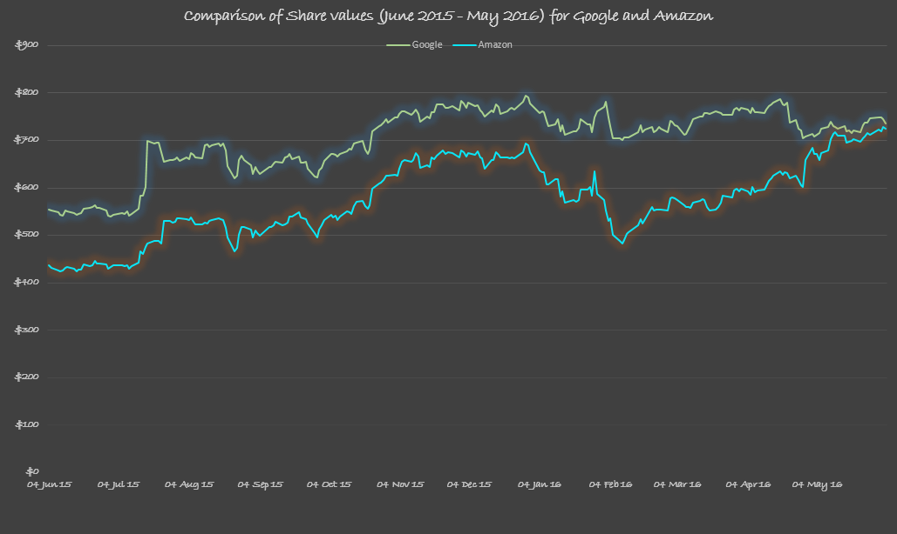
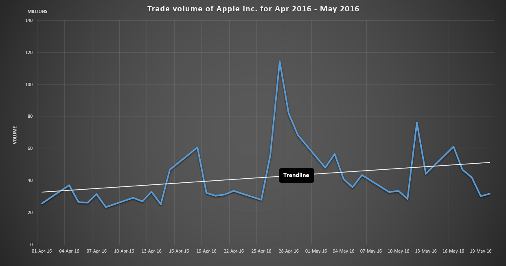
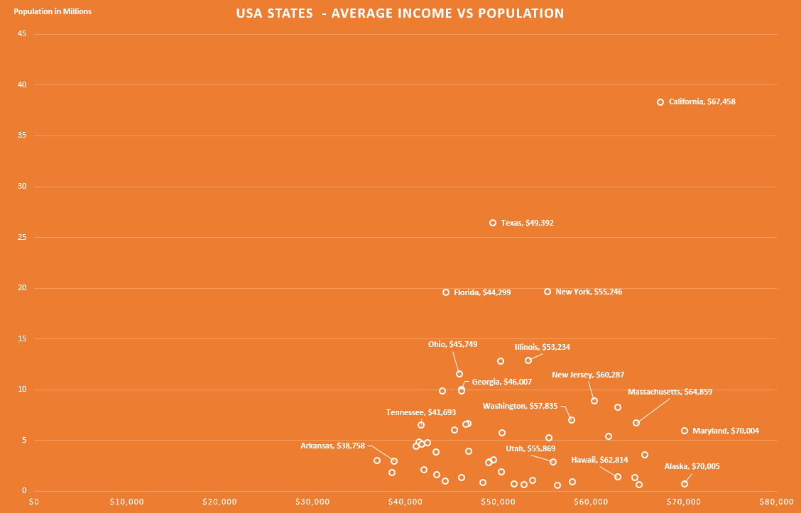
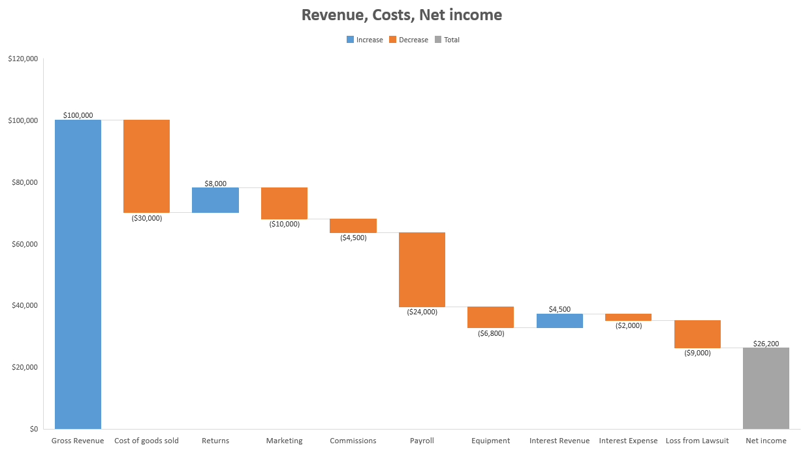
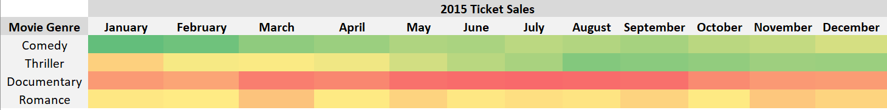
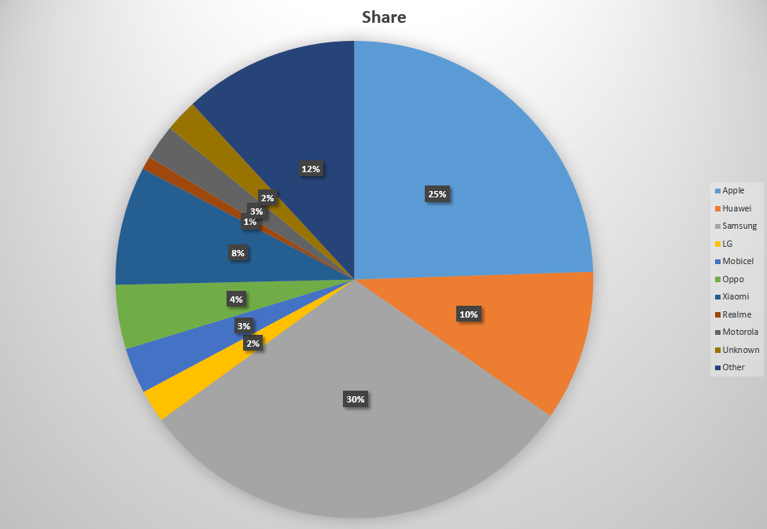

## About Excel
**Microsoft Excel** is a well-known spreadsheet developed by Microsoft for platforms like Windows, macOS, and 
various mobile operating systems. Excel has been the industry standards for spreadsheet since 1993 and commonly used for 
calculations, creating graphs and charts, and pivoting tables. Microsoft built **Visual Basic for 
Application** (also known as VBA, derived from the programming language Visual Basic) into Excel that allows you to write scripts 
that automates repeated tasks, this script often called a **macro** - a series of instructions. Excel is easy to use with 
graphics interface and useful documentations/hints, and the graphical representation of data and built-in mathematical formulas 
makes calculations straight-forward and simple. Additionly, Excel has substantial number of graphs and charts under the hood 
so that you can create some visualisations in minutes, providing you have the right data structure for chosen charts.  

*Note: All graphs/charts below are created using **Excel 2016**.*

## Best Practices
What steps could we take to make better data visualisations with excel?  
No matter what kind of tools you want to use, there are some questions you need to ask yourself before creating visualisations.  

<Accordion allowZeroExpanded="true">
  <AccordionItem>
    <AccordionItemHeading>
      <AccordionItemButton>
        1. Who are your audiences?
      </AccordionItemButton>
    </AccordionItemHeading>
    <AccordionItemPanel>
      Stakeholders comes from various areas with <b>different backgrounds</b> and it is likely they would not have the same mindset as you do, 
      you need to know who is your target audience in order to select and deliver key and relevant information. For stakeholders with 
      management roles, you might want to present data in a dashboard so they can have an overview of matters. Whereas for team 
      meetings you could use some charts to discuss specific problems. Complicated and fancy charts aren't always the best, be aware that 
      your audiences might need to spend extra time to learn what is going on.
    </AccordionItemPanel>
  </AccordionItem>
  
  <AccordionItem>
    <AccordionItemHeading>
      <AccordionItemButton>
        2. What problems are they facing?
      </AccordionItemButton>
    </AccordionItemHeading>
    <AccordionItemPanel>
      <b>Who</b> are you stakeholders? Researchers, students, professional staffs, or parents? An effective data visualisation should be able to answer 
      questions from stakeholders (could be yourself). Wihtout a good understanding of stakeholders' situation you might end up with 
      purposeless (and time-consuming) visualisations, so be sure you know <b>what you are aiming for</b>. 
    </AccordionItemPanel>
  </AccordionItem>

  <AccordionItem>
    <AccordionItemHeading>
      <AccordionItemButton>
        3. What type of data you have?
      </AccordionItemButton>
    </AccordionItemHeading>
    <AccordionItemPanel>
      Do you know what type of data you are working with? If it is <b>qualitative</b> data, can you classify it further to binomial, nominal, or ordinal? 
      For <b>quantitative</b> data, would you be able to identify whether it is continuous or discrete? Understand the type of data you have is key to 
      select the right visualisation.
    </AccordionItemPanel>
  </AccordionItem>

  <AccordionItem>
    <AccordionItemHeading>
      <AccordionItemButton>
        4. What information you want to send across?
      </AccordionItemButton>
    </AccordionItemHeading>
    <AccordionItemPanel>
      There are <b>more than 40</b> different types of charts/graphs nowadays and each of them are designed for specific types of data and purpose. 
      Knowing what information you want to deliver not only helps you in deciding what charts/graphs to use, but also assesses how well your visualisation 
      performs against stakeholders' problems.
    </AccordionItemPanel>
  </AccordionItem>
</Accordion>

Once we have answered each of the questions above, what specific actions could we take when making data visualisation in Excel?  

### Preparation of spreadsheets
To cook a dish you will allocate a substantial amount of time in the preparation of ingredients, whether you need to clean, rinse, slice, 
curing, freeze, decoat… Typically, the more time you spend in taking care of ingredients, the more flavour you get out of it. In making a visualisation 
you will also need to spend some time in preparation of the data. The table below listed some of common things you might want to take into account:  

<table>
  <thead>
    <tr>
      <th>Item</th>
      <th>Description</th>
    </tr>
  </thead>
  <tbody>
    <tr>
      <th>Data types</th>
      <td>There are over ten different data types available (Microsoft are expanding this to more than 100!) and Excel will interpret each type differently. 
        Having a suitable data type for each column help to maintain the consistence of column values and help you to avoid unsuitable graphs.
      </td>
    </tr>
    <tr>
      <th>Order of sheets</th>
      <td>It is common that you might have more than one spreadsheet in an Excel file, therefore, by ordering spreadsheets in a way that matches the order in your 
        process could help you locate information more easily and will also be beneficial to your collarators.
      </td>
    </tr>
    <tr>
      <th>Missing values</th>
      <td>Missing values could have a significant effect on your outputs, it typically occurs when a cell doesn't have a value (when it is required) or 
        the value is represented by <b>NA</b>, <b>NaN</b>, <b>Null</b> etc. Generally, you can <b>impute</b> missing values by column average, median, most 
        frequent value, and k-nearest neighbourhood (k-NN). However, missing value itself is a broad topic and there are different resolutions 
        depending on the value's data type, the relationship between data rows, and potentially other hidden issues.
      </td>
    </tr>
    <tr>
      <th>Clarity</th>
      <td>Check that your spreadsheet is easy to read and understand, for example, don't use complicated or irrelevant column names.</td>
    </tr>
    <tr>
      <th>Merge cells</th>
      <td><b>Avoid</b> merge cells if you can as this could discard some value and cause inconsistencies.</td>
    </tr>
    <tr>
      <th>Sorting</th>
      <td>Excel does not perform sorting for you when creating graphs/charts, so watch out for your column values if you need to present values in certain order.</td>
    </tr>
    <tr>
      <th>Macros</th>
      <td>Considering using macro if you need to perform some repeated tasks.</td>
    </tr>
    <tr>
      <th>Conditional formatting</th>
      <td>Use of conditional formatting could help you to identify <b>trends and patterns</b> within your spreadsheets by changing the visual appearance of cells.</td>
    </tr>
    <tr>
      <th>Data validation</th>
      <td>Data validation is a feature in Excel that validates users input for a cell. Use of data validation could help you avoid inconsistent data values.</td>
    </tr>
    <tr>
      <th>Protection</th>
      <td>If you're collarate with other people and do not wish them to change certain cells, you can 
        add <a href="https://support.microsoft.com/en-us/office/protect-a-worksheet-3179efdb-1285-4d49-a9c3-f4ca36276de6">protection</a> to the spreadsheet by lock cells up. 
        If your data comes from an external database then prefer connection to DB to ensure integrity rather than copy data out of DB.
      </td>
    </tr>
  </tbody>
</table>

### Select appropriate charts/graphs
You might have already noticed that Excel has a convenient built-in feature called <b>Recommended Charts</b> in the <b>Insert</b> section, as the name suggests 
it analyse and recommends charts to you based on the cells you have selected. If you want to make your own decision or wish to learn how to choose correct charts, 
check out the following resources: 

<LPWrap>
  <LPItem href="https://datavizcatalogue.com/">DATAVIZ CATALOGUE</LPItem>
  <LPItem href="https://www.data-to-viz.com/">DATA-TO-VIZ</LPItem>
  <LPItem video href="https://www.linkedin.com/learning/picking-the-right-chart-for-your-data/welcome?u=36248012">Picking the Right Chart For Your Data</LPItem>
  <LPItem href="https://dataviz.shef.ac.uk/blog/06/04/2020/chart-choice">Choosing Between Common Charts</LPItem>
  <LPItem href="https://dataviz.shef.ac.uk/blog/20/05/2020/Non-Numeric">Non-Numeric Data Visualisation</LPItem>
</LPWrap>   

### Making visualisations
After you have made your mind of which chart to use, it doesn't necessarily mean that you are done and can walk away with this visualisation. There 
are some details you have to watch out:

<Accordion allowZeroExpanded="true">
    <AccordionItem>
    <AccordionItemHeading>
      <AccordionItemButton>
        0. 10 seconds rule
      </AccordionItemButton>
    </AccordionItemHeading>
    <AccordionItemPanel>
      Before presenting your visualisation to audiences, do you think it is simple and precise enough for your audience to understand what message you are 
      trying to show within 10 seconds? It is not necessary that they need to fully understand all things in 10 seconds but should understand what you are 
      presenting without obstructions. Focus on what you try to deliver and maintain a balance between functions and design of your visualisations, always 
      remember that a fancy chart doesn't add any value if it is meaningless.
    </AccordionItemPanel>
  </AccordionItem>
  <AccordionItem>
    <AccordionItemHeading>
      <AccordionItemButton>
        I. Style / Theme / Size
      </AccordionItemButton>
    </AccordionItemHeading>
    <AccordionItemPanel>
      One great thing about Excel is it allows you to customise charts without too much effort. Once you have clicked a chart, you can either format or 
      design the chart using Chart Tools shown on the top menu section. Of course there is no restriction on what colour, font, or size etc.  you can choose 
      but do think about problems such as whether your chosen colours work well together, are fonts easy to read, is there a good contrast between foreground 
      and background colour, and the overall style consistency.   
      Here is a comparison between a good and a bad example of using different styles and themes.  
      Good:  
      
       
      Not so good:  
       
    </AccordionItemPanel>
  </AccordionItem>
  
  <AccordionItem>
    <AccordionItemHeading>
      <AccordionItemButton>
        II. Text / Title / Axis
      </AccordionItemButton>
    </AccordionItemHeading>
    <AccordionItemPanel>
      Text plays an important role in visualisation as it helps audiences make sense of charts and able to explain small details. Here are some tips to help 
      you in using texts:  
      <ul>
        <li>Numerical axis should start from 0</li>
        <li>Every chart should have a clear and relevant title (descriptive title)</li>
        <li>Change the unit of axis if text becomes cluttered, e.g. add thousands separate or convert to thousands, millions</li>
        <li>Avoid tilted axis labels, try a different chart or widen the chart if labels are too long</li>
        <li>Use data labels over gridlines</li>
        <li>Remove unnecessary axes would help you keep visualisation clean</li>
        <li>Consistent intervals!</li>
        <li>Avoid acronyms unless you have stated elsewhere</li>
      </ul>
    </AccordionItemPanel>
  </AccordionItem>

  <AccordionItem>
    <AccordionItemHeading>
      <AccordionItemButton>
        III. Label / Legend / Background
      </AccordionItemButton>
    </AccordionItemHeading>
    <AccordionItemPanel>
      This is another important aspect of the Excel charts, inappropriate use of legend and labels can be misleading.
      <ul>
        <li>Avoid distract background and gridlines in most of cases</li>
        <li>Delete legend if less than two metrics</li>
        <li>Prefer labels over legend for pie charts</li>
        <li>Avoid tilted axis labels</li>
        <li>Does the number of a pie chart add up to 100%?</li>
        <li>If there are only few varaibles on the x-axis, data labels might be better than axes</li>
      </ul>
    </AccordionItemPanel>
  </AccordionItem>

  <AccordionItem>
    <AccordionItemHeading>
      <AccordionItemButton>
        IV. Is it necessary?
      </AccordionItemButton>
    </AccordionItemHeading>
    <AccordionItemPanel>
      <blockquote><b>Tell a story, only highlight what you think is important</b></blockquote>
      This section listed some things that you might want to consider before you put it in production:  
      <b>3D</b> - Excel offers a 3-dimensional version for most of the charts, however, it is rare that people don't find it confusing and difficult to interpret.   
      <b>Dots</b> - When producing a line graph or a time series graph you often see graphs with dots at each time point, most of the time these dots don't add any extra value.  
      <b>Complex background</b> - Unsuitable background can be distracted and conflicting with your text and colours.  
      <b>Cropped axis</b> - cropped axis can cause confusion and misleading because not all information is visible to audiences.  
      <b>Colours</b> - When you have multiple lines in your graphs, is it worth to use different colour for each line or only colour the important one to make it stand out? 
    </AccordionItemPanel>
  </AccordionItem>
</Accordion>

  

## Some examples
This section presents some (good and bad) example charts made from Microsoft Excel 2016. Click on images to enlarge. 
You can download data used for these examples from the Linkedin 
course [Excel Data visualisation](https://www.linkedin.com/learning/excel-data-visualization-mastering-20-plus-charts-and-graphs/part-1-introduction?u=36248012).

### Bar/column chart

### Histograms

Left axis is removed and replaced by labels.

If your aim is to find the number of gym members with height in the range 180 - 185cm, highlight it should make some difference.

### Line chart

### Scatter plot

### Waterfall

### Heat maps

With numbers removed: 

### Pie chart

Labels or legends?

### Geospatial maps

A 3D map tour created using Excel:

## Going further
If you wish to explore more about Excel, it is worth to check the following resources:

<LPWrap>
  <LPItem video href="https://www.linkedin.com/learning/excel-data-visualization-mastering-20-plus-charts-and-graphs/part-1-introduction?u=36248012">Excel Data Visualisation</LPItem>
  <LPItem video href="https://www.linkedin.com/learning/paths/master-microsoft-excel?u=36248012">Learning Path Master Microsoft Excel</LPItem>
  <LPItem video href="https://www.linkedin.com/learning/excel-data-visualization-designing-custom-visualizations/part-2-introduction?u=36248012">Designing custom visualisations</LPItem>
</LPWrap>   

If you think about moving from Excel to Python or R, get started on our [Learning Path](https://dataviz.shef.ac.uk/docs/03/07/2020/LearningPath-Introduction).