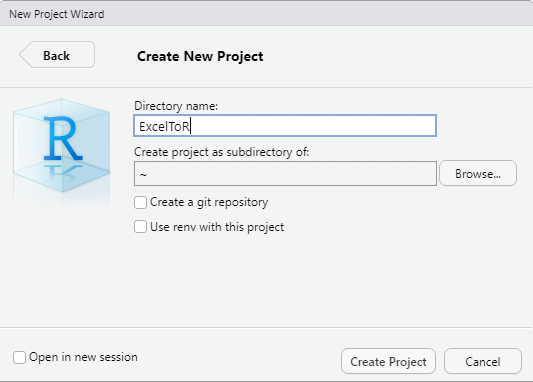
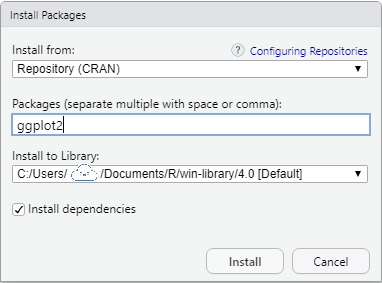
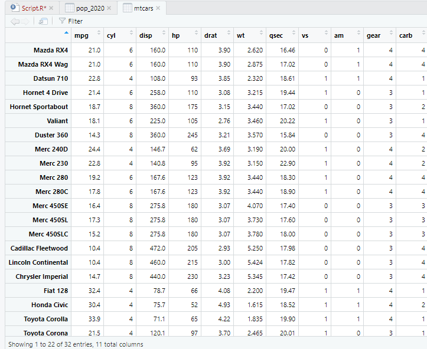
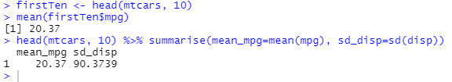
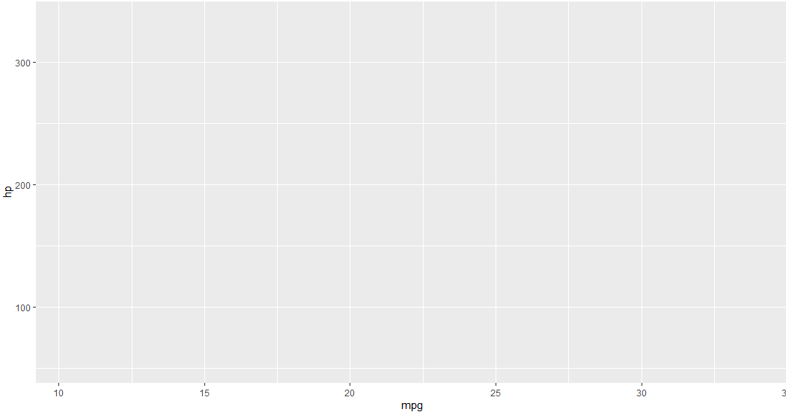
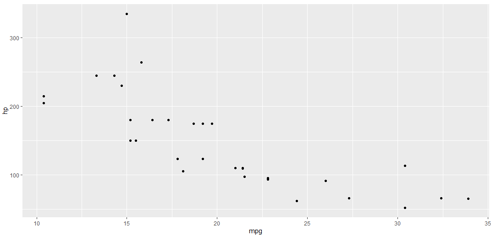
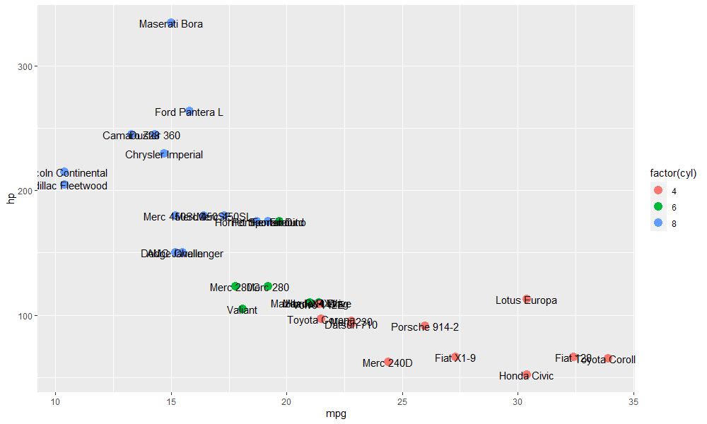
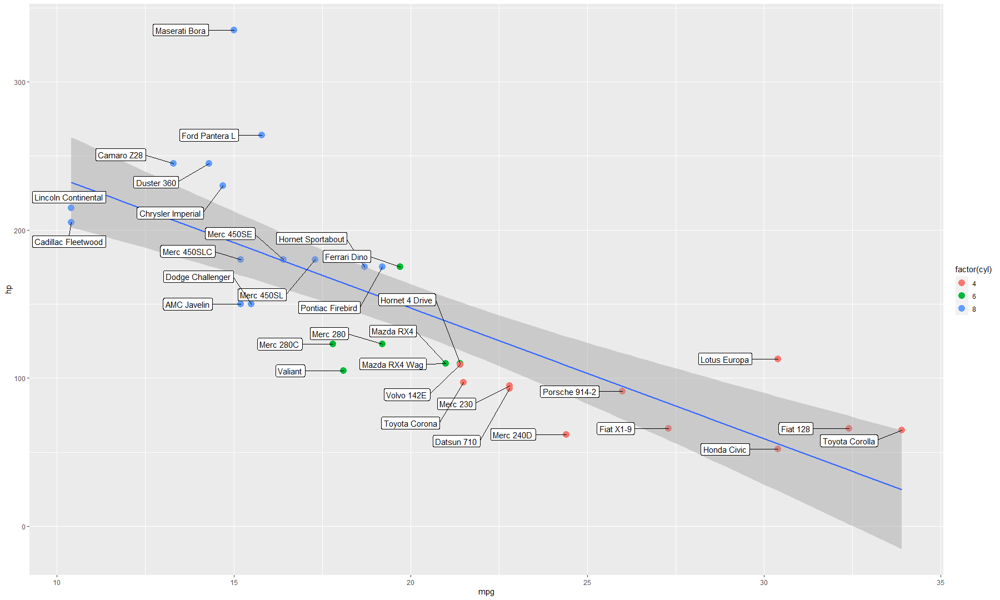
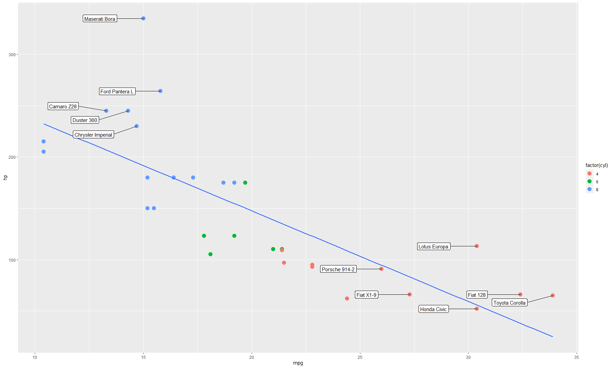
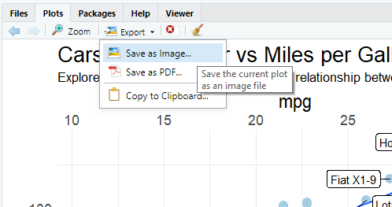

There are a lot of things to learn when you make a transition from Excel to R, especially if you haven't touched programming languages before, 
everything can be overwhelming and frustrating. Hopefully this article will help you make a smooth transition by helping you install and set 
up relevant software, introduce some fundamental concepts of R, and give some examples R codes for most commonly used functions in Excel. If you want a 
more structured and detailed introduction to R, see following resources:

<LPWrap>
	<LPItem href="https://cran.r-project.org/doc/manuals/r-release/R-intro.pdf">An Introduction to R</LPItem>
	<LPItem href="https://r4ds.had.co.nz/">R for Data Science</LPItem>
	<LPItem video href="https://www.linkedin.com/learning/learning-r-2/r-for-data-science?u=36248012">Learning R</LPItem>
</LPWrap>  

If you have any suggestions, please leave a comment below.

# Installation
R is a popular programming language and software environment that was originally designed for statistical purposes. Unlike Microsoft Excel you 
might have to pay a few hundred pounds for a one-time purchase or enter a yearly subscription of Microsoft 365 unless you have an academic email address, 
R is completely free and backed by a strong community. To install R, download and install the relevant version for your Operating System from either 
of two links below:  
	- https://cran.ma.imperial.ac.uk/
	- https://www.stats.bris.ac.uk/R/

Other than the base distribution of R, you will need to choose an IDE (integrated development environment) to work with R. I would suggest and recommend 
you to install and use [RStudio](https://rstudio.com/products/rstudio/download/) as it is by far the most popular IDE for R and I am going to use it 
for the content of this article.  

Once you have installed RStudio, you will see the following user interface: 


The area on the left that is highlighted in black is where you will write R codes, use terminals, and run any jobs. On the right hand side the panel 
is divided into two sections. The top section highlighted in red acts as a storage house for your current project. It stores a list of variables and 
datasets you have defined, shows a history of codes you have run before, and allows you to connect to external databases. The area highlighted in green 
contains five tabs. The **Files** tab is a file system that lists all directories and files under the current project; **Plots** displays any graphical 
images you have generated from the code on the left; Within the **Packages** tab you can manage R packages in your local environment and perform actions 
such as install, update, and delete. I would recommend you to use the **Help** tab regularly while you are learning R and/or RStudio as it provides a 
very useful manual and you can even browser packages reference without leaving RStudio. Finally, if you decided to explore more about generating web 
contents using RStudio, then you can preview the result in the **Viewer** tab.  

To get started, click the `File` button on the top left, then click `New Project`. In the pop-up window, choose `New Directory` then select `New Project` to 
create a new project, on the last step enter a directory name, in this case I have used `ExcelToR`. Note that if you have used *git* you can also set the 
directory to be a *Git repository* for tracking changes in your project/source code. 

  

Next, create a new R script either by clicking on the `File`, `New File` and `R Script` in orders, or press `Ctrl + Shift + N` on the keyboard.
 

 
There is one more thing I want you to do before creating visualisations - install packages **ggplot2** (a popular data visualisation tool),  **dplyr** (for 
data manipulation), and **readr** (fast file reading capability). There are two ways to do this:  

1. Go to the **Packages** tab on the right hand side then click on **install**. In the pop-up window as shown below, enter *ggplot2* and click install, make 
sure **Install dependencies** is checked! Then repeat this for other packages. 

2. Install the **[tidyverse](https://www.tidyverse.org/packages/)** package (it includes all packages mentioned above and more).

There are tons of packages out there and I encourage you to explore more tools suitable for your work.


 
Now you’re good to go to write R codes!  

*PS: I have included a copy of my R script [here](./Script.R).*


# Setup

## Load packages
In the first line of the script, let's write the following code to load the tidyverse package:
```r
# Load required libraries
library(tidyverse)

# OR the following if you installed packages separately
library(ggplot2)
library(dplyr)
library(readr)
```

## Load datasets
There are a number of ways you can load datasets, either local files, datasets hosted online, or through connections to databases. Here is how you would 
use the `read_csv()` function from the *readr* package to read csv files:

```r
# Read a local file (in the same directory of the script)
population_2020 <- read_csv('world_population2020.csv')

# Read dataset by url
pop_2020 <- read_csv('https://raw.githubusercontent.com/yld-weng/datasets/master/CC0-PublicDomain/world_population2020.csv')
```

There are also built-in datasets you can use, for these data you use `data` function to load datasets:
```r
data(mtcars)
```

On above, `<-` (left angle bracket with a dash) is called **assignment operator** meaning we assign objects on the right hand side to the variable name on the 
left hand side. Although you can choose whatever name you want it is usually recommended that variable names should not begin with numbers nor contain any 
special characters. All variables and data you have declared will be stored in the environment and should be listed in the environment tab on the right hand 
side of RStudio panel. If the variable name already exists, then the new assignment will override the existing object.  

**Tip**: You can use the shortcut `Alt + -` in Windows or `Option + -` in MacOS to insert the assignment operator. For more shortcuts, use `Alt + Shift + K` in Windows 
or `Option + Shift + K` in MacOS to open the shortcut menu in RStudio.  

**Get codes running**: There are several ways to run codes in RStudio,
1. On selected lines use `Ctrl + Enter` or click the **Run** button on the toolbar (top right of the code panel).
2. Use `Ctrl + Shift + Enter` to run the entire script.
3. Use `Ctrl + Shift + P` or the button next to the **Run** button for rerun previous code region.  

**Add comments**: Sometimes you want to add annotation/comments to your code, to do this add a hashtag before your comments:
```r
# This is a comment
# Next line is code
mtcars
```

To comment multiple existing lines, select lines then use `Ctrl + Shift + C`.

**Help**: If you are struggling with something, for example the uses of `sd()` function, type `help('sd')` 
or `??sd()` in the script and run and there will be relevant documentation appear in the *help* tab.

# Explore our data
For this section and beyond I am going to use two datasets declared on above, [mtcars](https://www.rdocumentation.org/packages/datasets/versions/3.6.2/topics/mtcars) (fuel 
consumption and other 10 aspects of car design for 32 cars, 1973-74 models) 
and [pop_2020](https://raw.githubusercontent.com/yld-weng/datasets/master/CC0-PublicDomain/world_population2020.csv) (2020 population data for 235 countries/regions around the world).  
To view data, you can either click it in the **environment** tab to get a nice and structured data frame similar to Excel (uneditable):



or simply insert the name of the dataset `mtcars` in a new line and run. The result will be displayed in the console:


You could also use functions like `head(dataset, n)` and `tail(dataset, n)` to get first or last n rows of the dataset:
```r
head(mtcars, 10)

tail(mtcars, 5)
``` 

In R (and just like any other programming languages) you can define your own functions, the 
syntax is as follows:
```r
functionName <- function(parameter1, parameter2=TRUE, ...) {
	Function Body
}
```
Parameters or arguments are optional and could have a default value (like parameter2), if 
the function body uses any parameters, then you should input them when calling the function. 
The return value of the function will be the last expression in the function body. Here is a 
function that returns the square of a number plus seven:
```r
myCalculation <- function(number) {
	square = number*number
	square + 7
}
```

Note that this is for demonstration and you can merge the function body into one line.

## Summary statistics
To get a summary statistics (minimum, maximum, median, quantile) of our data we can use the `summary` function:
```r
summary(mtcars)
```


Some functions from the *[base](https://stat.ethz.ch/R-manual/R-devel/library/base/html/00Index.html)* 
or *[stats](https://stat.ethz.ch/R-manual/R-devel/library/stats/html/00Index.html)* package (both 
installed by default, click on links to see available functions) use on single column:

```r
# standard deviation 
sd(mtcars$mpg)

# column mean
colMeans(mtcars$disp)

# minimum / maximum
min(mtcars$mpg)
max(mtcars$mpg)

# total of all column values
sum(mtcars$carb)
```

As you can see, we have a dollar sign `$` in between the name of the dataset and the name of the particular column. This dollar sign allows us to extract 
elements from a particular column. Alternatively, if you know the index (in R, Indexes are starting from 1) of the column name you can also 
do something like `sd(mtcars[1])`.

## Data manipulation 
**[Tidyverse](https://www.tidyverse.org)** has a powerful package *dplyr* designed for data manipulation and it works great with another package 
called *magrittr* (also part of tidyverse) that offers a set of operators (including the well known pipe operator `%>%`). Pipes generally improve code 
readability and help to reduce possible intermediate steps. For example, if we want the average miles per gallon for the first 10 cars, we could do 
something like this without pipe operator:
```r
firstTen <- head(mtcars, 10)
mean(firstTen$mpg)
```

With pipe operator (the *summarise* function comes from the *dplyr* package): 
```r
head(mtcars, 10) %>% summarise(mean_mpg=mean(mpg), sd_disp=sd(disp))
```



With the `%>%` operator we only need one line code and read everything from left to right in one go, and also have the ability to do a lot more with the *summarise* function.  

RStudio have prepared many useful [cheat sheets](https://rstudio.com/resources/cheatsheets/) for the *Tidyverse* package, I recommend you download them 
to help you quickly find the function you need to do your task. Here I will give examples for some commonly used *dplyr* functions. 
I also encourage you to check out *dplyr*'s [Reference](https://dplyr.tidyverse.org/reference/index.html) to 
get more information because I cannot cover all topics and aspects in this article. 

**Note**: Some *dplyr* functions returns a *tibble* rather than a dataframe. [*Tibble*](https://tibble.tidyverse.org/) can be described as enhanced dataframe.

### rename
To rename a column, you can do either of the following:
```r
# First way
rename(mtcars, 'miles/gallon'=mpg)

# Second way
mtcars %>% rename('miles/gallon'=mpg)

## multiple columns
mtcars %>% rename('miles/gallon'=mpg, 'horsepower'=hp)
```

The difference is that in the second way the dataset *mtcars* is pass on through the pipe therefore it is not required in the *rename* function.  

Let's also look at use only functions from the *base* package (installed by default, a part of R). If we know the index of particular column we want to rename:
```r
colnames(mtcars)[1] <- "miles/gallon"
```

Otherwise:

```r
colnames(mtcars)[colnames(mtcars) == 'mpg'] <- 'miles/gallon'
```

We can divide the code into chunks so we know how it works:

```r
# list all column names
colnames(mtcars)
# add condition to the list, find name equals mpg
colnames(mtcars)[colnames(mtcars) == 'mpg']

# assign new name to mpg 
colnames(mtcars)[colnames(mtcars) == 'mpg'] <- 'miles/gallon'
```

If you wish to rename multiple columns then you either need to repeat the step above multiple times or end up writing more complex codes, in this case 
*rename* function from *dplyr* would be a better solution.

### group_by
The `group_by` function is particularly useful when you need to aggregate data into some groups and then apply other manipulations.

```r
mtcars %>% group_by(cyl) %>% summarise(Total=n(), avgMpg=mean(mpg), hpSD=sd(hp))
```

In this case I have grouped cars by the number of cylinders and summarise each group by three attributes:
- `Total=n()` `n()` is a *dplyr* function that gives the number of observation for current the group
- `avgMpg=mean(mpg)` calculates the average mpg for the group
- `hpSD=sd(hp)` calculates the standard deviation of horsepowers for cars in the group


### select 
If you want a subset of original data, `select()` method comes in handy. To select columns, simply do:
```r
mtcars %>% select(mpg, hp, cyl, qsec)
```

You can also disregard some columns, in here `!` means **NOT** and `c()` represents a 
vector - a sequence of data elements:
```r
# select columns other than mpg and hp
mtcars %>% select(!c(mpg, hp))
```

Select column based on characters of names:
```r
# select column names starts with m and ends with g
mtcars %>% select(starts_with("m") & ends_with("g"))

# select column names contains specific characters
mtcars %>% select(contains("m"))
```

Select columns from A to B using `:` operator:
```r
mtcars %>% select(mpg:hp)
```

### filter
While the `select()` function have more to do with columns, the `filter()` function helps us to 
subset row data based on input conditions. For example, let's get all cars with *mpg* greater  
than 30:
```r
mtcars %>% filter(mpg > 30)
```


More ways to filter:

```r
# select rows with horsepower in between 150 and 200
mtcars %>% filter(hp > 150 & hp < 200)

# remove rows with mpg as NA
mtcars %>% filter(!is.na(mpg))
```

### mutate
The `mutate()` function make additions to your dataset while preserving the dataset from the 
last step. Here is an example of converting mpg to litres per a hundred kilometres by adding 
a new column: 
```r
mtcars %>% mutate('Litre/100km' = 235/mpg)
```


you could also replace calculation by a function: 
```r
toKm <- function(x) {
  235.214583/x
}

mtcars %>% mutate('Litre/100km' = toKm(mpg))
```

Since indexes changes when using the `mutate()` and the `mtcars` dataset use car names as
indexes I'm going to make a new column for car names and keep only Volvo and Honda cars. 
```r
mtcars %>% mutate(carName=rownames(mtcars)) %>% filter(str_detect(carName, 'Volvo|Honda'))
```

### arrange
This function allows you order (ascending by default) rows of a data frame by values 
selected columns:
```r
# order by mpg then by hp
mtcars %>% arrange(mpg, hp)
```

Descending order:
```r
mtcars %>% arrange(desc(mpg)) %>% arrange(desc(hp))
```

### slice 
This function is useful for selecting, removing and duplicating rows.
```r
# get first or last rows
mtcars %>% slice_head(n=3)
mtcars %>% slice_tail(n=3)

# get the 29th row
mtcars %>% slice(29)

# 5th to 20th rows
mtcars %>% slice(5:20)

# remove rows with negative sign
mtcars %>% slice(-(5:20))
```

### across
This function is use to apply the same manipulation to multiple columns, here is an example of 
calculating the median for each column:
```r
mtcars %>% summarise(across(,~median(.x)))

# with certain condition - column name contains m
mtcars %>% summarise(across(contains('m'), ~median(.x)))
```

Here `~` is a formula style syntax captures the code without evaluating it right away 
and `.x` refers to values in the column.

## Scatter plots
Drawing a graph with *ggplot2* is simple, let's continue with the *mtcars* dataset and see what 
can we get with scatter plots. Suppose we want to see the relationship between *mpg* and 
*hp* (horsepower), all you need to do is:
```r
ggplot(mtcars, aes(x=mpg, y=hp)) + geom_point()
```


<em>'Blank sheet' created by <i>ggplot()</i> function</em>

When you are using *ggplot2* all plots must begin with a call to the function `ggplot()`, within the 
function we specify the dataset and aesthetics for the plot. The `ggplot()` only creates 
a "blank sheet" but *ggplot2* provides *geom_* functions which allows us to add additional 
layers on top of this sheet. There are different *geom_* functions for different types of 
graphs and charts, see more details in the **[ggplot2 reference](https://ggplot2.tidyverse.org/reference/index.html)**. 
In this section we will be working on scatter plots but the steps are more or less identical in 
creating other types of graphs.  


*A simple scatter plot*

So to create a scatter plot we are using the *geom_point()* function, and the function takes a number 
of arguments that allows us to customise styles/aesthetics:
```r
# Controlling the transparency, size and stroke of points
ggplot(mtcars, aes(mpg, hp)) + geom_point(alpha=.8,size=3, stroke=.8)

# Add label to points, and colour points according to the cyl value
ggplot(mtcars, aes(mpg, hp, label=rownames(mtcars))) + geom_point(aes(color=factor(cyl)), size=4) + geom_text()
```


*Colouring points according to the cyl value, with labels* 

Make sure the function `geom_text()` is added to the plot otherwise, labels won't work. As you can see labels 
are not well spread so I have installed a new package **ggrepel**:

```r {5}
library(ggrepel)

ggplot(mtcars, aes(mpg, hp, label=rownames(mtcars))) + 
  geom_point(aes(color=factor(cyl)), size=4) +
  geom_label_repel(
    nudge_x = -1.5, 
    direction = "y", 
    hjust = 0.5, 
    force = 4, 
    size = 4
  )
```


Now the labels look much more clear. We could also add a regression line to the plot:
```r {3}
ggplot(mtcars, aes(mpg, hp, label=rownames(mtcars))) + 
  geom_point(aes(color=factor(cyl)), size=4) +
  geom_smooth(method=lm) +
  geom_label_repel(
    nudge_x = -1.5, 
    direction = "y", 
    hjust = 0.5, 
    force = 4, 
    size = 4
  ) 
```



Note that `geom_smooth()` is inserted before labels because new layers are sit on top previous 
layers. If you labels points base on certain conditions, you will also need to subset data:
```r
ggplot(mtcars, aes(mpg, hp, label=rownames(mtcars))) + 
  geom_point(aes(color=factor(cyl)), size=4) + 
  geom_smooth(method=lm, se=FALSE) +
  geom_label_repel(
    data=subset(mtcars, mtcars$mpg > 25 | mtcars$hp > 220), 
    aes(label = mtcars %>% filter(mpg > 25 | hp > 220) %>% rownames(mtcars)), 
    nudge_x = -2, 
    direction = "y", 
    hjust = 0.5, 
    force = 4, 
    size = 4
  ) 
```

  

It is most likely we need to add titles for the plot, to do this we can use the `labs()` function: 
```r
... +
labs(title = "Cars: Horsepower vs Miles per Gallon", 
			subtitle = "Explore fuel economy of popular cars via relationship 
			between mpg and horsepower. Cars are grouped by number of cylinders."
)
```

Once you are happy with the layout, you might start thinking about the theme 
and colours of your plot. **ggplot2** comes with some pre-designed [themes](https://ggplot2.tidyverse.org/reference/index.html#section-themes) 
such as `theme_classic()` and `theme_minimal()`, of course you can also use `theme()` to twerk individual settings. In 
addition, I am using `scale_color_brewer(palette="Paired")` to change colours for points. Here is my final scatter plot:
```r
# Aesthetics
ggplot(mtcars, aes(mpg, hp, label=rownames(mtcars))) + 
  geom_point(aes(color=factor(cyl)), size=4) + 
  geom_smooth(method=lm, se=FALSE) +
  geom_label_repel(
    data=subset(mtcars, mtcars$mpg > 25 | mtcars$hp > 220), 
    aes(label = mtcars %>% filter(mpg > 25 | hp > 220) %>% rownames(mtcars)), 
    nudge_x = -2, 
    direction = "y", 
    hjust = 0.5, 
    force = 4, 
    size = 4
  ) +
  labs(title = "Cars: Horsepower vs Miles per Gallon", 
       subtitle = "Explore fuel economy of popular cars via relationship 
       between mpg and horsepower. Cars are grouped by number of cylinders."
  ) + 
  theme_minimal() + scale_color_brewer(palette="Paired") +
  theme(legend.position = "bottom", text=element_text(size=17), legend.title=element_text(size = 18), plot.subtitle=element_text(size=13)) +
  scale_x_continuous(position = "top") + scale_y_reverse()

# I have also tweaked the axes 
```

  

To save a plot, click *Export* on the **Plots** panel then choose your preference.



Alternatively, use the `ggsave()`` function like this:
```r
ggsave("myImage.png", dpi=300, width = 24, height = 16, units = "cm")
```

By default, the function will save the last plot created using *ggplot2*.  

Hopefully, this is a useful section and, as mentioned before, there are functions 
for other types of graphs, for more information visit *[ggplot2](https://ggplot2.tidyverse.org/reference/index.html)*.

# Most used functions in Excel
This section will give some example R codes for common functions in Excel. Note that these 
codes are prepared in contrast with functions in Excel 2016, some functions might not work in 
other versions of Excel. Throughout the section the following dataset will be used:
```r
pop_2020 <- read_csv('https://raw.githubusercontent.com/yld-weng/datasets/master/CC0-PublicDomain/world_population2020.csv')
```


*A snapshot of the population data*


## Conditional formula
Although it is not possible to format data cells in R entirely like Excel, we can still apply conditions to data:
```r
# Get countries with population between 100k to 200k
pop_2020[(pop_2020$Population > 100000) & (pop_2020$Population < 200000),]
# Get countries with Fertility rate equals 2 or 1.1
pop_2020[(pop_2020$Fert.Rate == 2.0 | pop_2020$Fert.Rate == 1.1),]
```

There are more examples in the <a anchor href="#data-manipulation">Data manipulation</a> section, if you still curious 
about how to display a formatted data frame, packages like [pillar](https://pillar.r-lib.org/) and 
[formattable](https://www.rdocumentation.org/packages/formattable/) could be helpful.  

## VLOOKUP
The *VLOOKUP* function is versatile and has multiple usage. A common approach is that given a value *x*, 
return values in the *nth* column, which has value *x* in the same row. The following code returns 
the land area of China.
```r
pop_2020[pop_2020$Region=="China",]$Land_Area
```

## LEN
The *LEN* function simply returns the number of characters for the selected cell, in R you can use the 
`nchar()` to achieve the same result:
```r
nchar(pop_2020[pop_2020$Region=="China",]$Land_Area)
```

## COUNTA 
To count the number of non-empty rows for particular column, use `is.na()` for checking NA values and `sum()` 
for counting the total:
```r
sum(!is.na(pop_2020$Net_Migrants))
```

## SUMIF / AVERAGEIF
Get the total or average of particular column subject to some conditions:
```r
sum(pop_2020[pop_2020$Density < 10,]$Population)

mean(pop_2020[pop_2020$Density < 10,]$Population)
```

## LEFT / RIGHT
LEFT/RIGHT function allows you to extract a substring from a string, starting from the 
left-most/right-most character. You can use the `substr()` function in R which takes 
three arguments:
`substr(textToExtract, placeToStart, placeToFinish)`.

```r
myString <- "ExcelToR"
# first 5 characters
substr(myString, 1, 5)

# last 5 characters
substr(myString, nchar(myString)-5+1, nchar(myString))
```

## MIN / MAX
R has included `min()` and `max()` functions in the *base* package.

```r
max(pop_2020$Density)
min(pop_2020$Density)
```

## CONCATENATE
The *CONCATENATE* function is used to join strings/text from different cells. 

```r
# default for sep is " "
paste("Moving", "From", "Excel", "To", "R", sep = "!")
```

## COUNTIF
Count the number of rows based on some conditions:
```r
pop_2020 %>% drop_na(Net_Migrants) %>% count(Net_Migrants > 500000)
```

## INDEX 
Retrieve data elements based on an index is quite straightforward and very 
similar to Excel:
```r
# row 1
pop_2020[1,]

# column 4
pop_2020[,4]

# row 2 to 3, column 3
pop_2020[2:3,3]
```

# Summary of resources
- Download R from CRAN mirrors (UK): [Imperial](https://cran.ma.imperial.ac.uk/) or [Bristol](https://www.stats.bris.ac.uk/R/).
- Download [RStudio](https://rstudio.com/products/rstudio/download/)
- [Tidyverse](https://www.tidyverse.org/)
- Tidyverse [cheat sheets](https://rstudio.com/resources/cheatsheets/) 
- [ggplot2](https://ggplot2.tidyverse.org/) and its [reference](https://ggplot2.tidyverse.org/reference/index.html)
- Dplyr [reference](https://dplyr.tidyverse.org/reference/index.html)
- Datasets [mtcars](https://www.rdocumentation.org/packages/datasets/versions/3.6.2/topics/mtcars) and [world population 2020](https://raw.githubusercontent.com/yld-weng/datasets/master/CC0-PublicDomain/world_population2020.csv)
- A [copy](./Script.R) of R script for this articles
