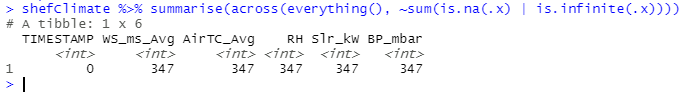

# Some Introduction
A major advantage of using R is that it is highly extensible, with a broad variety of packages designed for specific purposes available on the internet. An R package is a collection that puts together reusable functions, documentation describing these functions, and sometimes examples of datasets you can use out of the box. R itself includes a set of packages by default (typically called base packages), but there are many more fantastic packages online for you to investigate.  
  
In this blog post we will explore some of the most popular packages in R for data processing when producing visualisations.
The dataset I am going to use is the [Hadfield Green Roof 5-year dataset](https://doi.org/10.15131/shef.data.11876736.v1) I have found on **Online Research Data** ([ORDA](https://orda.shef.ac.uk), The University of Sheffield's data repository). This dataset contains five CSV files which collected Sheffield climate data, soil moisture in test beds, continuous cumulative rainfall runoff from the soil, continuous cumulative rainfall data, and whether the runoff measurements are valid, over the 5-years period from 2011 to 2016.  
  
Before you continue, I will assume you already have some experience with R and are familiar with core concepts like data types, vector and list, data frame, functions, and plot, etc., and preferably have used [RStudio](https://rstudio.com/) before. If you are new to R then you might also find this <Link to="/blog/01/10/2020/moving-from-excel-to-r">introductory blog post</Link> useful.  

You can find all the source code in [this Github repository](https://github.com/researchdata-sheffield/R-Series). If you have any suggestions or want me to include any particular package feel free to [send me an email](mailto:y.weng@sheffield.ac.uk)!  

I will first introduce you to *Tidyverse* which is a collection of many popular packages in R providing extensive functionality for working with data. Then I will briefly introduce some other packages that might be helpful depending on your situations.


# Tidyverse
I would refer to Tidyverse as a library rather than a package because it contains a collection of highly usable packages and *"all packages share an underlying design philosophy, grammar, and data structure"*. This library is very versatile as each package specialises in a certain area which tackles most of the issues you will encounter when working with datasets. On the other hand these packages also work well with each other seamlessly, and you can certainly use pipe operators to create a chain for your workflow. If you are looking for packages for essential data pre-processing and data visualisation then this library could ideally be your first choice, and you can always use it only for data pre-processing and choose a different visualisation package of your preference. A list of some packages from the library:  
 - [ggplot2](https://ggplot2.tidyverse.org/) (data visualisation)
 - [readr](https://readr.tidyverse.org/) (data import)
 - [dplyr](https://dplyr.tidyverse.org/) (data transformation)
 - [tidyr](https://tidyr.tidyverse.org/) (data processing / manipulation)
 - [lubridate](https://lubridate.tidyverse.org/) (Date manipulation)

For each package there is an associate **cheat sheet** and you can find it in the link provided. I recommend saving a copy of each as they provide both text and graphical description for most of the functions so you can find the function you need more quickly and get new ideas.  

The rest of this section will be some practical examples using Tidyverse packages.

## Load datasets
In the process of reading Sheffield 5-year climate data from University's data repository, I'm using the `read_csv` function from the *readr* package:  

```r
shefClimate <- read_csv("https://figshare.shef.ac.uk/ndownloader/files/25647497")
```

Notice that you can fetch data directly from Figshare using the download link. To get the link for your chosen data, hover your mouse on the dataset, then right click *download* and select *Copy Link Location* or *Copy link address* depending on your browser.  


*Read Sheffield Climate data*  

From the output we can see the `TIMESTAMP` column is of type character, what if we require it to be 
type `<datetime>`? To do this we can pass a list of types to the parameter `col_types` for the function to parse:  

```r
shefClimate <- read_csv(
  "https://figshare.shef.ac.uk/ndownloader/files/25647497",
  col_types = cols(
    col_datetime("%d-%b-%Y %H:%M:%S"),
    col_double(),
    col_double(),
    col_double(),
    col_double(),
    col_double()
  )
)
```  
  
  
You might have correctly observed that outputs in the console are labelled as **tibble** - a package (also a part of the Tidyverse) for manipulating and displaying data frames and it has become the default output for most of the Tidyverse functions that deal with data frames. By default a large tibble will only show the first 10 rows, to print more results (say 20) use `datasetName %>% print(n=20)`. With `%>%` being called as pipe operator, if we have `x %>% f(y)` this is equivalent to `f(x, y)`, back to printing rows on above it would mean taking the dataset *x* then printing *y* rows and the function `f` will be `print()` in this case.  

  


If you cannot find the right function for your dataset types, *readr*'s cheat sheet has provided some useful alternative packages on the top left.


## Missing values
The next thing will be to check existence of missing values or null values whether they are due to loss of information or on purpose. We can use the `summarise()` function to count how many null values in each column:  

```r
# apply function sum() to count number of NAs for all columns selected with everything()
shefClimate %>% summarise(across(everything(), ~sum(is.na(.x) | is.infinite(.x))))
```  



As you can see there are three functions in the code shown formerly. The `summarise()` function produces one or more rows of summary statistics specified by you for each combination of grouping variables (if no groups specified, it would apply to the whole dataframe); the `across()` function apply the same transformation to selected columns and the `everything()` function selects all variables in the data frame. Putting it all together, we select all columns using `everything()` and apply `sum()` function to all columns using `across()` and finally display the result with `summarise()`. For the same result using base packages you can equally use:  

```r
apply(shefClimate, 2, function(x) sum(is.na(x) | is.infinite(x)))
```

From the output presented above it appears that the column `TIMESTAMP` doesn't have any null values, let's take a look at the list of timestamp whilst other columns have been null:  

```r
shefClimate %>% filter(across(!TIMESTAMP, ~is.na(.x)))
```


The `filter()` comes convenient as it allows you to subset the dataframe and keep only rows that satisfy the condition you have passed within the function.  

Examine it is indeed the problem of timestamp by checking digits for minutes and seconds:  

```r
# The minute() and the second() functions are included in the lubridate package
shefClimate %>% filter(minute(TIMESTAMP) != '0' | second(TIMESTAMP) != '0')
```

And we get the same output! Which means null values do not occur at the beginning of the hour so we can go ahead to discard them.  

To remove these null values, I can either use `drop_na()` from *tidyr* or use the `filter()` function:  

```r
# Method 1
shefClimateNoNA <- shefClimate %>% drop_na()

# Method 2
shefClimateNoNA <- shefClimate %>% filter(across(everything(), ~ !(is.na(.x) | is.infinite(.x))))
```

Now we should check whether all hourly data exists in the dataset. My approach is to generate a sequence of hours between the start date and the end date of the dataset, then check if all timestamps in the dataset exists in the sequence:  

```r
allHours <- seq(
  from = as_datetime("2011-03-01", tz = "UTC"),
  to = as_datetime("2016-02-29 23:00:00", tz = "UTC"),
  by = "hour"
)
 
missingHours <- allHours[!(allHours %in% shefClimate$TIMESTAMP)]
missingHours
```
  

  
It turns out there are over **350** missing hours so let's try to eliminate the gaps!  
  
To make the dataset complete I pursued a straightforward approach. For a missing hour if the previous hour exists (which means there is data available) then use the same data, otherwise use the computed average of the same hour from other years.  

```r
imputeClimateData <- function(myDataset, missingHours) {
  newDataset = myDataset
  
  for (missingHour in missingHours) {
    lastHour = missingHour - 3600
    
    if (lastHour %in% myDataset$TIMESTAMP) {
      # add missing hour from last hour
      lastHourData <- myDataset %>% filter(TIMESTAMP == lastHour)
      lastHourData$TIMESTAMP = as_datetime(missingHour, origin="1970-01-01", tz = "UTC")
      
      # add a new row to the dataset
      newDataset <- newDataset %>% add_row(lastHourData)
      
    } else {
      # add missing hour using other year's average
      missingHourCT <- as_datetime(missingHour, origin="1970-01-01", tz = "UTC")
      
      month = month(missingHourCT) 
      day = day(missingHourCT)
      hour = hour(missingHourCT)
      
      allYearsAvg <- myDataset %>% 
        filter(
          hour(TIMESTAMP) == hour & 
          day(TIMESTAMP) == day & 
          month(TIMESTAMP) == month
        ) %>%
        summarise(across(everything(), ~ mean(.x)))
      
      allYearsAvg$TIMESTAMP = missingHourCT
      
      myDataset <- myDataset %>% add_row(allYearsAvg)
    }
  }
  # arrange/sort the dataset by date in ascending order
  return(newDataset %>% arrange(TIMESTAMP))
}

while (length(missingHours) != 0) {
  shefClimateNoNA <- imputeClimateData(shefClimateNoNA, missingHours)
  missingHours <- allHours[!(allHours %in% shefClimateNoNA$TIMESTAMP)]
}

# check if all hours exists
allHours[!(allHours %in% shefClimateNoNA$TIMESTAMP)]

# output: POSIXct of length 0
```  

# Other packages
Over the time there will be more great packages coming out so if you have any suggestions or want to include any particular package in this section feel free to [send me an email](mailto:y.weng@sheffield.ac.uk).

## reshape2
The *[reshape2](https://cran.r-project.org/web/packages/reshape2/reshape2.pdf)* is a small yet powerful package written by the author of *Tidyverse* focused on conversion of data structures. For example, one use case is that you have a table with many columns (wide format) but you can use the `melt()` function (one of the only two functions) to convert it as a long format so that each observation has multiple rows in the table, and vice versa. The conversions are extremely useful when you use a visualisations package that requires data to be in a particular structure. Although *reshape2* is in the *retired lifecycle* meaning no additional features will be made in the future and contributors recommended the public to use *tidyr*, you can still go ahead to install it and use it effortlessly.  


# What's next
The <Link to="/blog/20/01/2021/Static-Visualisations-In-R">second part of this series</Link> will be on static visualisations and we'll be exploring packages such as *ggplot2* (a part of Tidyverse), *rgl*, and *Lattice*. 

