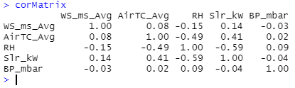
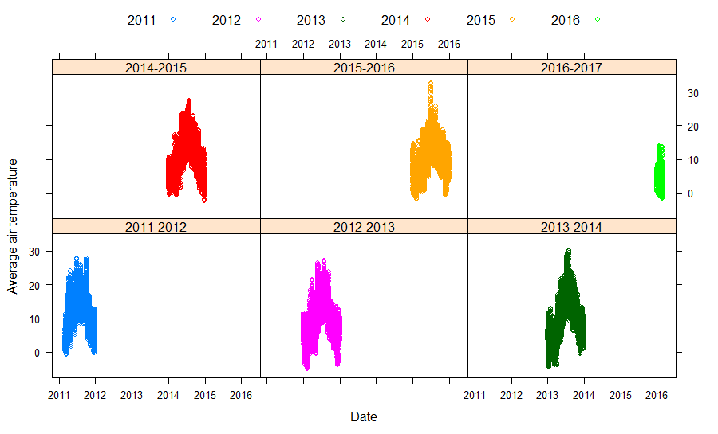
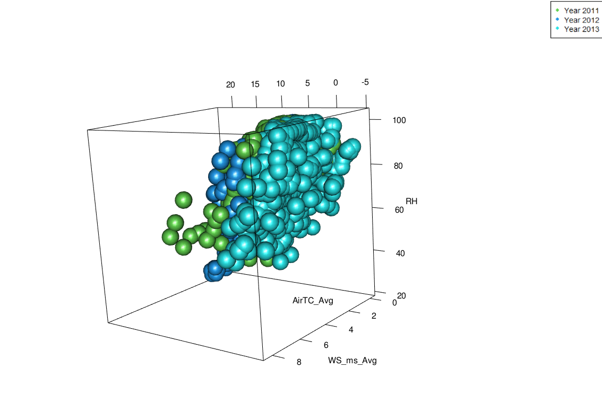
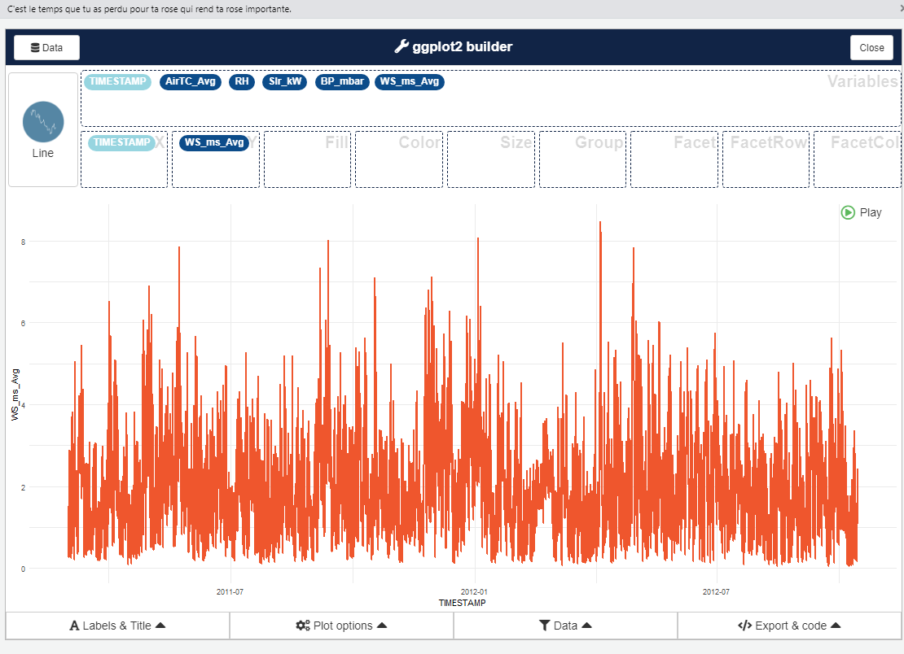

# Some Introduction
A major advantage of using R is that it is highly extensible, with a broad variety of packages designed for specific purposes available on the internet. An R package is a collection that puts together reusable functions, documentation describing these functions, and sometimes examples datasets you can use out of the box. R itself includes a set of packages by default (typically called base packages), but there are many more fantastic packages online for you to investigate.  
  
In this blog post we will explore some of the most popular packages in R for **static visualisations**.
The dataset I am going to use is the [Hadfield Green Roof 5-year dataset](https://doi.org/10.15131/shef.data.11876736.v1) I have found on **Online Research Data** ([ORDA](https://orda.shef.ac.uk), The University of Sheffield's data repository). This dataset contains five CSV files which collected Sheffield climate data, soil moisture in test beds, continuous cumulative rainfall runoff from the soil, continuous cumulative rainfall data, and whether the runoff measurements are valid, over the 5-years period from 2011 to 2016.  
  
Before you continue, I will assume you already have some experience with R and are familiar with core concepts like data types, vector and list, data frame, functions, and plot, etc., and preferably have used [RStudio](https://rstudio.com/) before. If you are new to R then you might also find this <Link to="/blog/01/10/2020/moving-from-excel-to-r">introductory blog post</Link> useful.  

You can find all the source code in [this Github repository](https://github.com/yld-weng/hadfield-green-roof). If you have any suggestions or want me to include any particular package feel free to [send me an email](mailto:y.weng@sheffield.ac.uk)!


# Tidyverse
I would refer to Tidyverse as a library rather than a package because it contains a collection of highly usable packages and *"all packages share an underlying design philosophy, grammar, and data structure"*. This library is very versatile as each package specialises in a certain area which tackles most of the issues you will encounter when working with datasets. On the other hand these packages also work well with each other seamlessly, and you can certainly use pipe operators to create a chain for your workflow. If you are looking for packages for essential data pre-processing and data visualisation then this library could ideally be your first choice, and you can always use it only for data pre-processing and choose a different visualisation package of your preference. A list of some packages from the library:  
 - [ggplot2](https://ggplot2.tidyverse.org/) (data visualisation)
 - [readr](https://readr.tidyverse.org/) (data import)
 - [dplyr](https://dplyr.tidyverse.org/) (data transformation)
 - [tidyr](https://tidyr.tidyverse.org/) (data processing / manipulation)
 - [lubridate](https://lubridate.tidyverse.org/) (Date manipulation)

For each package there is an associate **cheat sheet** and you can find it in the link provided. I recommend saving a copy of each as they provide both text and graphical description for most of the functions so you can find the function you need more quickly and get new ideas.  

The rest of this section will be some practical examples using Tidyverse packages.

## Load datasets
In the process of reading Sheffield 5-year climate data from University's data repository, I'm using the `read_csv` function from the *readr* package:  

```r
shefClimate <- read_csv("https://figshare.shef.ac.uk/ndownloader/files/25647497")
```

Notice that you can fetch data directly from Figshare using the download link. To get the link for your chosen data, hover your mouse on the dataset, then right click *download* and select *Copy Link Location* or *Copy link address* depending on your browser.  


*Read Sheffield Climate data*  

From the output we can see the `TIMESTAMP` column is of type character, what if we require it to be 
type `<datetime>`? To do this we can pass a list of types to the parameter `col_types` for the function to parse:  

```r
shefClimate <- read_csv(
  "https://figshare.shef.ac.uk/ndownloader/files/25647497",
  col_types = cols(
    col_datetime("%d-%b-%Y %H:%M:%S"),
    col_double(),
    col_double(),
    col_double(),
    col_double(),
    col_double()
  )
)
```  
  
  
You might have correctly observed that outputs in the console are labelled as **tibble** - a package (also a part of the Tidyverse) for manipulating and displaying data frame and it has become the default output for most of the Tidyverse functions that deals with data frames. By default a large tibble will only show the first 10 rows, to print more results (say 20) use `datasetName %>% print(n=20)`. With `%>%` being called as pipe operator, if we have `x %>% f(y)` this is equivalent to `f(x, y)`, back to printing rows on above it would mean taking the dataset *x* then printing *y* rows and the function `f` will be `print()` in this case.  

  


If you cannot find the right function for your dataset types, *readr*'s cheat sheet has provided some useful alternative packages on the top left.


## Missing values
The next thing will be to check existence of missing values or null values whether they are due to loss of information or on purpose. We can use the `summarise()` function to count how many null values in each column:  

```r
# apply function sum() to count number of NAs for all columns selected with everything()
shefClimate %>% summarise(across(everything(), ~sum(is.na(.x) | is.infinite(.x))))
```  


As you can see there are three functions in the code shown formerly. The `summarise()` function produces one or more rows of summary statistics specified by you for each combination of grouping variables (if no groups specified, it would apply to the whole dataframe); the `across()` function apply the same transformation to selected columns and the `everything()` function selects all variables in the data frame. Putting it all together, we select all columns using `eveything()` and apply `sum()` function to all columns using `across()` and finally display the result with `summarise()`. For the same result using base packages you can equally use:  

```r
apply(shefClimate, 2, function(x) sum(is.na(x) | is.infinite(x)))
```

From the output presented above it appears that the column `TIMESTAMP` doesn't have any null values, let's take a look at the list of timestamp whilst other columns have been null:  

```r
shefClimate %>% filter(across(!TIMESTAMP, ~is.na(.x)))
```


The `filter()` comes convenient as it allows you to subset the dataframe and keep only rows that satisfy the condition you have passed within the function.  

Examine it is indeed the problem of timestamp by checking digits for minutes and seconds:  

```r
# The minute() and the second() functions are included in the lubridate package
shefClimate %>% filter(minute(TIMESTAMP) != '0' | second(TIMESTAMP) != '0')
```

And we get the same output! Which means null values does not occurred at the beginning of the hour so we can go ahead to discard them.  

To remove these null values, I can either use `drop_na()` from *tidyr* or use the `filter()` function:  

```r
# Method 1
shefClimateNoNA <- shefClimate %>% drop_na()

# Method 2
shefClimateNoNA <- shefClimate %>% filter(across(everything(), ~ !(is.na(.x) | is.infinite(.x))))
```

Now we should check whether all hourly data exists in the dataset. My approach is to generate a sequence of hours between the start date and the end date of the dataset, then check if all timestamps in the dataset exists in the sequence:  

```r
allHours <- seq(
  from = as.POSIXct("2011-03-01", tz = "UTC"),
  to = as.POSIXct("2016-02-29 23:00:00", tz = "UTC"),
  by = "hour"
)

missingHours <- allHours[!(allHours %in% shefClimate$TIMESTAMP)]
missingHours
```
  

  
It turns out there are over **350** missing hours so let's try to eliminate the gaps!  
  
To make the dataset complete I pursued a straightforward approach. For a missing hour if the previous hour exists (which means there is data available) then use the same data, otherwise use the computed average of the same hour from other years.  

```r
imputeClimateData <- function(myDataset, missingHours) {
  newDataset = myDataset
  
  for (missingHour in missingHours) {
    lastHour = missingHour - 3600
    
    if (lastHour %in% myDataset$TIMESTAMP) {
      # add missing hour from last hour
      lastHourData <- myDataset %>% filter(TIMESTAMP == lastHour)
      lastHourData$TIMESTAMP = as.POSIXct(missingHour, origin="1970-01-01", tz = "UTC")
      
      # add a new row to the dataset
      newDataset <- newDataset %>% add_row(lastHourData)
      
    } else {
      # add missing hour using other year's average
      missingHourCT <- as.POSIXct(missingHour, origin="1970-01-01", tz = "UTC")
      
      month = month(missingHourCT) 
      day = day(missingHourCT)
      hour = hour(missingHourCT)
      
      allYearsAvg <- myDataset %>% 
        filter(
          hour(TIMESTAMP) == hour & 
          day(TIMESTAMP) == day & 
          month(TIMESTAMP) == month
        ) %>%
        summarise(across(everything(), ~ mean(.x)))
      
      allYearsAvg$TIMESTAMP = missingHourCT
      
      myDataset <- myDataset %>% add_row(allYearsAvg)
    }
  }
  # arrange/sort the dataset by date in ascending order
  return(newDataset %>% arrange(TIMESTAMP))
}

while (length(missingHours) != 0) {
  shefClimateNoNA <- imputeClimateData(shefClimateNoNA, missingHours)
  missingHours <- allHours[!(allHours %in% shefClimateNoNA$TIMESTAMP)]
}

# check if all hours exists
allHours[!(allHours %in% shefClimateNoNA$TIMESTAMP)]

# output: POSIXct of length 0
```  
  
  
## ggplot2
The *ggplot2* package is probably the most popular data visualisation package by [downloads](https://ipub.com/dev-corner/apps/r-package-downloads/). There has been a lot of debate and comparison between the base plotting system and *ggplot2* going on but I personally like *ggplot2* more because:  
 - it allows much more customisation
 - has unique *ggplot* layers which effectively decompose chart elements into functions and we can add layers on top of the existing chart 
 - and aesthetically pleasing
 
In general, if you mostly plot graphs for data exploring then the basic plotting will be sufficient. Whereas if your audiences are beyond yourself then *ggplot2* works better. One thing to note is that *ggplot2* doesn't support 3D plot at the moment. If you would like to know about difference between them, check out this [Comparing ggplot2 and R Base Graphics](https://flowingdata.com/2016/03/22/comparing-ggplot2-and-r-base-graphics/) guide on **FLOWINGDATA**.  
       
Most of the time we seek answers from the dataset we are approching, and it is common we will have more questions pop up when examining charts for the dataset. I have prepared some questions to get started:   
1. What is the difference in average temperature between consecutive winters (usually 20 Dec to 20 March, but the dataset is ended on 29 Feb 2016)
2. Correlation between each pair of variables  
3. Density distribution of each variable  
4. FAO-56 Penman-Monteith method
5. Is there a difference in VWC (soil moisture) between top, middle, bottom probe for testbed 1?  
   
There are many functions available within the *ggplot2* package, [click here](https://ggplot2.tidyverse.org/) for the cheat sheet to see full options. There will be some pictures in this section, and I'll leave it to you to draw conclusions. It is also worth noting that you will find many specialised data visualisation packages depends on the *ggplot2* package and built their functions around the ggplot2 object, therefore, a reasonable understanding of this package will add extra benefit when you explore other packages.  
  

### Bar chart
To get the date range out of the dataset, I'm using the `between()` function from the *dplyr* package. I'm also using `|` (the OR operator) for filtering multiple date ranges:  

```r
shefClimateNoNA %>%
  filter(
    between(TIMESTAMP, as.POSIXct("2011-12-20"), as.POSIXct("2012-03-20")) |
    between(TIMESTAMP, as.POSIXct("2012-12-20"), as.POSIXct("2013-03-20")) |
    between(TIMESTAMP, as.POSIXct("2013-12-20"), as.POSIXct("2014-03-20")) |
    between(TIMESTAMP, as.POSIXct("2014-12-20"), as.POSIXct("2015-03-20")) |
    between(TIMESTAMP, as.POSIXct("2015-12-20"), as.POSIXct("2016-02-29"))
  )
```  

Since there isn't any variables that allows us to group dates in a convenient way, I'm going to create a new column called `season` for indicating which winter season each timestamp belongs to:  
  
```r 
... %>% 
  mutate(
    season = if_else(
      month(TIMESTAMP) %in% c(11, 12),
      paste(year(TIMESTAMP), year(TIMESTAMP)+1, sep = "-"),
      paste(year(TIMESTAMP)-1, year(TIMESTAMP), sep = "-")
    )
  )  
```  
  
The `mutate()` function adds the new variable/column `season` specified within the bracket to the dataset and each row value is conditioned on which month that timestamp belongs to. The `paste()` function allows us to join multiple strings using the separator specified at the end of the function.  


That's great! Now we can group dates by seasons and calculate average temperature for each season!

```r
... %>%
  group_by(season) %>%
  select(-TIMESTAMP) %>%
  summarise(across(everything(), ~mean(.x))) 
```

  

From the tibble shown above we can calculate the difference without an effort so I won't carry out the calculations here, but do remember that we don't have data beyond 29th Feb 2016. Instantly I can use *ggplot2* to visualise the final outcome:  

```r
... %>%
  ggplot(data = ., aes(x = season, y = AirTC_Avg)) + 
  geom_col(aes(fill = season)) + 
  scale_fill_brewer(palette = "Blues") +
  labs(
    x = "Winter season", 
    y = "Average air temperature",
    title = 
      "Average air temperature for each winter season from 2011 - 2016",
    subtitle = 
      "NOTE: Winter period is typically 20 Dec - 20 Mar (next year)
      the final date of this dataset is 29 Feb 2016"
  ) +
  theme(
    plot.title = element_text(vjust = 1),
    plot.subtitle = element_text(size = 8, vjust = 4)
  )
```


### Tile plane  
The *stats* package has the `cor()` function for computing correlation:  

```r
corMatrix <- shefClimateNoNA %>% 
  select(-TIMESTAMP) %>% 
  cor() %>% 
  round(., 2)

corMatrix
```

  

However, as you can see we are getting a matrix with row indexes being variable values and that's not what we want for `ggplot()` plus `geom_tile()` which requires three columns - two for the combinations of variables and the third column being the correlation value. So here are some transformations:  
  
```r
corVars <- rownames(corMatrix)

corMatrix %>% 
  as_tibble() %>% 
  # decrease the number of columns
  # add more rows
  pivot_longer(       
    cols=1:5, 
    names_to = "var1", 
    values_to = "value"
  ) %>% 
  mutate(var2 = rep(corVars, each = 5)) %>%
  relocate(var2, .after = var1)
```  

  

You can also install the **reshape2** package commonly used to transform data into desire structures, but I will stick to functions within *Tidyverse* in this section to introduce you as many functions as possible.  

Now plot the graph:  

```r
... %>%
  ggplot(
    aes(x = var1, y = var2, fill = value)
  ) + 
  geom_tile(color="white", size=0.05) +
  scale_fill_gradient(low = "#fedf00", high = "#009640") + 
  geom_text(aes(label = round(value, 1)))
```

  

  

### Density plot
To produce a density plot for each variable I simply repeat the function for each variable:

```r
plot1 <- ggplot(data = shefClimateNoNA) + 
  geom_density(
    aes(x = WS_ms_Avg), fill = "#fedf00", color = "#fedf00", alpha = 0.8
  ) + 
  labs(x = "Average windspeed (m/s)", title = "Density plot for Average windspeed (m/s)")

# repeat for other variables
plot2 <- ...

plot3 <- ...

plot4 <- ...

plot5 <- ...
```

Then use the *gridExtra* package to arrange plots side by side:

```r
library(gridExtra)

grid.arrange(plot1, plot2, plot3, plot4, plot5, ncol=2)
```


 
### 2D-bin
Move on to the FAO-56 Penman-Monteith method established to approximate the sum of water evaporation and transpiration from a surface area. I'm not an expert in Hydrology but thank to (Berretta, Poë and Stovin, 2014) and (Zotarelli, 2009) I was able to grasp some details in the formula and come up with the following (correct me if you discover a mistake!):  

$$
\frac{0.408T(3.6Sr) + 0.066\frac{900}{24(T + 273)}(W(P - HP))}{T + 0.066(1 + 0.34W)}
$$

Where <br/>  
     
 $W$ = Wind speed (m/s)  
 $T$ = Average air temperature (C)  
 $Sr$ = Solar Radiation (MJ/m2/h)  
 $P$ = Pressure (kPa)  
 and $H$ = Relative Humidity (expressed in fraction)

In the actual calculation I have made some adjustments to match the correct units:
 - Convert solar radiation from kilowatt to joules we need 1W = 1J/s => 1kw = 1000J/s = 60,000J/min 
  = 3,600,000J/hour = 3.6MJ/hour
 - Convert pressure to kPa by dividing it by 1000
 - Convert relative humidity to fraction

```r
shefClimateNoNA %>% 
  filter(
    between(
      TIMESTAMP, 
      as.POSIXct("2011-03-01"), 
      as.POSIXct("2012-03-01")
    )
  ) %>%
  mutate(
    FAO56 = (0.408 * AirTC_Avg * (Slr_kW * 3.6) + 
               0.066 * (900 / 24 / (AirTC_Avg + 273)) * 
               (WS_ms_Avg * (BP_mbar / 1000 - (RH / 100) * BP_mbar / 1000))
             ) / 
      (AirTC_Avg + 0.066 * (1 + 0.34 * WS_ms_Avg))
  ) 
```

Now I'm going to use 2D bin to visualise the density of FAO56 values:  

```r
... %>%
  ggplot(aes(x = TIMESTAMP, y = FAO56)) +
  geom_bin2d()
```

  


### Time series
For this section I'm going to compare VWC (soil moisture) between top, middle, bottom probe for testbed 1, so 
let's read another dataset from the repository:  

```r
shefVWC <- read_csv(
  "https://figshare.shef.ac.uk/ndownloader/files/25647500",
  col_types = cols(
    col_datetime("%d-%b-%Y %H:%M:%S"),
    col_double(),
    col_double(),
    col_double(),
    col_double(),
    col_double(),
    col_double(),
    col_double(),
    col_double(),
    col_double(),
    col_double(),
    col_double(),
    col_double()
  )
)
```
  
My intention is to create a time series for each probe but also display them on a same graph and to achieve this I need to group values in a separate column (as the `geom_line()` function only accepts two variables). To achieve this, we can use the `pivot_longer()` function encountered before and create a new column which contains all values from columns *TB1_T*, *TB1_M*, and *TB1_B*. Then in the *ggplot()* function we specify the group parameter to be the new column and we're done! The last thing to do (as usual) will be styles, there are tones of customisation you can do to a chart and I encourage you to check out the ggplot2 cheat sheet.  

```r
shefVWC %>% 
  pivot_longer(cols = TB1_T:TB1_B, names_to = "TB1", values_to = "TB1value") %>%
  ggplot(aes(x = TIMESTAMP, y = TB1value, group = TB1, color = TB1)) +
  geom_line(size = 0.9) +
  scale_color_manual(values = c("#0066b3", "#251d5a", "#009640")) +
  labs(
    x = "Date", 
    y = "Soil moisture (VWC)",
    title = "Soil moisture for Three probes (Top, Middle, Bottom) of Test Bed 1"
  ) + 
  scale_x_datetime(
    date_breaks = "3 month", 
    date_labels = "%b  %Y", 
    limits = c(as.POSIXct("2011-03-01", tz="UTC"), NA)
  ) +
  theme(
    axis.text.x = element_text(angle = 30, hjust = 1),
    panel.grid.major = element_blank(),
    panel.grid.minor = element_blank(),
    panel.background = element_blank(),
    axis.line = element_line(color = "#dbdbdb")
  )
```


# Other packages
In this section I'll briefly introduce some packages you can use as an alternative or in addition to *ggplot2*. Over the time there will be more great packages coming out so if you have any suggestions or want to include any particular package in this section feel free to [send me an email](mailto:y.weng@sheffield.ac.uk).

## ggpubr
The *[ggpubr](https://rpkgs.datanovia.com/ggpubr/)* package is based on the *ggplot2* package and aims to empower researchers with no advanced R programming skills to created **publication ready plots** by providing a less opaque syntax. If you are new to R then it is worth a while to explore package in more details.


*Histogram with mean lines and marginal rug (source: [ggpubr](https://rpkgs.datanovia.com/ggpubr/))*


*Boxplots for each year's air temperatures*


## Lattice
The *Lattice* package was published a few years ahead of *ggplot2* and although it might not be as popular as *ggplot2* but it is however great for multiple plots on a same plane (via conditioning), simple 3D plots, or visualising **multivariate data**. However, styling are not intuitive and easy as you will find in *ggplot2* since charts in *Lattice* cannot be stored as objects and there are no 'layers' you can add onto the chart once it is generated. The syntax in *Lattice* will look familiar if you have used **Formula** in R before, [visit here](https://www.statmethods.net/advgraphs/trellis.html) to learn more about.

Some simple examples:  


*Simple relationship between variable x and y* 


*Simple relationship between variable x and y with groups*  


*Relationship between variable x and y for each level of z*  


## rgl
*[rgl](https://cran.r-project.org/web/packages/rgl/rgl.pdf)* is a package specialised in 3D visualisations that also supports real-time interactive plots. It contains functions which allows user to convert graphics produced by *rgl* to *Lattice* or base. For more information on how to use *rgl*, see the following resources:  
- [rgl Overview](https://cran.rstudio.com/web/packages/rgl/vignettes/rgl.html)
- [A complete guide to 3D visualization device system in R](https://www.sthda.com/english/wiki/a-complete-guide-to-3d-visualization-device-system-in-r-r-software-and-data-visualization)  
- [rgl manual](https://cran.r-project.org/web/packages/rgl/rgl.pdf)  



*3D plot (air temperature vs humidity vs wind speed) for Mar 2011, Mar 2012, and Mar 2013*


## esquisse
If you are new to R and like to use *ggplot2* or have used it a lot then you might find [esquisse](https://github.com/dreamRs/esquisse) useful when you don't want to spend time writing long codes or just want to explore the dataset real quick. 
This is an add-on package for RStudio and you can launch it via RStudio menu or execute `esquisse::esquisser()`:



This add-on allows you to select data frames from the environment, choose most of the charts supported by *ggplot2*, specify parameters, filter variables, and many more via click, slide, drag and drop. Under the hood it uses *ggplot2* and *dplyr* so features are limited and you will have to do the data transformation before feeding in data.  

## ggrepel
You will find *[ggrepel](https://github.com/slowkow/ggrepel)* extremely useful if you regularly using text labels in *ggplot2* and trying to think a better way to organise them without obstruction and overlap. I have used this package in the <Link to="/blog/08/10/2020/moving-from-excel-to-r#scatter-plots">Moving from Excel to R</Link> blog post.


# What's next
The second part of this series will be on interactive plots and we'll be exploring packages such as Plotly, htmlwidget, and Shiny. 


# References
Berretta, C., Poë, S. and Stovin, V. (2014). Moisture content behaviour in extensive green roofs 
during dry periods: The influence of vegetation and substrate characteristics. Journal of 
Hydrology, 511, pp.374–386.  
  
Zotarelli, L. (2009). AE459/AE459: Step by Step Calculation of the Penman-Monteith 
Evapotranspiration (FAO-56 Method). [online] Ufl.edu. Available at: https://edis.ifas.ufl.edu/ae459 [Accessed 14 Apr. 2019].

