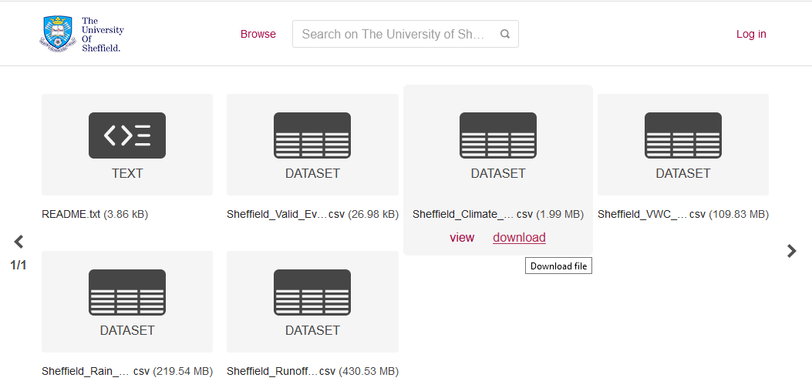
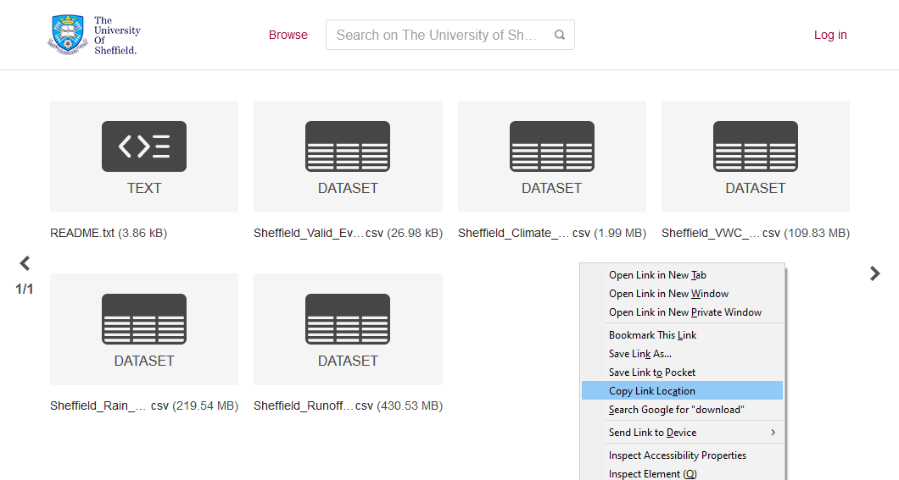
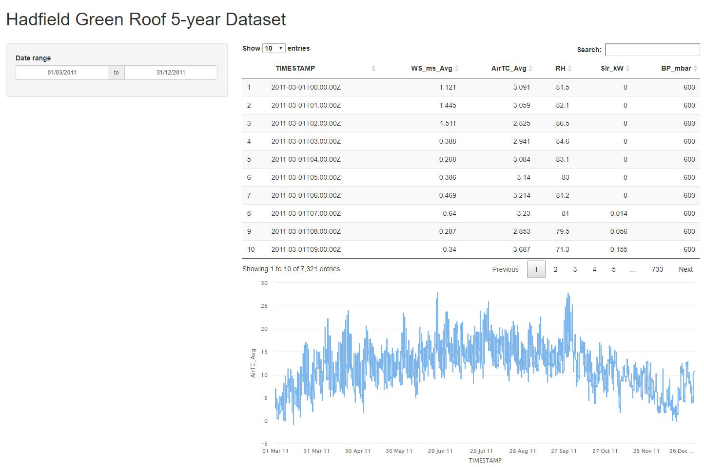
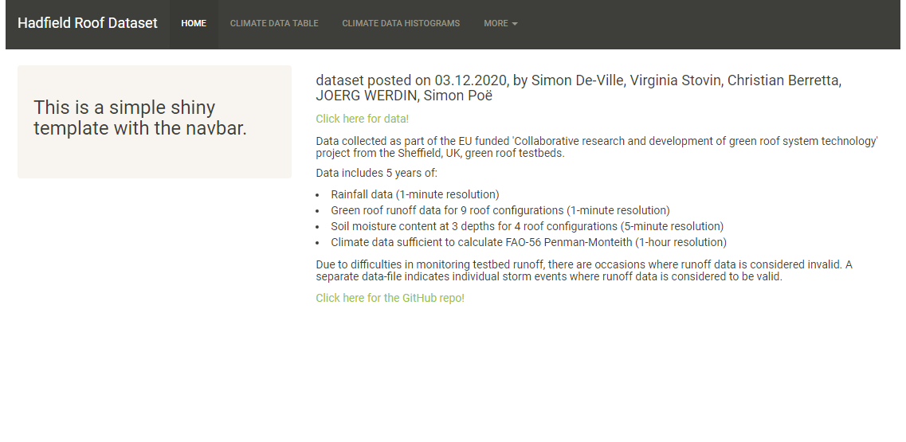
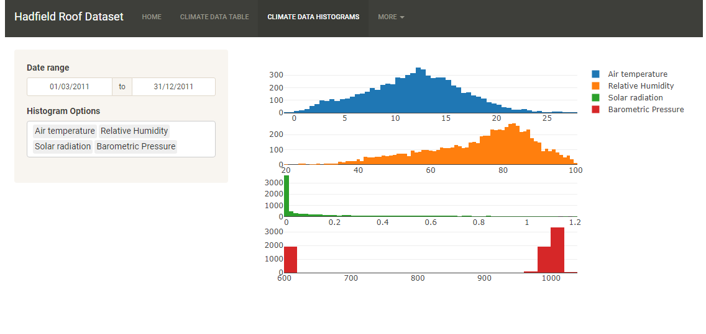
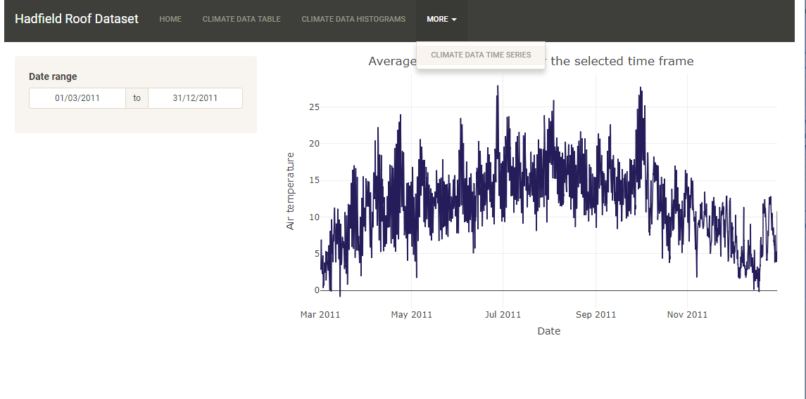
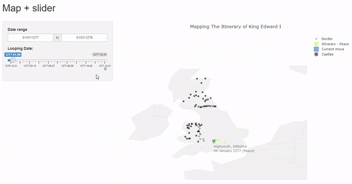

With the Shiny package you can build interactive web applications using R script.
This tutorial will give you quick-start guide to help you begin to explore the versatile package and create your own applications as well as present some ready to use templates to help you to build your first Shiny app. 

With the Shiny package installed you can start to develop your app.
The basic components of a shiny app are ui commands and server commands.
The ui commands make up the user facing part of the app, this is where users can declare inputs;
common inputs are listed in this <a href = "https://shiny.rstudio.com/gallery/widget-gallery.html"> helpful widget gallery</a>.
The server commands are where the bulk of your processing will take place.
These two components can be created in a single app.r file as shown below:  

```R
library(shiny)

ui <- fluidPage(
  <UI Commands>
)

server <- function(input, output) {
  <Server Commands>
}

shinyApp(ui = ui, server = server)
```
However, these files can become lengthy and difficult to read, particularly for complex applications.
Therefore it is common practice to separate the ui and server components into separate files, stored together in a new directory.
Each component named `ui.R` and `server.R` respectively.  

## A Simple Shiny App

The following code is an example of a simple shiny app which creates a sine wave with time equal to the user input.

<iframe height = "500" width="100%" frameborder="no" src="https://gi-tuos.shinyapps.io/demo_shiny/"> </iframe>

In this example the ui file is built in a fluid page format, containing a numeric input widget and a plot output.
The numeric input widget allows users to specify the sample size. This value is referred to as `input\$\<id\>`.
The plot output is refered to as `output\$\<id\>` and is called from the server.r file.

```R
ui <- fluidPage(
  numericInput(inputId = "Num",
               "Sample size", value = 15),
  plotOutput(outputId = "LinePlot")
)
```
The server.r file contains instructions on how to build the output objects called in the ui.
Inputs from the ui file are called by name as specifed in the ui file, in this case, input$Num.
renderPlot({}) specifies the code required to create the LinePlot object, which is called into the ui.r file.


```R
server <- function(input, output) {

  output$LinePlot <- renderPlot({
    x=seq(0, input$Num, 0.1)
    y=sin(x)
    df <- data.frame(x, y)

    ggplot(data = df, aes(x, y)) +
      geom_line() +
      labs(x = "Time", y = "Sine Wave")
  })
 }
 ```

This Shiny app also uses a `global.R` file, stored in the same directory as the `server.R` and `ui.R` files.
This file defines objects that are available to both sides of the application.
`Global.R` files are executed only once as the app compiles. In this instance it contains the command to load relevant packages

```R
library("tidyverse")
```  

## Templates
If you are new to Shiny then these [official tutorials](https://shiny.rstudio.com/tutorial/) will be really helpful to get you started. We also encourage you to get inspiration from the [Shiny Gallery](https://shiny.rstudio.com/gallery/) which consist of many wonderful Shiny apps created within the Shiny app developer community. All apps in the Shiny Gallery are open source and you are most welcomed to learn from others! Some other useful resources:  

<LPWrap>
  <LPItem href="https://www.r-graph-gallery.com/">The R Graph Gallery</LPItem>
  <LPItem href="https://rstudio.github.io/shinydashboard/index.html">Shiny dashboard</LPItem>
  <LPItem href="https://ox-it.github.io/OxfordIDN_Shiny-App-Templates/">Oxford IDN Shiny Templates</LPItem>
</LPWrap>  

If you are looking for something more advanced, check out the [golem](https://github.com/ThinkR-open/golem) framework for building Shiny apps.  

When creating a Shiny app, we recommend you to consider the following steps (preferably in the order shown below):  
<Accordion allowZeroExpanded="true">
  <AccordionItem>
    <AccordionItemHeading>
      <AccordionItemButton>
        LAYOUT
      </AccordionItemButton>
    </AccordionItemHeading>
    <AccordionItemPanel>
      The first thing to consider is the overall layout of the app. Depeneding on the complexity and the nature of your app (whether it is a simple app to display data as a table or Shiny-based website focus on particular group of audiences), it is always helpful to sketch the design before you start building the app. For example, if you expect many charts and contents then it is best to divide them into multiple pages. 
    </AccordionItemPanel>
  </AccordionItem>
  <AccordionItem>
    <AccordionItemHeading>
      <AccordionItemButton>
        INTERACTIVE
      </AccordionItemButton>
    </AccordionItemHeading>
    <AccordionItemPanel>
      After the layout of the app and locations for each chart are planned, what sort of interactive elements you want to add on top of the chart? Suppose the <a href="https://www.rdocumentation.org/packages/datasets/versions/3.6.2/topics/mtcars">mtcars</a> dataset was given and a table was created for displaying the dataset in rows, a <a href="https://shiny.rstudio.com/gallery/sliders.html">slider widget</a> could be use to set the range for the variable <em>miles per gallon (mpg)</em> and the table will be filtered accordingly. Alternatively, the <a href="https://shiny.rstudio.com/gallery/selectize-vs-select.html">select widget</a> will also be helpful. There are many other widgets available and you can learn more at the <a href="https://shiny.rstudio.com/gallery/widget-gallery.html">Widgets section</a>.
    </AccordionItemPanel>
  </AccordionItem>
  <AccordionItem>
    <AccordionItemHeading>
      <AccordionItemButton>
        IMPLEMENTATION
      </AccordionItemButton>
    </AccordionItemHeading>
    <AccordionItemPanel>
      Once all design work have completed we can start building the app as we have went through at the beginning of the tutorial but mostly likely with much more elements. We recommend you refer to the <a href="https://shiny.rstudio.com/reference/shiny/">latest reference</a> for the Shiny package, the development team of Shiny have wonderfully organised functions and corresponding description in a clean fasion so it is relatively easy to navigate through the reference. The app will likely to slow down as the size of dataset increases, you might want consider using <a href="https://shiny.rstudio.com/tutorial/written-tutorial/lesson6/">reactive expression</a> in your app to improve performances.
    </AccordionItemPanel>
  </AccordionItem>
    <AccordionItem>
    <AccordionItemHeading>
      <AccordionItemButton>
        STYLES
      </AccordionItemButton>
    </AccordionItemHeading>
    <AccordionItemPanel>
      It is worth a while to consider the appearance of your app, e.g. the font size, text colours, background colours, and spaces between elements. Shiny has HTML5 equivalent functions that can be used to wrap elements and add inline styles, you can learn more from the <a href="https://shiny.rstudio.com/tutorial/written-tutorial/lesson2/">UI interface tutorial</a>. In addition, you might also find <a href="https://rstudio.github.io/shinythemes/">Shiny Themes</a> helpful for alter the overall appearance.
    </AccordionItemPanel>
  </AccordionItem>
</Accordion>


### How to

#### Fetch data from ORDA
One of the most important aspects for reproducible research is to make sure data is preserved and accessible so that it can be pulled out anytime regardless of the tools people are using. Researchers are strongly encouraged to deposit their data in [ORDA](https://orda.shef.ac.uk)(university's data repository), unless there is a subject-specific repository or data centre which is commonly used in their field.  

It is quick and easy to read data in R, here is an example of reading a csv file:  

```r
myData <- read.csv("https://figshare.shef.ac.uk/ndownloader/files/25647497")
# OR using readr 
library(readr)
myData <- read_csv("https://figshare.shef.ac.uk/ndownloader/files/25647497")
```  

To get the url for a dataset in ORDA, follow the steps below:  
1. Click on item containing the dataset and it will navigate you to [figshare.shef.ac.uk](https://figshare.shef.ac.uk)  
2. Hover on the dataset you wish to use and right click the *download* text that shows up  
  
3. Click `Copy Link Location` (Firefox) / `Copy link address` (Chrome) / `Copy link` (Edge and Safari)  
  


#### Use templates
Each template will be executable as is if the data file has been placed in the correct directory. The `app.R` file contains a line `source('./climateData.R')` which read and parse the `climateData.R` script (which does some data processing) from the root directory (change the path accordingly if you placed the file in a different directory), all codes within this script will be executed and any variables or functions defined within this script can also be used in the `app.R` file. 

To use any particular template, either download the [whole repository](https://github.com/researchdata-sheffield/R-Series) **OR** download both the corresponding folder use the link provided in each section and/or the [climateData.R](https://github.com/researchdata-sheffield/R-Series/blob/main/climateData.R) file if required. You can also download and mix multiple templates together.  

It is always advisable to create a seperate script for data processing and other housekeeping tasks then use the `source()` function to include data when necessary. This will increase your code readability and easier to maintain. To add your own data you can replace all contents within the data file with any steps for preparing data for visualisations.  

When replacing a widget we recommend you verify the output of the widget in the `server` function like `output$widgetOutput = renderText({ input$yourWidgetId })` and then print the output in the main panel using `verbatimTextOutput("widgetOutput")`. These steps will help you pass the correct values to charting functions. Each visualisation package has different render and output functions, for example Plotly has `renderPlotly()` and `plotlyOutput()` whereas Highcharter uses `renderHighchart()` and `highchartOutput()`.


### Highcharter and Data Table
This simple template uses the **DT** package to display data in a table and the **Highcharter** package for creating time series. Additionally there is a date widget that controls the date interval for visualisations on the right.  



[Data](https://figshare.shef.ac.uk/articles/dataset/Hadfield_Green_Roof_5-year_Dataset/11876736) | [Code](https://github.com/researchdata-sheffield/R-Series/tree/main/shiny/simpleHighcharter)


### Plotly
This template builds on top of the previous one and replaced *Highcharter* with *Plotly* and added histograms as well as an options widget for choosing variables to plot.


[Data](https://figshare.shef.ac.uk/articles/dataset/Hadfield_Green_Roof_5-year_Dataset/11876736) | [Code](https://github.com/researchdata-sheffield/R-Series/tree/main/shiny/simplePlotly)  
  
  
### Plotly with Navbar
Scrolling through a long page is not a nice experience for users and this process is repeated whenever you want to change parameters using widgets that are on the top of the page, therefore, splitting contents and charts into different pages/tabs could be a good option. This template uses the **sandstone** shinytheme, you can always change or remove it at line 16. 





[Data](https://figshare.shef.ac.uk/articles/dataset/Hadfield_Green_Roof_5-year_Dataset/11876736) | [Code](https://github.com/researchdata-sheffield/R-Series/tree/main/shiny/simplePlotlyNavbar)  


### Scatter plot on Map
This scattergeo plot was made using Plotly shows the itinerary of King Edward I within the selected date range. If you have geographical data that you want to plot, this template might be a good place to start.  


[Data](https://figshare.shef.ac.uk/articles/dataset/Mapping_The_Itinerary_of_King_Edward_I/8948699) | [Code](https://github.com/researchdata-sheffield/R-Series/tree/main/shiny/map)  


### Map with sliders
This template extends the previous scattergeo plot and added a slider that allows users to view the itinerary at specific date (including previous dates). Once the play button is clicked the slider will automatically increments day by day until it hits the end date, and the map will also be updated accordingly.  



[Data](https://figshare.shef.ac.uk/articles/dataset/Mapping_The_Itinerary_of_King_Edward_I/8948699) | [Code](https://github.com/researchdata-sheffield/R-Series/tree/main/shiny/mapWithSlider)  


## Publish your apps
Please read this <b><Link to="/docs/01/03/2021/Hosting-Shiny-Apps">public guidance/policy statement</Link></b> for hosting shiny apps.