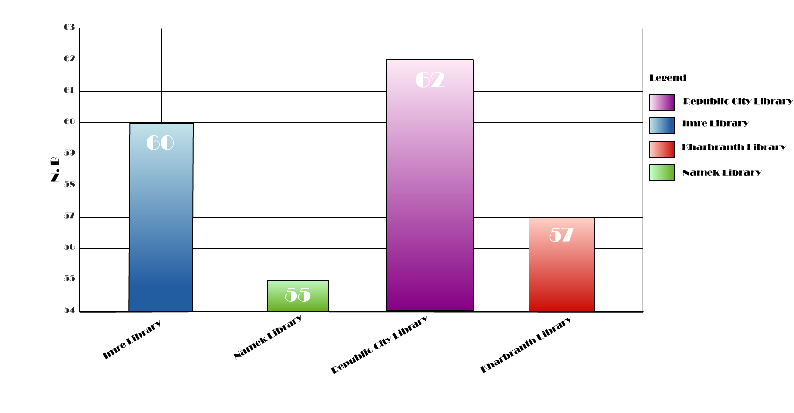
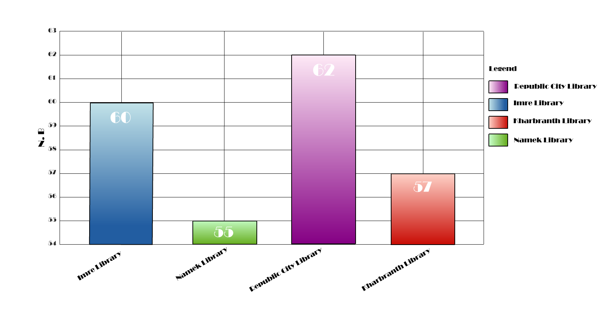

## Some good practice guidelines
There is a lot of readily available advice to help us improve our plots and avoid common pitfalls. Seminal work from Edward Tufte and John Tukey are excellent places to look for guidance. 
As well as a plethora of modern examples including; [from Data to Viz](https://www.data-to-viz.com/), [Cynthia Brewer's](https://colorbrewer2.org/#type=sequential&scheme=BuGn&n=3) work on colour, 
[Bang Wong's](https://www.nature.com/articles/nmeth0211-101) points of view series for Nature Methods and of course, the work of [Jeffery Heer](https://homes.cs.washington.edu/~jheer/). With so much excellent advice out there, 
what I hope to do with this blog is synthesise some of the more common issues that may face you when creating data visualisations. I'll work them into a case study to demonstrate the positive effect of making multiple small changes. 

The case study is a simple example showing the average number of books loaned each day from four different libraries. 
The data, along with the libraries, are fictional. As you can see, the bar chart is very striking. However, I've inadvertantly obscured a lot of the detail in my design choices. 
Readers will have to spend longer than necessary to digest the message that I present in this graph. Often, it leaves you wondering if there's something that you've missed.

I will discuss some steps that I can take to make this graphic much more fit-for-purpose. As I work through these changes, I'll keep in mind that often, the most effective visualisations are **clear**, **simple** and **intentional**.
- **Clear:** Data visualisations are used to inform. If they are overly complicated or unfamiliar to the target audience, they are not fit for purpose.
- **Simple:** Good design lets the data do the talking.
- **Intentional:** Data visualisations portray a message. What that message is should be clear before creating the visualisation.

I can summarise the changes I make to this graph in 11 steps, they are as follows: 

<iframe id="kaltura_player" src="https://cdnapisec.kaltura.com/p/2103181/sp/210318100/embedIframeJs/uiconf_id/40991011/partner_id/2103181?iframeembed=true&playerId=kaltura_player&entry_id=1_wmqn5nan&flashvars[streamerType]=auto&amp;flashvars[localizationCode]=en&amp;flashvars[leadWithHTML5]=true&amp;flashvars[sideBarContainer.plugin]=true&amp;flashvars[sideBarContainer.position]=left&amp;flashvars[sideBarContainer.clickToClose]=true&amp;flashvars[chapters.plugin]=true&amp;flashvars[chapters.layout]=vertical&amp;flashvars[chapters.thumbnailRotator]=false&amp;flashvars[streamSelector.plugin]=true&amp;flashvars[EmbedPlayer.SpinnerTarget]=videoHolder&amp;flashvars[dualScreen.plugin]=true&amp;flashvars[hotspots.plugin]=1&amp;flashvars[Kaltura.addCrossoriginToIframe]=true&amp;&wid=1_3hfc4n76" width="400" height="285" allowfullscreen webkitallowfullscreen mozAllowFullScreen allow="autoplay *; fullscreen *; encrypted-media *" sandbox="allow-forms allow-same-origin allow-scripts allow-top-navigation allow-pointer-lock allow-popups allow-modals allow-orientation-lock allow-popups-to-escape-sandbox allow-presentation allow-top-navigation-by-user-activation" frameborder="0" title="Kaltura Player">
</iframe>

## Step 1: Removing the 3D effects 

It's quite rare nowadays to see many authors using a 3D effect such as the one shown in my example. Studies on graphical perception have demonstrated that volume is susceptible to misinterpretation (Cleaveland and McGill, 1984). 
By simply removing the 3-dimensional effect, the reader relies on the bar's height as opposed to volume. Also, like me, you may find the relationship between the four bars becomes more pronounced. 

To be clear, what I'm are discussing here is the removal of gratuitous 3D effects. In this instance, the 3rd dimension adds nothing to the message that I portay with this chart. 
I do not claim that 3-dimensional plotting has no place in modern data visualisation; in fact, 3-dimensional plots can be engaging and informative if used in the right context. 
Think of [Matlab](https://uk.mathworks.com/help/matlab/ref/surf.html) and [Python's](https://matplotlib.org/stable/gallery/mplot3d/surface3d.html#sphx-glr-gallery-mplot3d-surface3d-py) surface plots 
or R's [plot3d package](https://cran.r-project.org/web/packages/plot3D/vignettes/plot3D.pdf). Perhaps even more exciting, think of data visualisations in augmented or virtual reality!

## Step 2: Make the bars equal width

We know that this bar chart intends to show the average number of books loaned from each library per day. 
That's all. The bar's height represents this information; therefore, the unequal widths are an unnecessary addition to the chart. 
Instead of accentuating our point, they may be detracting from the overall message by implying that I show something else here that the reader should note. 
Making the bars an equal width is a fast and effective way to make bar charts clear (Bigwood and Spore, 2013).

## Step 3: Remove the gradient fill 

Here we have a very similar situation to Step 4. Gradient fills implicitly imply that there is a change in value to be noted. 
Think of when we typically see colour gradients used in data visualisation; in a [choropleth](https://datavizcatalogue.com/methods/choropleth.html) or a [heatmap](https://datavizcatalogue.com/methods/heatmap.html). 
When we use gradient fills or pattern fills unnecessarily, we are unconsciously complicating our graph and forcing our reader to waste time looking at something other than the bar's height.

## Step 4: Remove the colour altogether

It is quite common to see unnecessary colour on graphs, especially simple ones like these that some people could consider a little boring without it. 
However, we need to remember that good data viz lets the data speak for itself. 
When introducing colour to data visualisation, it's often useful to pause and question whether it adds anything to our message. If not, then it may [do more harm than good!](https://clauswilke.com/dataviz/color-pitfalls.html)

## Step 5: Remove the legend

Now that we have removed the unnecessary colour, it's quite clear that we no longer need the legend. 
Many of us quite familiar with seeing a legend, so we sometimes forget to question whether we actually need it or whether it's just an item cluttering our figure. 
In this case, I have labelled each of the variables on the X-axis. We know what each bar represents. 

If you look at the figure with the legend and the figure without, you may find your eye tracking around the graph far less, 
spending more time on the bars - the data. You may find that it is becoming increasingly common to see data visualisations avoiding legends altogether by labelling elements directly. 
This is particularly common in [media](https://bbc.github.io/rcookbook/#make_changes_to_the_legend) and [government statistical departments.](https://style.ons.gov.uk/category/data-visualisation/titles-and-text/) 

## Step 6: Text

There are a few things to address with the text on this graph, perhaps the most striking is the font. It's quite easy to get swept up in the fine details when searching for the best font for your data visualisation. 
Serif or Sans Serif? Lining or old style? Tabular or proportional? 
There's [a lot to consider](https://medium.com/nightingale/choosing-a-font-for-your-data-visualization-2ed37afea637#:~:text=Font%20used%3A%20Lato%20is%20a,but%20not%20distorted%2C%20letter%20spacing). 
However, unless it is of particular interest to you, I think it's important to not get too bogged down in these debates. 
On a fundamental level, the font *"must draw our attention before it is read but not interfere with reading"* Bang Wong (2011). 
This leaves some room for personal taste but ensures that text isn't uncomfortable, as it is in our 'before' graph.

There are two other issues with the font on this chart that need addressing. The y axis label and the x tick labels. The Y-axis label on our original chart read as "n.b". Very unhelpful. With a little deductive prowess, we may be able to discern that this stands for "number of books". However, it's not immediately obvious. If you're using labels, make sure they are clear. 

The final issue is those rotated x tick labels. We can spare our readers having to crane their necks by simply rotating these back to horizontal. 
If the length of the x tick labels and/or the number of bars prohibits this simple fix, then I would recommend switching to a horizontal bar chart. 
You may note that I'm hypocritical here as my y-axis label is still rotated; this is a personal preference. 
I find that the white space generated above and below a horizontal y-axis label is too much waste for my liking; I'd rather maximise the size of the x-axes.

## Step 7: Order the bars

When using bar charts, it's good practice to place the bars in size order. 
Doing so effectively highlights the relationship between each of the bars. 
It's also excellent for detecting outliers. 
From Data to Viz have an excellent summary of the impact of [ordering data](https://www.data-to-viz.com/caveat/order_data.html). 
Of course, it's important to note that this is only the case for variables that have no logical order. 
If you're working with data in an existing order, such as frequency of responses to a Likert scale or time-series data, then you should preserve the order. 

## Step 8: Remove gridlines

There are no hard and fast rules regarding whether or not to include gridlines in a chart. 
Of course, gridlines can provide visual assistance, helping the reader to get a better understanding of the data behind the image. 
However, when we visualise our data, what we are  often portraying is less about the exact numbers, more about the relationship between them. 
When considering gridlines in this context, they can actually detract from our ability to see the data as a whole. 
I've chosen not to use gridlines in this example; there are just four bars, we're working with whole numbers, and the difference between those numbers is not large. Therefore, the gridlines provide little visual assistance. 

It is important when considering gridlines to understand what it is you want to achieve with your chart. Experiment with your visualisations. But do remember, if gridlines are the best option for your figure, then be sure to soften them. [Claus Wilke](https://clauswilke.com/dataviz/balance-data-context.html#background-grids), has some excellent advice about when to use gridlines and how to soften them if you do choose to use them. 

## Step 9: Remove data labels

In step 9, I've chosen to remove the data labels on the bars. The alternative could be to remove the y-axis altogether and maintain the data labels. 
This chart has few variables, therefore, by directly labelling the bars, readers could quickly digest the data behind the visualisation. 
However, my personal preference has again come to the fore; I've chosen to keep the y-axis. 
My reason for this choice is, simple plots like these can appear throughout a scientific paper or report. 
By maintaining a typical x and y-axis in simple charts, they can feel more consistent with later charts, specifically, more complex ones where x and y-axis are essential.  

A bit of food for thought there, I'd like to highlight that it's important to think about your design choices; each of your decisions should be conscious ones.  

## Step 10: Y-axis Scale

Until this point, we have focussed a lot on the clarity of the graph and making it easier to digest the message. Step 10, the scale on the y axis, is a little different. 
Here we have an example of how we might lie, intentionally or otherwise, with graphs. 
When a reader glances at the graph, they may assume the library in Namek is used considerably less by the public than the library in Republic City. 
The graph gives the impression that for every book withdrawn in Namek, eight more are withdrawn from Republic City, which is untrue. The chosen limits of the y-axis have exaggerated it. 
When we correct this, we can see a far smaller difference between the four libraries. 

An excellent TEDed talk by Lea Gaslowitz covers the concept of stretching the truth a little too far, inadvertently or otherwise, with our y-axis. I highly recommend watching it. 

    

        <iframe src="https://embed.ted.com/talks/lang/en/lea_gaslowitz_how_to_spot_a_misleading_graph" width="854" height="480" style="position:absolute;left:0;top:0;width:100%;height:100%" frameborder="0" scrolling="no" allowfullscreen>
        </iframe>
    

Cutting the Y-axis is a very contentious debate in data visualisation; see [this page](https://www.data-to-viz.com/caveat/cut_y_axis.html) and the links therein. 
It is because of the opportunity it offers to mislead readers. For this chart, and typically for all bar charts, you should start your axis at zero; this is because bar charts typically represent quantities or parts of a whole. There are very few exceptions to this. 
The same is not true for other charts. As Lea Gaslowitz shows, it is just as likely to be misled by a cut axis as an uncut one. So it's not a suitable answer to always start your charts at 0. 
You must take control of your y-axis scale. If it's necessary to fight with your software's default settings to achieve this, then do. If you do choose to cut, then make this abundantly clear to your readers. 

## Step 11: Add a detailed figure caption

Finally, all charts should have an informative title or a figure caption. I've chosen to use a figure caption for this chart as I envisage it in a paper or a report. 
The figure caption typically describes what the reader is looking at and can offer further information about the data to help the reader grasp the visualisation's message.

## Final notes
The example I have shown here is very exaggerated but I hope that it has still been useful. You may have noted there are some areas where the good practice guidance is a little grey. These are areas where you can explore your own style. You may find Data visualisation referred to as art. 

## References
Bigwood, S. and Spore, M. (2013) *The Designer's Guide to Presenting Numbers, Figures, and Charts*. Allworth Press, New York. 

Cleveland, W. S. and McGill, R. (1984) Graphical Perception: Theory, Experimentation, and Application to the Development of Graphical Methods. *American Statistical Association*. **79**(387) pp. 531-554. 

Wong, B. (2011) Points of view: Typography. *Nature Methods*. **8**(277)

