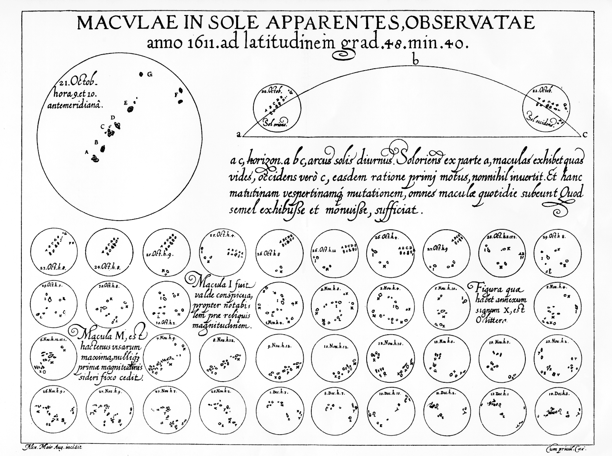
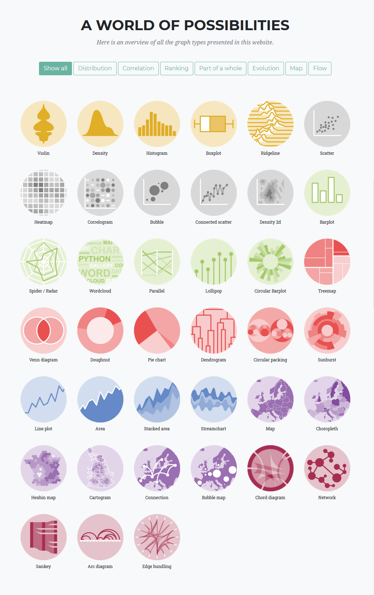

[Resources for the workshop](https://n8cir.org.uk/events/event-resource/data-vis-resources/)  

# Day 1

## History of visualisation
Visualisation of information is not new, and it has a far longer history than we might have expected. The development of modern data visualisation is closely related to statistics and typically features quantitative information, but that does not mean we should not think beyond numbers. 

  
*Macvlae in sole apparentes observatae, by Christopher Scheiner. 1612.*

Olivia demonstrated a piece of work [[start at 8:59](https://youtu.be/5g4kNMN4AsI?t=539)] of Chirstoph Scheiner (a contemporary of Galileo) that looking through telescopes to track sunspots. For each telescopic view there are positions of sunspots seen on the sun. These drawings are not only a record of observations but a means to analyse those data.  

Modern Landscape of data visualisations as we saw today, has evolved a large number of graphs and charts for different purposes. One notable difference is the rise of interactive data visualisations powered by the evolution of modern web technologies. People now were able to interact with data and forming their own insight or perform analysis.You might be interested in examples that are given in the workshop [[start at 20:24](https://youtu.be/5g4kNMN4AsI?t=1224)].  

  
*Overview of graph types ([source](https://www.data-to-viz.com/))*

## Visualise cultural data
So what is cultural heritage data? Olivia has suggested that these are *data representing the holdings of cultural heritage institutions (descriptive metadata records and digital reproductions)* in any of the following form:  
- Artworks, photographs, films
- Objects / Artefacts  
- Publications: books, newspapers, reports, ephemera  
- Archival material  
- Records (Census, parish records, etc.)  
- Maps  
- Web content, historic buildings, sound archives, ... etc.  

The purpose of visualisation is to help people understand certain things better. This is for sure when it comes to visualising cultural data. Olivia has outlined [[start at 30:44](https://youtu.be/5g4kNMN4AsI?t=1844)] the spectrum of use cases data visualisation in cultural data and aggregated use cases in three modes - Analysis, Exploration, and Presentation (AEP). These three modes focus on different aspects and serve different audiences. For example, The British Library has created a data visualisation to analyse the holding of newspapers and make decisions on which form of newspapers to digitalise. It is also worth mentioning that these three modes are also frequently seen in other areas. Take the statistical model as an example, if we were building a statistical model for a dataset we generally need to go through an exploration process to get a rough idea of the structure of the dataset at first instance. For example, we can plot a box plot to see the distribution of data points in quartiles or create a density plot to show the overall distribution. In the analysis stage one can use plots to assess the assumptions we have made on the dataset, and finally present the model in an interactive way or through some simple visualisations.

Some fascinating and informative examples [[start at 32:48](https://youtu.be/5g4kNMN4AsI?t=1968)] for cultural data have been presented during the workshop including those made by Olivia using [D3.js](https://d3js.org/) with [Observable notebooks](https://observablehq.com/). D3.js (A Javascript library) has been increasing used by programmers and becoming the backbone of many data visualisation libraries, but its steep learning curve has made people withdrawn from this highly customisable tool. Recently, Observable has launched a new Javascript library - [Observable Plot](https://observablehq.com/@observablehq/plot) built on top of D3 for exploration of tabular data. It is simpler to use yet still powerfully in some areas. Regardless of the complexity of D3, it seems that the key lies not in what it can do, but what you can do with your creativity.  

It was encouraging to see qualitative data visualisations play an important part in cultural heritage collections and remind us that data visualisation is more than just numbers and statistics. 

# Day 2
In part 2 of the workshop, Olivia has outlined the typical steps from a piece of dataset to a visualisation and practical considerations you might want to make. In the process of creating a visualisation, it is not surprising that you will spend most of your time in the preparation step - finding a suitable dataset, cleaning, preprocessing, designing, etc. Although there is no guarantee of a positive linear relationship between the amount of time spent in preparation and the quality of your visualisation, a good visualisation takes time to be crafted. On the other hand, I agree with Olivia that *what you can make is determined by the content and shape of the data you have (or can get)* [[start at 4:28](https://youtu.be/avLG15LImLU?t=268)]. 

Part 2 covered a lot of content, but every bit of information is useful. Here are timestamps in the video for each topic, click on the link to jump to each topic:
- [Case study: The Press Picker](https://youtu.be/avLG15LImLU?t=682)
- [Visual design](https://youtu.be/avLG15LImLU?t=1544) (base on the book *The visual display of quantitative information* by Edward Tufte)
  - [Graphical Integrity](https://youtu.be/avLG15LImLU?t=1769)
  - [Legibility](https://youtu.be/avLG15LImLU?t=2492)
  - [Clarity of purpose](https://youtu.be/avLG15LImLU?t=3309)
  - [Tone, associations, context](https://youtu.be/avLG15LImLU?t=4250)   
- [Data visualisation tools](https://youtu.be/avLG15LImLU?t=5116)

Personally, I have found the visual design really useful throughout the whole section. If you are interested in amplifying the impact of your visualisations or you want to get started to make visualisations, then this section should give you some useful tips and inspiration on the best practice. In summary, the design of visualisations should represent the underlying data accurately, the visualisation itself should be clear to read without ambiguity as well as concisely deliver messages or information you want to get across, and the visualisation should communicate in an attractive way depending on the type of your audiences.  

At the end Olivia talked and gave examples of tools you can use to create visualisation, such as ggplot2, plotly, seaborn, and D3.js. While you are keen to explore these tools, our website's <Link to="/blog">blog</Link> and <Link to="/#learning_path">learning paths</Link> could be another good starting point. We will constantly update the website and add more contents as time goes. If you would like specific help on anything in creating a data visualisation, feel free to contact us.

There are many interesting examples in this workshop, and I encourage you to explore further by watching videos or reading notes.