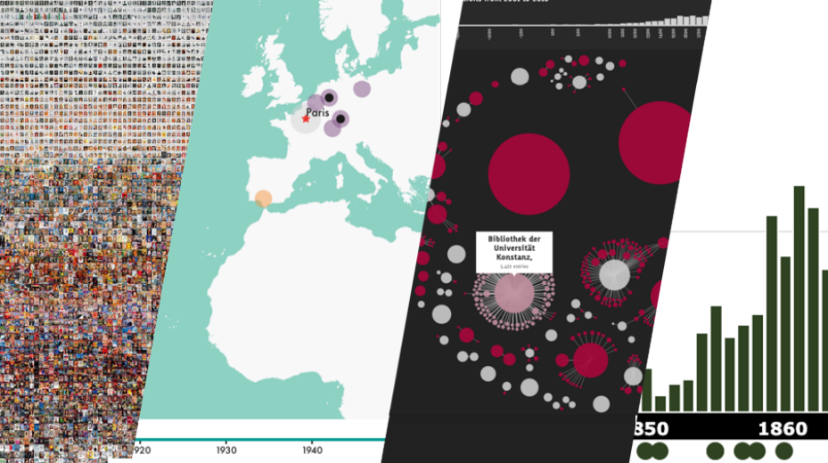

  
  <em className="absolute bottom-0 text-sm -mb-32">
    Image from Dr Olivia Vane's{" "}
    <a href="https://n8cir.org.uk/events/event-resource/data-vis-resources/">
      presentation
    </a>
  </em>

_Credit: This post is based on videos and notes made available on [N8 CIR](https://n8cir.org.uk/events/event-resource/data-vis-resources/) for the workshop - Data Visualisation for Cultural Heritage Collections, presented by [Dr Olivia Vane](https://oliviavane.co.uk/index), a Research Software Engineer at The British Library. I would also like to thank [Rosie](https://github.com/rosiehigman) for reviewed this blog post._

---

[Resources for the workshop](https://n8cir.org.uk/events/event-resource/data-vis-resources/)

This two part workshop gave a good overview of the history and key concepts in data visualisation, as well as practical steps in making visualisations from datasets. The videos provide a unique and interesting opportunity to learn more about how data visualisations play an important role in cultural heritage and benefit different stakeholders such as researchers, cultural heritage collection managers, and visitors to The British Library. One thing that stood out was that many projects in The British library make use of [D3](https://d3js.org/)(a Javascript library) which is commonly recognised as one of the most powerful tools for creating interactive data visualisation. The D3 team recently launched a new Javascript library, [Observable Plot](https://observablehq.com/@observablehq/plot), designed for data exploration with a simplified syntax, inspired by ggplot2 and vega-lite, potentially allowing many more people to use it. This new, more accessible library is particularly important given the vital role D3 is likely to play in the future of data visualisation.

# Data visualisation and visualising cultural heritage data

## History of visualisation

Visualisation of information is not new, and it has a far longer history than we might expect. The development of modern data visualisation is closely related to statistics and typically features quantitative information, but that does not mean we should not think beyond numbers.

  
_Macvlae in sole apparentes observatae, by Christopher Scheiner. 1612._

Olivia demonstrated a piece of work [[start at 8:59](https://youtu.be/5g4kNMN4AsI?t=539)] of Chirstoph Scheiner (a contemporary of Galileo) looking through telescopes to track sunspots. For each telescopic view there are positions of sunspots seen on the sun. These drawings are not only a record of observations but a means to analyse those data.

  
_Overview of modern graphs and charts ([source](https://www.data-to-viz.com/))_

The modern landscape of data visualisation has evolved a large number of graphs and charts for different purposes, and more recently the rise of interactive data visualisations powered by modern web technologies. People are now able to interact with data and create their own insights or perform analysis. There are several interesting examples given in the workshop [[start at 20:24](https://youtu.be/5g4kNMN4AsI?t=1224)], in particular the _[Overview visualisation along the time periods and cultural heritage sectors](https://uclab.fh-potsdam.de/ddb/timeline/)_ created by _Deutsche Digitale Bibliothek Visualisiert_. This visualisation allows you to see the most common keywords, places, persons and organisations in cultural heritage sectors over a particular time period by selecting a time span ranging from 4000 BC until 2020 AC. The most amazing thing about this tool is that you can quickly see influential people and important place names in a certain time span, as well as the organisations that collect the history of this time span.

_Periods & Sectors from 1940 until 1950_

## Visualising cultural data

So what is cultural heritage data? Olivia has suggested that these are _data representing the holdings of cultural heritage institutions (descriptive metadata records and digital reproductions)_ in any of the following form:

- Artworks, photographs, films
- Objects / Artefacts
- Publications: books, newspapers, reports, ephemera
- Archival material
- Records (Census, parish records, etc.)
- Maps
- Web content, historic buildings, sound archives, and much more

The purpose of visualising cultural data is to make it easier to understand and possible to gain better insights. Olivia outlined [[start at 30:44](https://youtu.be/5g4kNMN4AsI?t=1844)] the spectrum of use cases data visualisation for cultural data and aggregated use cases in three modes - Analysis, Exploration, and Presentation (AEP). These three modes focus on different aspects and serve different audiences. An example of visualisations under the Analysis mode is the [press picker](https://www.oliviavane.co.uk/press-picker) created by Olivia and her team at The British Library, that was used for analysing the holding of newspapers (over 700 milions pages) and make decisions on which form of newspapers to digitise. It is also worth mentioning that these three modes are also frequently seen in other areas. Take statistical modeling as an example, if we were building a statistical model for a dataset we generally need to go through an exploration process to get a rough idea of the structure of the dataset at first. For example, we can plot a box plot to see the distribution of data points in quartiles or create a density plot to show the overall distribution. In the analysis stage one can use plots to assess the assumptions we have made on the dataset, and finally present the model in an interactive way or through some simple visualisations.

Some fascinating and informative examples [[start at 32:48](https://youtu.be/5g4kNMN4AsI?t=1968)] for cultural data were presented during the workshop including those made by Olivia using [D3.js](https://d3js.org/) with [Observable notebooks](https://observablehq.com/). D3.js (a Javascript library) has been increasingly used by programmers and is becoming the backbone of many data visualisation libraries, but its steep learning curve has reduced the take up of this highly customisable tool. Recently, Observable has launched a new Javascript library - [Observable Plot](https://observablehq.com/@observablehq/plot) built on top of D3 for exploration of tabular data. It is simpler to use because a layered of grammar of graphics (also adopted by the _ggplot2_ package in R) is introduced, yet it is still highly customisable and flexible. It is not intended to be a replacement of D3 but I suspect it might be a good entry point for people who want to learn D3 whilst the community building the ecosystem around it.

# From data to visualisation

In part 2 of the workshop, Olivia outlined the typical steps from a dataset to a visualisation and practical considerations you might want to make. In the process of creating a visualisation, it is not surprising that you will spend most of your time in the preparation step - finding a suitable dataset, cleaning, preprocessing, designing, etc. Although there is no guarantee of a positive linear relationship between the amount of time spent in preparation and the quality of your visualisation, a good visualisation takes time to be crafted. On the other hand, I agree with Olivia that _what you can make is determined by the content and shape of the data you have (or can get)_ [[start at 4:28](https://youtu.be/avLG15LImLU?t=268)].

> What you can make is determined by the content and shape of the data you have (or can get)

There was a lot of useful content in this section which is easiest to understand through the video of Olivia’s presentation. Here are timestamps in the video for each topic, click on the link to jump to each topic:

- [Case study: The Press Picker](https://youtu.be/avLG15LImLU?t=682)
- [Visual design](https://youtu.be/avLG15LImLU?t=1544) (based on the book _The visual display of quantitative information_ by Edward Tufte)
  - [Graphical Integrity](https://youtu.be/avLG15LImLU?t=1769)
  - [Legibility](https://youtu.be/avLG15LImLU?t=2492)
  - [Clarity of purpose](https://youtu.be/avLG15LImLU?t=3309)
  - [Tone, associations, context](https://youtu.be/avLG15LImLU?t=4250)
- [Data visualisation tools](https://youtu.be/avLG15LImLU?t=5116)

Personally, I found the emphasis on visual design really useful throughout the whole section. If you are interested in amplifying the impact of your visualisations or you want to get started to make visualisations, then this section should give you some inspiration and useful tips on the best practices. In summary, the design of visualisations should represent the underlying data accurately, the visualisation itself should be clear to read without ambiguity as well as concisely deliver messages or information you want to get across, and the visualisation should communicate in an attractive way depending on the type of your audiences. There are many interesting examples in this workshop, and I encourage you to explore further by watching videos or reading notes.

At the end Olivia talked and gave examples of tools you can use to create visualisation, such as ggplot2, plotly, seaborn, and D3.js. If you are keen to explore these tools, our website's <Link to="/blog">blog</Link> and <Link to="/#learning-path">learning paths</Link> could be another good starting point. We regularly update the website and if you would like specific help creating a data visualisation, please contact us.
