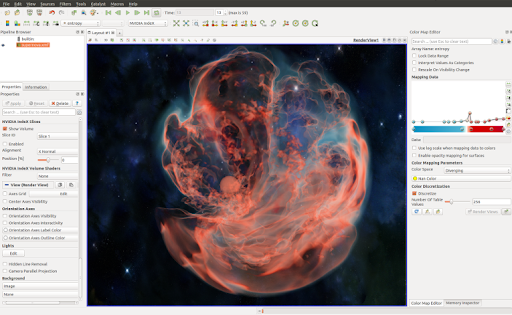
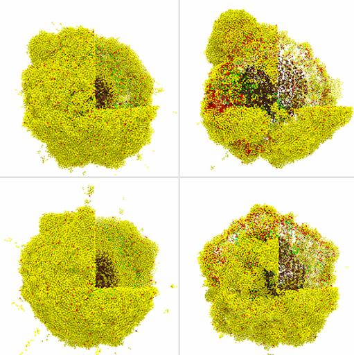
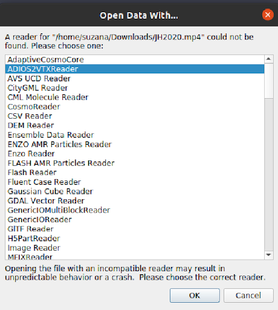
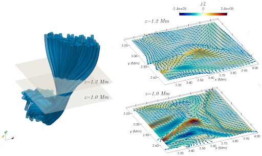
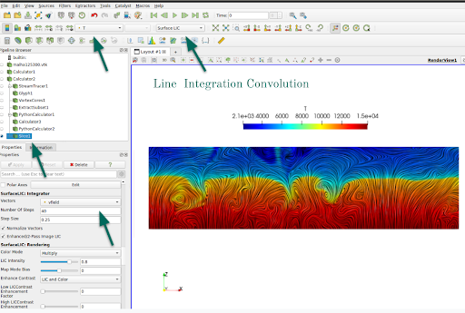
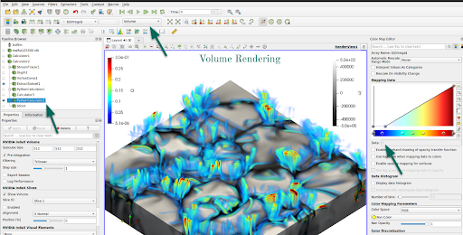
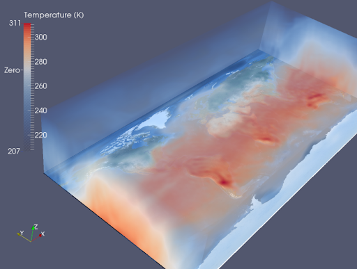

_This post is based on Suzana Silva's presentation at [Research IT Forum: Image processing, techniques and technology.](https://drive.google.com/file/d/1pB1ggQ6OMLNNTGlibcSvgyag_Vei020y/view)_

### _What is ParaView?_

ParaView is free software that can visualise both observational and numerical data.
It has been used in many different research fields, as illustrated in Figure 1, where we see ParaView applied in cosmology and Figure 2, where we see it applied to medical research.
ParaView can readily render the images based on the research data, facilitating visualisation of the data from different perspectives by rotating and post-processing the original data.
Thereby, this software offers the necessary tools to create some high-quality images, which gives support to explain your research and can help your work gain visibility.
There are several examples of data visualisation with ParaView, see [ParaView's gallery](https://www.ParaView.org/gallery/)

  
_Figure 1 - Supernova visualisation using ParaView volume rendering_

_Figure 2 - A cancer immunology hypothesis study_

One of the main reasons ParaView is so popular is that it can analyse and visualise data without programming.
Everything can be done interactively, and it is well documented, making ParaView very user-friendly.
That quality can be handy when it comes to early-career PhD researchers with little background in programming.

### _Using ParaView_

To start with ParaView, you should first download the [most recent version of ParaView](https://www.paraview.org/download)

The primary type of file Paraview reads are vtk files. It is quite straightforward to write an output in vtk from any software or code, and there are plenty of examples online.
But Paraview can also read different file extensions, including the type of files mostly used in flow simulations.
Therefore, if you have a file that Paraview has a reader for, you can open and select the reader - shown in Figure 3, and Paraview will promptly process your data.

_Figure 3 - ParaView reader_

To illustrate the applicability of ParaView, we show some very helpful visualisation tools for flow analysis.
Figure 4 displays the screenshot for ParaView reading a part of a 3D magnetohydrodynamics simulation that has been previously analysed in Silva et al. (2020, 2021).
We see a pipeline structure applied to the original vtk data on the left part of the figure.
Each one of the functions applied can be selected by choosing 'Filters' and then searching for the filter to be applied;
i.e. calculator (to find new variables, define vectors), python calculator (allows you to use all the routines from python, like the ones available in numpy), etc.
Figure 4 focuses on the streamlines and glyphs visualisation using the Streamtracer and Glyph filter, respectively.
The streamlines allow you to visualise the field orientation of a particular vector field, as shown in the left panel.
They are tangent to the vector field at every point, and this software also allows you to plot them at any location of your data just by clicking on the button indicated by the green arrow in Figure 4
and selecting the field vector you want to visualise as shown by the black arrow. Another way to visualise the flow is to plot glyphs oriented along the vector field, which is shown on the right panel.
For that, all you have to do is again click the bottom indicated by the orange arrow. The glyphs can be applied to surfaces or streamlines.

_Figure 4 - Data visualisation with ParaView for a 3D magnetohydrodynamics simulation of the Quiet Sun._

In Figure 5, we see an example of a streamline usage to visualise the simulation of airflow around an aeroplane.

_Figure 5 - Fan/nozzle and ground plane streamlines. [UFO-CFD](https://sites.google.com/site/ufocfdsolver/)_

The streamlines can also be animated by loading and applying the StreamlinesRepresentation plugin.
That type of visualisation helps to show how the motion of the flow would be along the streamlines, as illustrated in Figure 6.

_Figure 6 - Stream Lines representation display animated streamlines using a vector field defined on a dataset._
[Source](https://blog.kitware.com/new-animated-stream-lines-representation-for-paraview-5-3/)

As I mentioned before, glyphs can be applied to surfaces, indicating the flow behaviour in a 2D section of the simulation, which can be very helpful in aerospace analysis.
As depicted in Figure 7, where we have two horizontal planes, the glyphs indicate the direction of the magnetic field in those planes, colour-coded by the vertical component of the current density.

_Figure 7 - Example of visualisation with ParaView (originally published in [iopscience](https://iopscience.iop.org/article/10.3847/1538-4357/abfec2))._
_Left panel: The magnetic field lines computed using Streamtracer filter._
_The two xy-planes, placed at z=1~Mm and z=1.2~Mm and coloured in light khaki, represent the slices portrayed in the right lower panel and the right upper panel, respectively._
_Right panel: Slices coloured by the vertical component of the current density, **J**, with arrows in blue showing the orientation of the horizontal components of the magnetic field._

Another way to visualise the flow or vector field topology on a surface is by using the Line Integral Convolution for short LIC.
Loosely speaking, the LIC works in a manner similar to throwing paint in a river or, more precisely, by convolving noise with a vector field producing streaking patterns that follow vector field tangents.
Using Python or Fortran to obtain LIC can be quite computationally expensive, depending on your original data size.
However, ParaView can promptly provide that type of visualisation by just loading the SurfaceLIC plugin and selecting SurfaceLIC as indicated by the right arrow in Figure 8.
We see that LIC enhances the flow properties, and it can be done for any vector field in your data.

_Figure 8 - Line Interagration Convolution using ParaView_

Another remarkable property of ParaView is to perform volume rendering of any dataset.
Suppose the computer has NVIDIA for graphics processing; the NVIDIA IndeX plugin efficiently performs the volume rendering.
Volume rendering is a technique that renders the 3D variable as a translucent solid. Figure 9 illustrates how to use volume rendering in your data.
First, we used a Python calculator filter to retrieve the vorticity of the velocity field and choose the volume visualisation, adjusting the translucency.
For instance, if one is interested in high vorticity regions, we can adjust the table colour to be fully transparent to lower values of vorticity as indicated on the colourmap pointed by the green arrow on the right.

_Figure 9: Example of using python calculator and volume rendering visualisation._

Volume rendering creates impressive images, and in Figure 10, we can see the temperature distribution in a simulation for atmospheric flow.

_Figure 10: [Volume rendering of simulated atmospheric temperature](https://www.dkrz.de/mms/pdf/vis/paraview.pdf)_

Several other filters and plugins in Paraview can help you achieve the best in terms of data visualisation.
The usage of those other filters depends on the type of research or properties of the data.  
In summary, ParaView provides means not only to visualise the data, but it also gives you tools to post-process it without requiring programming skills.
Therefore, ParaView is a powerful, user-friendly tool that allows researchers from different fields to create images or animations of their analysis.
