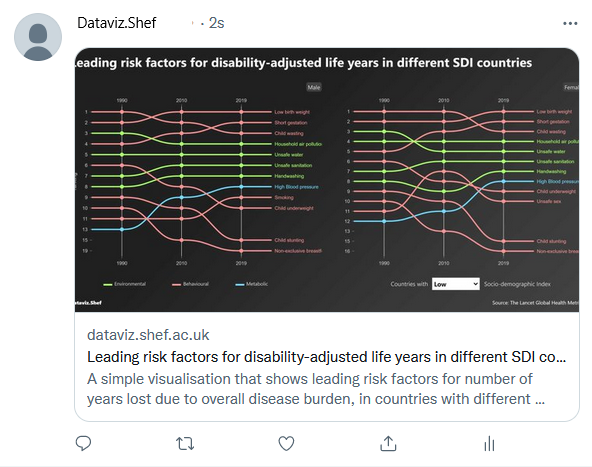

Data visualisation is a great way to create impact, in support of the University’s vision, and supports the promotion of research. Looking back over the past year, data visualisation has been an effective tool for understanding worldwide trending topics such as climate change, CoVid-19, and elections. Attractive and understandable data visualisations increase the visibility of the University's research and appeal to different stakeholders. In addition, by sharing any source code, data, and other resources involved in making the visualisation, others can benefit from this openness, allowing them to effectively reproduce workflows or adapt from our materials and draw inspiration from them.

In the past year, we have created the website <Link to="/">Dataviz.shef</Link>, hosted several <Link to="/events">events</Link>, and provided materials such as <Link to="/#learning-path">learning paths</Link>, <Link to="/blog">blog posts</Link>, and <Link to="/blog/category/tutorial">tutorials</Link> to a range of audiences in the university. Recently, inspired by [Beautiful News](https://informationisbeautiful.net/beautifulnews/), we have created a <Link to="/visualisation/">new visualisation page</Link> for latest research news stories at the University of Sheffield. Visualisations are categorised into departments/faculties and given relevant tags to help you find items which interest you the most.

We are committed to making research news more understandable and accessible to wider audiences. Each visualisation comes with a brief description and several tabs containing information to help you digest and absorb the data. In addition, we have tested most of the visualisations using web accessibility tools to remove as many barriers as possible that prevent people from accessing the latest news via data visualisation. From time to time, you might want to explore some visualisations in detail. Since data and codes are open sourced (and digitally preserved) for almost every visualisation, you would not have to worry about finding underlying resources.

Suppose you would like to download and save any of the visualisations. In that case, you can use the download button just under the visualisation, choosing the static version in SVG or PNG format (if available). Most authors also provide embed code if you would like to present and share visualisations somewhere else!

Another new feature that comes with the new visualisation page is the Twitter card. You can share the visualisation on Twitter with pretty thumbnails by either:

- clicking the Twitter button under each visualisation, or
- copying and pasting the URL of the visualisation into the tweet compose box

If you would like to contribute visualisations to this new page, please refer to the document - <Link to="/docs/21/07/2021/Contribute-visualisation">Contribute visualisation</Link>.

We love feedback and suggestions! Please <a href="mailto:rdm@sheffield.ac.uk">get in touch</a> with us via Slack or Email.
