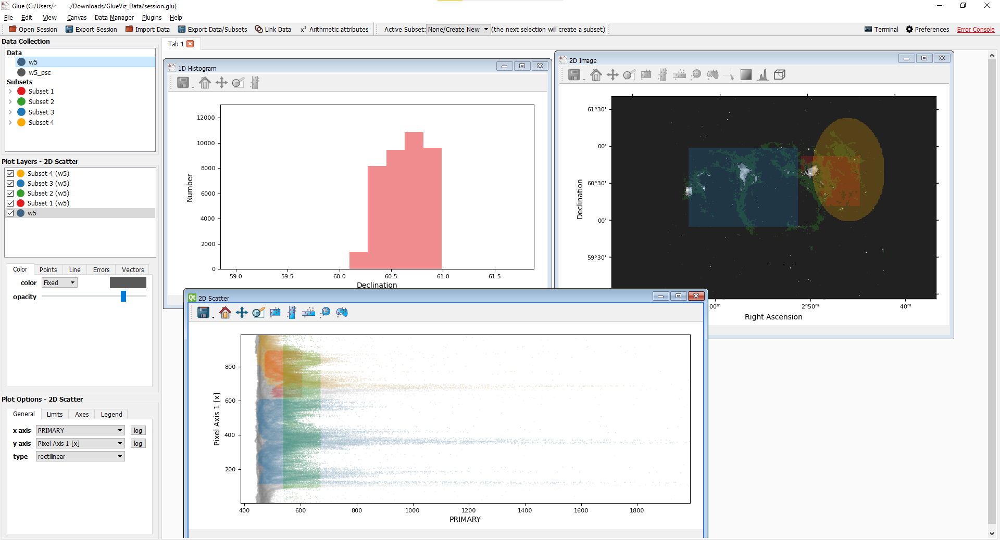

_This is an event blog for the [GlueViz workshop](https://n8cir.org.uk/events/glueviz/) hosted by the N8 Centre of Excellence in Computationally Intensive Research (N8 CIR)._

## Heterogeneous data

Heterogeneous data refers to data samples coming from a number of distinct sources which could well be independent or very different to each other. However, modern research often involved exploration and analysis of interrelated heterogeneous data which cannot be done simply by programming scripts. For example, how do you interpret the daily recorded rainfall in the context of hourly recorded temperature? Given that we have a multiple of social-economic datasets for variety of different populations, how do we find the commonality and difference between these populations? Sometimes we would like to combine data that are not naturally linked together, but there isn't an easy way to achieve this using static visualisations. Hence the _Glue_ word used for the Python library _GlueViz_.

Definition of _heterogeneous_ by the speaker **[Jonathan H Pickering](https://eps.leeds.ac.uk/computing/staff/540/dr-jonathan-pickering)**:

> Items within the data have a diverse nature and are incommensurable because of their different natures.

## GlueViz

The creation of GlueViz dates back to 2012 with additional features added overtime. The data viewer tool is built on top of the [Matplotlib](https://matplotlib.org/) visualisation library and enabled you to visualise the data using Histogram, Image, Scatter plots, Dendrogram, and Table. In the most recent version `v1.2` you will find a new data viewer which is called `3D Scatter` that can generate some very interesting three-dimensional plots. You will soon see an example of this plot later on. If you want to run something programaticlly then Glueviz does have some flexibility as it integrated Python IPython terminal so you could extend Glueviz further and write custom scripts.

  
_GlueViz user interface_

We have talked about heterogeneous data, but GlueViz is also quite useful in exploring just a single dataset. If we were writing Python scripts for some simple data exploration, we would need to import some packages, read and perhaps transform the data file, then call the target method to draw a chart. In the GlueViz software, most stages of this process can be simplified through a graphical user interface and you can drag and drop the dataset to create charts supported by the software (although it is quite limited at this time).

## Features

This section outline some notable features of the Glueviz software.

### Subset propagation

One major feature of Glueviz is the ability to synchonise selections across multiple plots from a same dataset. When you use the selection tool to create a _subset_ of a plot (say plot A which includes any data points falls within the selection area), this will create a new coloured layer on top of the plot. Then any other plots created from the same dataset of the plot A will also highlight the selected data points.

The following image illustrates this feature.

  
_Illustration of subset propagation_

The plot on the top right is a 2D image with three subsets, and the plot on the top left is a Histogram created from the red colour subset. The 2D scatter plot on the bottom is more interesting. This plot is created from the same dataset _w5_ used in the 2D image, and you can see that different colours of selections in the 2D image are also mapped onto this 2D scatter plot. Of course, you can choose not to display certain selection (plot) layer in the menu on the left hand side.

### Datasets linkage

### Session export

Similar to R
Python package - Dill. But this is built-in.

### Custom scripts

## Drawbacks?

- limited charts
- Internal data strucuture can be a bit confusing

## Summary
