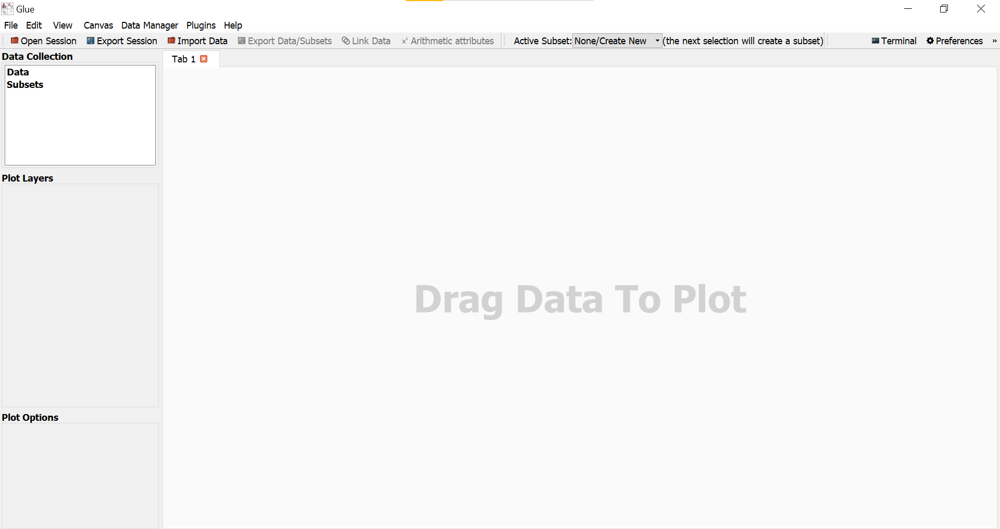
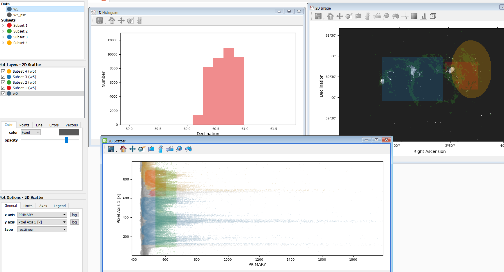
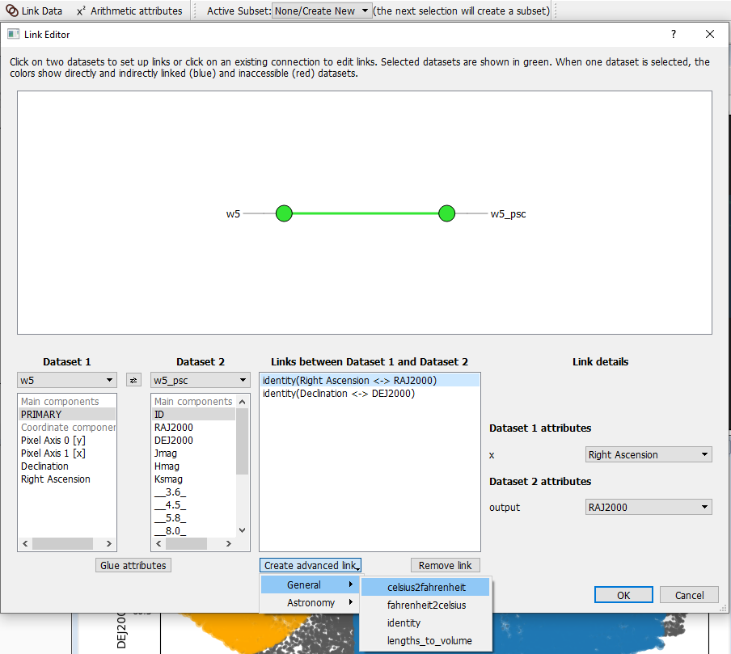
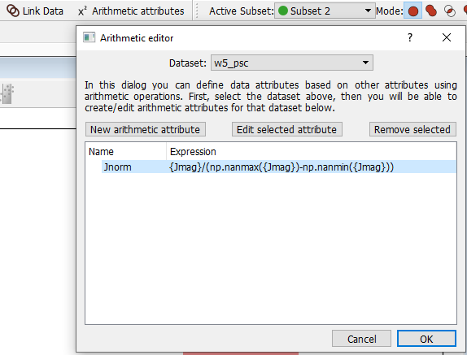
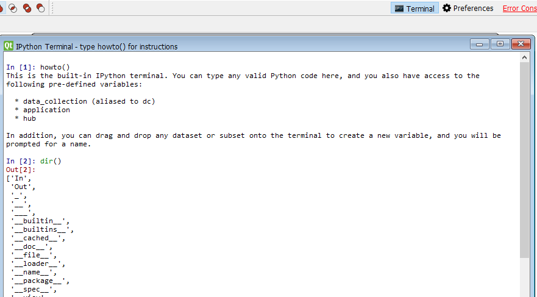

import earthquakeMp4 from "./earthquake.mp4";

_This is an event blog for the [GlueViz workshop](https://n8cir.org.uk/events/glueviz/) hosted by the N8 Centre of Excellence in Computationally Intensive Research (N8 CIR). You can access the training materials from [here](https://n8cir.org.uk/events/event-resource/glueviz/)._

## Heterogeneous data

Heterogeneous data refers to data samples coming from a number of distinct sources which could well be independent or very different to each other. However, modern research often involves exploration and analysis of interrelated heterogeneous data which cannot be done simply by programming scripts. For example, how do you interpret the daily recorded rainfall in the context of hourly recorded temperature? Given that we have a multiple of social-economic datasets for a variety of different populations, how do we find the commonality and difference between these populations? Sometimes we would like to combine data that are not naturally linked together, but there isn't an easy way to achieve this using static visualisations. Hence the _Glue_ word used for the Python library _GlueViz_.

Definition of _heterogeneous_ by the speaker **[Jonathan H Pickering](https://eps.leeds.ac.uk/computing/staff/540/dr-jonathan-pickering)**:

> Items within the data have a diverse nature and are incommensurable because of their different natures.

## GlueViz

The creation of GlueViz dates back to 2012 with additional features added overtime. The data viewer tool is built on top of the [Matplotlib](https://matplotlib.org/) visualisation library and enables you to visualise the data using Histogram, Image, Scatter plots, Dendrogram, and Table. In the most recent version `v1.2` you will find a new data viewer which is called `3D Scatter` that can generate some very interesting three-dimensional plots. However, I&apos;m slightly disappointed about the number of plots that Glueviz provided. Nevertheless, if you want to run something programmatically then Glueviz does have some flexibility as it has an integrated Python IPython terminal so you could extend Glueviz further and write custom scripts, and create your own data viewer!

<video controls>
  <source src={earthquakeMp4} type="video/mp4" />
</video>{" "}

_Video 1: 3D scatter plot of earthquake locations_

We have talked about heterogeneous data, but GlueViz is also quite useful in exploring just a single dataset. If we were writing Python scripts for some simple data exploration, we would need to import some packages, read and perhaps transform the data file, then call the target method to draw a chart. In the GlueViz software, most stages of this process can be simplified through a graphical user interface and you can drag and drop the dataset to create charts supported by the software (although it is quite limited at this time).

  
_Image 1. GlueViz user interface_

## Features

This section outlines some notable features of Glueviz. The speaker mentioned that there is a geospatial tool for Glueviz but not working well in anaconda. If you are interested in this, it is best to install it using `pip`.

### Selection propagation

One major feature of Glueviz is the ability to synchronise selections across multiple plots from the same dataset. When you use the selection tool to create a _subset_ of a plot (say plot A which includes any data points that falls within the selection area), this will create a new coloured layer on top of the plot. Then any other plots created from the same dataset of the plot A will also highlight the selected data points.

The following image illustrates this feature.

  
_Image 2. Illustration of selection propagation_

The plot on the top right is a 2D image with three subsets, and the plot on the top left is a Histogram created from the red colour subset. The 2D scatter plot on the bottom is more interesting. This plot is created from the same dataset _w5_ used in the 2D image, and you can see that different colours of selections in the 2D image are also mapped onto this scatter plot. Of course, you can choose not to display a certain selection (plot) layer in the menu on the left hand side. This feature is particularly useful when you explore the dataset with multiple plots. If you have two more datasets, the selection propagation is still possible via _Data Linking_.

### Data Linking

Sometimes we would like to link two different datasets together and we can do this by using the `Link data` button in Glueviz to _glue_ the same attribute or attributes that describe the same quantity. In this way, selections will also be propagated between datasets.

  
_Image 3. Link data in Glueviz_

Image 3 is an example of linking same attributes from two astronomy datasets _w5_ and _w5_psc_. At the bottom you can see that Glueviz have some built-in advanced links in which you can link translated attributes, or attributes effectively describing the same quantity. If you cannot find a link that suite your need, you can create a custom linking function programatically in the `config.py` file located under the `.glue` directory. You can find more details about this [here](https://docs.glueviz.org/en/stable/customizing_guide/customization.html#custom-links).

  
_Image 4. An example of selection propagation in data linking_

The layout of Image 4 is similar to Image 2 but the bottom plot is replaced by a 2D scatter plot from the dataset _w5_psc_. As you may have observed that blue and orange layers are also passed to the scatter plot, whereas the green and red selections are not propagated because attributes in these layers does not have a link to _w5_psc_ (unlike _Right Ascension_ and _Declination_).

### Arithmetic attributes

It is very common to create a new variable from existing variables, also known as data transformation during data processing/analysis. It is recommended that we do not store transformed/normalised variables in the original data file, but recalculate them whenever they are needed. By sticking to this computational good practice, we can minimise the confusion when other people look at these files.

  
_Image 5. Create a arithmetic attribute in Glueviz_

To create a new attribute for the existing dataset, simply click the `Arithmetic attributes` button on the top menu, then follow the instruction shown in the dialog box. Users are given the option to use functions from the `numpy` library, as well as any functions defined in the`.glue/config.py` file.

### Session export

One thing that I like about Glueviz is the ability to store the current session (literally everything, can include data if you wish to) so you could technically put your work in version control! If you have used RStudio before then this feature should sound familiar. One tip is to export the session regularly, especially before you want to close any windows - as this could sometimes crash the Glueviz.

PS. It can be quite frustrating when a Jupyter notebook crashes and loses all defined variables. Although you can use this **[Dill](https://pypi.org/project/dill/)** package to do some extra work...

### Extensibility

As I have mentioned, Glueviz has an integrated IPython terminal in which you can open from the top right corner. Everything that is typed in the terminal will be reflected on the graphs created. You can also use it to find out more about Glueviz&apos;s data structure and manipulate your data if you wish to.

  
_Image 6. IPython terminal_

Another way to use Glueviz is through its [API](https://docs.glueviz.org/en/stable/developer_guide/api.html?highlight=API). Glueviz provides various endpoints so if you are a Python expert and want the maximum flexibility, this is probably the best starting point.

## Wrap-up

In this blog post I have briefly introduced Glueviz and what it can do to help you explore different, interrelated datasets. If you would like to learn more about Glueviz there are excellent [official documentation](https://docs.glueviz.org/en/stable/index.html) available online and you can also check out the Jonathan's [training materials](https://n8cir.org.uk/events/event-resource/glueviz/).
