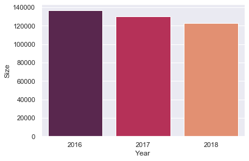

# Objectives
Last article introduced some basic descriptive statistics such as measures of central tendency and measures of variation. In this article we will apply some measures to get a better understanding of three datasets. The datasets we're using are Road Safety Data for accidents between 2016-2018 that is available on <a href="https://data.gov.uk/dataset/cb7ae6f0-4be6-4935-9277-47e5ce24a11f/road-safety-data">data.gov.uk</a>. 


```python
import pandas as pd
import numpy as np
import seaborn as sns

#file names: acc_2016.csv, acc_2017.csv, acc_2018.csv

years = [2016, 2017, 2018]
file_list = []
for year in years:
    df = pd.read_csv("acc_" + str(year) + ".csv", parse_dates=[9,11])
    df["Year"] = year
    file_list.append(df)

df_acc = pd.concat(file_list)
df_acc

```


```python
# select year variable, count number of accident for each year, sort by year.
df_byYear = pd.DataFrame(df_acc.Year.value_counts().sort_index()).reset_index()
df_byYear.columns = ["Year", "Size"]
df_byYear

sns.barplot(x="Year", y="Size", palette="rocket", data=df_byYear)
```




```python
df_acc.Date.describe()
```
