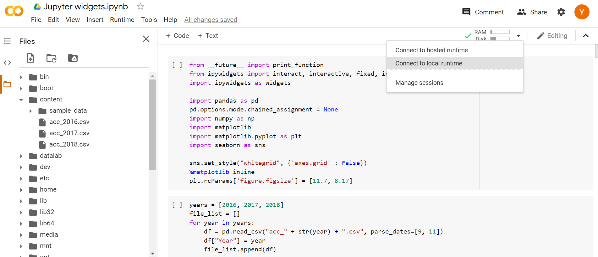
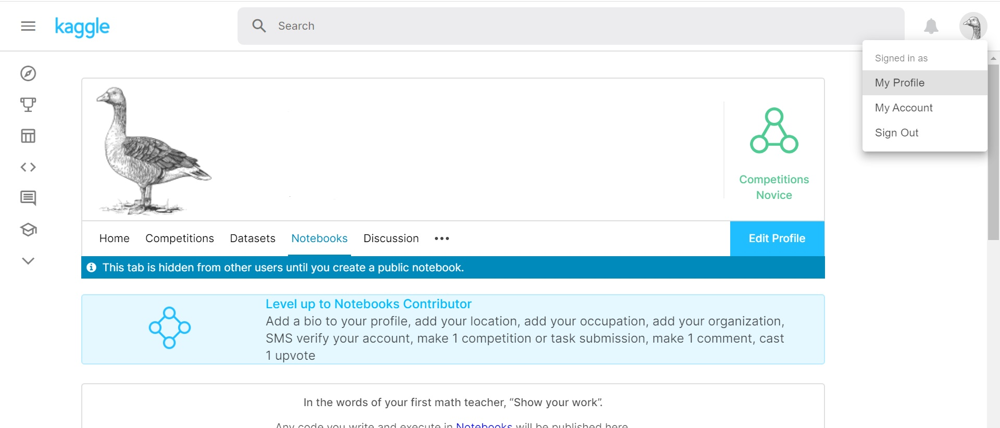
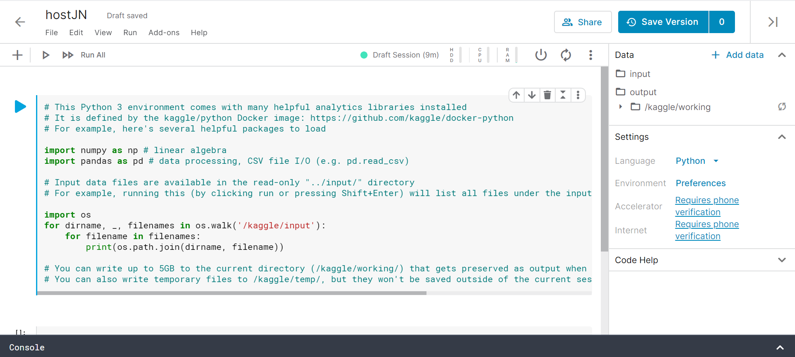

*"As a researcher I want to host Jupyter notebooks on the web for free so that people can access them over the internet."*

---

<br />

# Introduction
The Jupyter Notebook has become a very popluar web application for sharing and creating documents that contain 
live code, equations, visualisations and narrative text. This article put together a number of user-friendly 
pathways for running live, interactive Jupyter notebooks on the web, and documentation on how to use it.

<br />

# Binder
Binder ([mybinder.org](https://mybinder.org)) is a free and transparent public service offers an easy place to share 
computing environments to everyone. *It allows users to specify custom environments and share them with a single link. 
Use-cases involve workshops, scientific workflows and streamline sharing among teams.*  
Generally you'll need to following these steps before using Binder:  
  1. Store your data and Jupyter notebooks in a **public repository** supported by Binder, for example, GitHub, Git, or
  Figshare (see the full list on [mybinder.org](https://mybinder.org)). For illustration, I have created a 
  [GitHub repository](https://github.com/yld-weng/Host-Jupyter-Notebook) and uploaded my notebook and data. 
  2. You **must** create at least one configuration file that specifies your denpendencies and/or configuration of environments. 
  Configuration file varies according to programming languages, see this [documentation](https://mybinder.readthedocs.io/en/latest/config_files.html) 
  for more info. For my notebook that is written in Python, I have simply created a file called *environment.yml*:  
    ```yml      
    channels:
      - defaults
      - conda-forge
    dependencies:
      - ipython
      - seaborn
      - matplotlib
      - numpy
      - scipy
      - pandas
    ```  
    <br />

  3. Go to [Binder](mybinder.org) and build your repository:
  
  Once you have filled all the details and clicked launch, Binder will start working on it and if the build is 
  successful, webpage should be navigated to a Jupyter notebook process
  ([my notebook](https://hub.gke.mybinder.org/user/yld-weng-hostingjupyternotebook-zo9mel24/tree)) same as you 
  would expected in local machines.  
  
  4. On the main page Binder also provides a badge for your notebook that you can embed anywhere you like. You can 
  either share this badge or just copy the URL.
  5. Rebuilt the repository if you have made new changes to your code/data.
  
<br />

# Google Colaboratory
[Google Colaboratory](https://colab.research.google.com/notebooks) is a free online Jupyter notebook 
environment that allows you to run your notebook without installation of dependencies and environments. 
Goole Colab accepts files from upload as well as GitHub repository, or you can connect it to your Google Drive 
and open any notebooks from there.  

The user interface is similar to Jupyter notebook so it is relatively easy to use. Just beware that there are 
two environments **hosted runtime** (default) and **local runtime** you can connected to. For hosted runtime 
the notebook will be execute on Google Compute Engine backend, and any files you have uploaded (note: ideally 
data should be placed under the content folder) will be cleared once the session is terminated. Connect to a 
local runtime using Jupyter allows you to execute code on your local hardware but beware notebooks will have 
access to your local file system.


Lastly, share your notebook by using the share button on the top right of the page (as you how you would share
 a google drive file).

<br />

# Kaggle
Kaggle is a popluar machine learning and data science community attracted more than one million users from over
190 countries and regions. To host a notebook on Kaggle simply register an account and go to *My Profile*, at 
the bottom of the page click on *New Notebook* button.
  

Use the editor to write a new notebook or upload your existing notebooks and data. Once finished, use the share
button!


<br />

# Microsoft Azure Notebooks


<br />

# JupyterHub on ShARC
