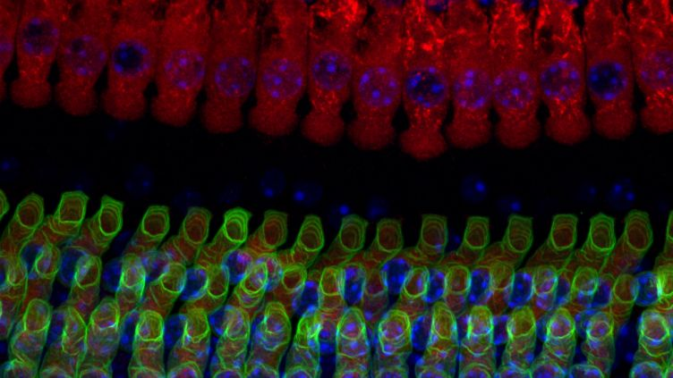

---
author: ["Y.L Weng"]
title: "Scientists awarded funding to investigate causes of age-related hearing loss"
description: "Age-related hearing loss is the most common health condition in the elderly with approximately half of adults in their
 		70s exhibiting symptoms severe enough to affect communication. It is a progressive disorder, which affects our ability to discriminate speech in a noisy environment and is associated with social isolation, depression, and an increased risk of neurodegenerative diseases.
		Although hearing aids and cochlear implants are beneficial, they cannot restore normal hearing.
		This is especially the case when the cells in the ear are missing or do not function, which are both characteristic features when hearing loss is age-related. 
		A major obstacle preventing the development of new treatments is a lack of understanding of the cellular and molecular mechanisms that cause the progressive loss of hearing with age. Uncovering these mechanisms will pave the way to develop new approaches to prevent, slowdown or even reverse the loss of this important sensory system."

date: "2020-03-01"
category: ["News"]
tag: ["Science", "Neuroscience"]
thumbnail: ./hear.jpg
---

  

    <h1 className="text-white text-3xl mt-5">Scientists awarded funding to investigate causes of age-related hearing loss</h1>
    <h2 className="text-white mt-5 text-sm">Y.L Weng</h2>
  

</img>

A newly funded study could lead to a better understanding of why people lose their hearing with age and has 
the potential to help develop new therapies to prevent or repair age-related hearing loss.

Age-related hearing loss is the most common health condition in the elderly with approximately half of adults in their 70s exhibiting symptoms severe enough to affect communication. It is a progressive disorder, which affects our ability to discriminate speech in a noisy environment and is associated with social isolation, depression, and an increased risk of neurodegenerative diseases.

Although hearing aids and cochlear implants are beneficial, they cannot restore normal hearing. This is especially the case when the cells in the ear are missing or do not function, which are both characteristic features when hearing loss is age-related. A major obstacle preventing the development of new treatments is a lack of understanding of the cellular and molecular mechanisms that cause the progressive loss of hearing with age. Uncovering these mechanisms will pave the way to develop new approaches to prevent, slowdown or even reverse the loss of this important sensory system.

Professor Walter Marcotti from the Department of Biomedical Science and the Neuroscience Institute at The University of Sheffield has received £600,765 funding from the Biotechnology and Biological Sciences Research Council (BBSRC) to investigate the biological aspects associated with age-related hearing loss. By providing a better understanding, the study aims to help identify targetable genes in the future, which will allow the development of diagnostic and therapeutic interventions.

Sound is detected by sensitive sensory cells – hair cells – which are located inside the cochlea in the inner ear. When sound enters the ear canal it produces vibrations, which initiate the conversion of sound waves into an electrical current. These currents are sent to the brain via special sensory nerve fibres and allow us to perceive sound.

In normal hearing, central efferent nerve fibres send instructions to hair cells and afferent auditory fibres to change how they are functioning – for example, when a noise is very loud they will reduce the activity of the hair cells to avoid damage. This efferent feedback system helps to keep the hair cells and sensory nerve fibres healthy. However, in age-related hearing loss there is a change in the connection between the efferent nerve fibres and the hair cells which we are yet to understand.

Professor Walter Marcotti explains, “Our research will investigate the change in the efferent nerve fibres in the aging cochlea to test whether this happens as an attempt to repair the faulty aged cochlea. This work will be performed in collaboration with Dr Mirna Mustapha and Dr Stuart Johnson from the Hearing Research Group alongside Dr Saaid Safieddine from the Institute Pasteur in Paris and Professor Dwayne Simmons from the Baylor College in Texas.

“We will not only investigate when, how and why these changes in the efferent nerve fibres occur, but also provide evidence about their functional role and whether the faulty cochlea has the potential to revert back to its normal mature structure following repair. As we begin to think about therapeutic strategies to combat age-related hearing loss, should we be trying to prevent, or promote, the efferent re-wiring?

“This has the potential to provide a significant breakthrough in our quest to deliver a treatment for the millions of older adults affected by age-related hearing loss.”

The research forms part of the work of the University of Sheffield’s Neuroscience Institute, which aims to bring academics and scientists together from across varied specialties to translate scientific discoveries from the lab into pioneering treatments that will benefit patients living with neurodegenerative and sensory disorders.

