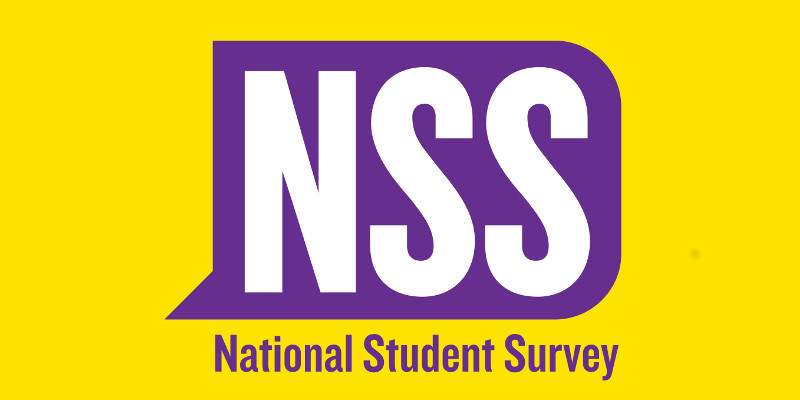

---
author: ["Y.L Weng"]
title: "National Student Survey (NSS) 2020"
date: "2020-03-01"
description: "Thank you for continuing to encourage our students to complete the NSS. We’re now in the third week of the NSS and our overall response rate is currently at 28 percent.
 In order to publish our results we need to reach a 50 percent response rate. "
category: ["Student"]
tag: ["Staff"]
thumbnail: ./nss.jpg
---

  

    <h1 className="text-white text-3xl mt-5">National Student Survey (NSS) 2020</h1>
    <h2 className="text-white mt-5 text-sm">Y.L Weng</h2>
  

</img>

Thank you for continuing to encourage our students to complete the NSS. We’re now in the third week of the NSS and our overall response rate is currently at 28 percent.
 In order to publish our results we need to reach a 50 percent response rate. 

