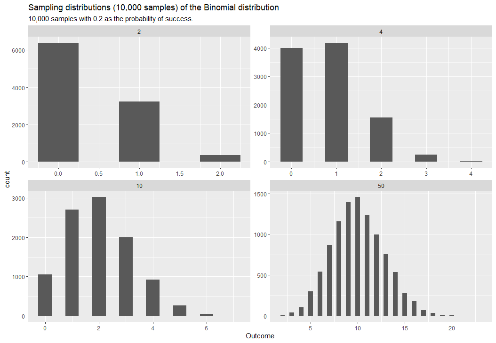
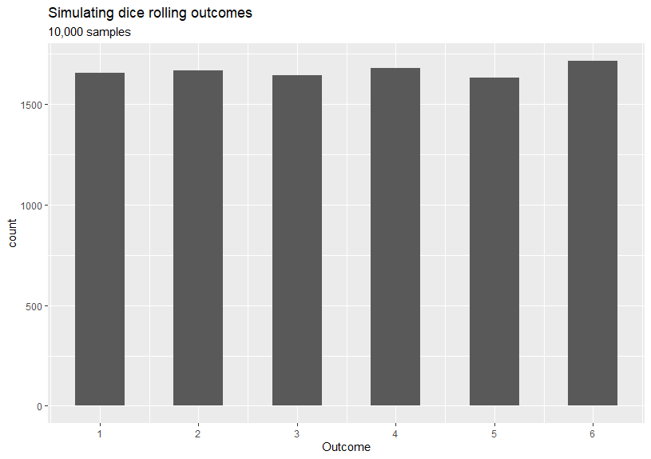
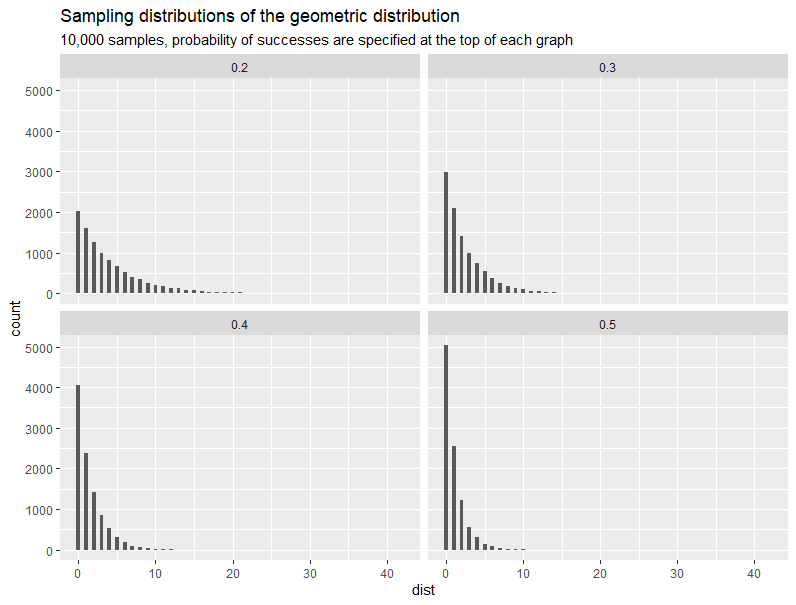
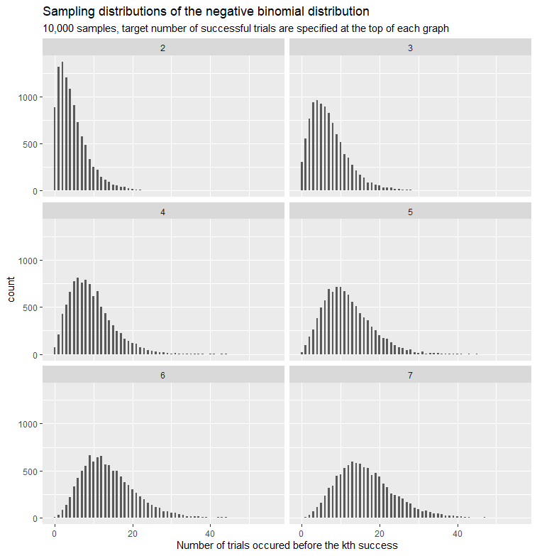
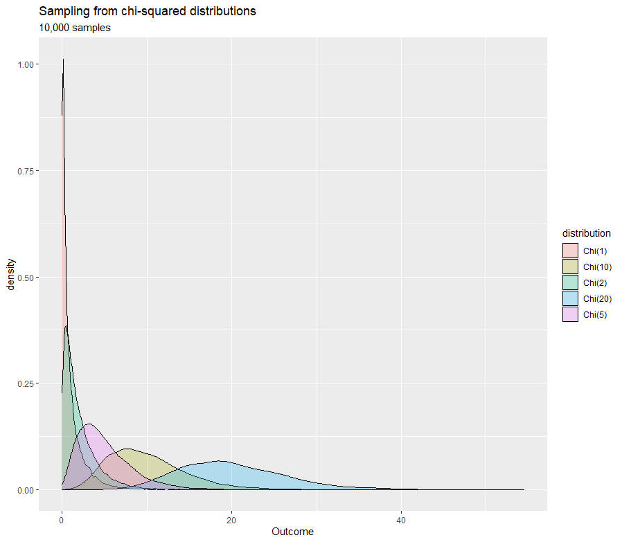
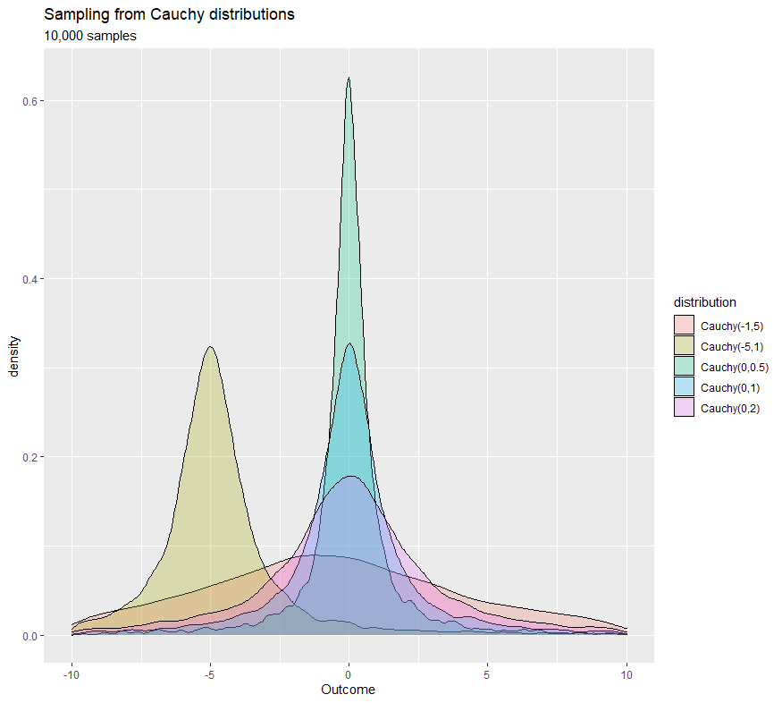
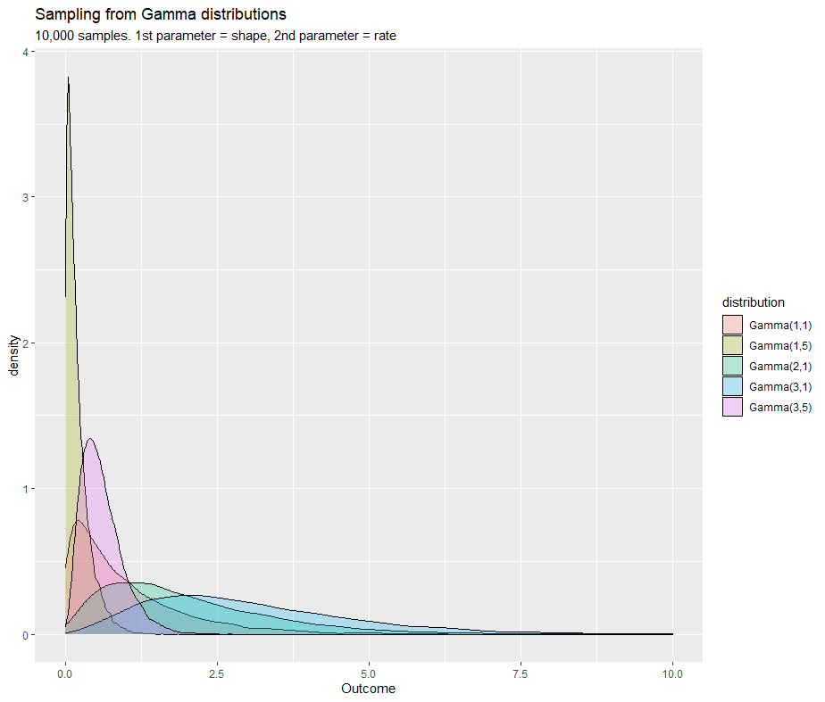

---
type: docs
author: ["Dataviz Team", "Jean Russell"]
title: "Probability Distributions"
description: Statistical Modeling Part 1 - In this chapter we will be exploring probability distributions by variable types.
date: 2021-03-18
---  

import { HiOutlineLightBulb } from "react-icons/hi"  

## Introduction
A **[random variable](https://www.stat.yale.edu/Courses/1997-98/101/ranvar.htm)** is a numerical representation (can be either a set of values or a function mapped to a continuous range) of an experiment's outcomes. A **[probability distribution](https://www.itl.nist.gov/div898/handbook/eda/section3/eda361.htm)** is a mathematical function that gives the probabilities for different possible outcomes of the experiment. Consider an experiment of drawing a ball three times with replacement from an urn which consists of seven red balls and three blue balls. If a random variable **X** represents the total number of times we draw a blue ball, then the set of possible values that **X** can be are:  {$0, 1, 2, 3$}. Then the probability distribution for the random variable **X** gives the probabilities for these outcomes to happen. For example, the chance of getting blue balls from the urn in all three draws will be $(\frac{3}{10})^{3} = \frac{27}{1000} = 2.7\%$. If **Y** is a discrete random variable then it has a corresponding discrete probability distribution; If **Y** is a continuous random variable then its corresponding probability distribution will also be continuous.  

In practice, datasets can be described as samples of the population or outcomes of random variables (features that we have collected). Each dataset usually has two or more variables and each variable could have different probability distributions. It is often our interest to identify a dataset's distribution so that we can make assumptions on the dataset's nature and/or relationships between variables, and develop statistical models based on these assumptions.  

We will be exploring probability distributions for common variable types such as binary, ordinal, nominal, and continuous. For each probability distribution (where possible) we will also give an example and tips on when to use. For a longer list of probability distributions, please see the [pdf](https://www.stat.tamu.edu/~twehrly/611/distab.pdf).  

## Prerequisites
This chapter (Part 1) does not have strict requirements on what you should know, but it would be nice if you are familiar with the following concepts:  

  

    Required 
    
None

  

  

    Recommended
    
Mean, Median, Mode, Range, Standard Deviation, Z-Score, Probability, Continuous/Discrete/Categorical variable

  

  

    Optional
    
Probability Mass Function, Probability Density Function

  

## Discrete
As mentioned in the introduction, a discrete random variable $X$ has a finite number of outcomes and the discrete probability distribution of $X$ is a space that describes the likelihood of occurrence of each outcome. In this section we will learn common discrete probability distributions and what variable type they can match to. You might found the following definitions useful:  

  

    <b>Binary variables</b> are variables which have only two possible values, typical examples are Boolean - True or False, Yes or No, 0 or 1, type 1 or type 2, and many more. In addition, one might create a binary variable from an existing variable to find some useful insight. For example, dividing students into two groups based on whether they have taken a specific course.  
  

  

    A <b>nominal variable</b> is a variable that has two or more unordered categories or groups. Examples of categorical variables are gender, age, hair colour, answers to True or False questions, faculties within the university, blood type, etc. 
  

  

    <b>Ordinal variables</b> are similar to nominal variables but now the order matters. For example, a survey might ask surveyees to rate something at a scale from 0 to 9. Ordinal distributions are exceedingly rare and are often created by combining discrete distributions or applying restrictions on a multinomial distribution. This makes them statistically difficult to handle. You do need a statistician to model ordinal data properly. Alternatively, approximated by splitting into positive and negative results then using a bernoulli or by treating as a scalar thus using Gaussian distribution.
  

  

    <b>Discrete variables</b> are numerical and countable, whereas the previous three variables were categorical (qualitative). Examples of discrete variables are daily average temperatures over a period of time, number of papers that a researcher has published, and the distance that a cyclist has cycled.
  

  
 
 

For each distribution we have created a graph containing subplots, and you will see how the distribution responds to the change of parameters. If you would like a copy of codes that generates these graphs, [download it here](discrete/Discrete.R). Note that these graphs are histograms and if you would like to convert them into probability mass functions, replace `geom_histogram()` by `geom_density()`.
 
We also recommend you visit the [distribution viewer](https://www.essycode.com/distribution-viewer/) website and as it would help you to explore different distributions dynamically.  

### Bernoulli

  

A bernoulli distribution is a single Bernoulli trial (a random experiment with exactly two possible outcomes) in which the probability of success (True, 1, Yes) is $p$ and the probability of failure (False, 0, No) is $1-p$. Therefore, this distribution is a great match for an experiment in which the outcomes are binary variables (Yes or No, True or False). For example, will it rain in the next hour in Sheffield, a rolled dice will show my chosen number between 1 and 6, and whether my pizza be delivered before 6pm. 
 

  <h2 className="mt-0 flex items-center"><HiOutlineLightBulb className="inline-block text-4xl mr-2" /> When to use?</h2>
  <ul className="my-0">
    <li>Binary or bimodal variable</li>
  </ul>

### Binomial
A binomial distribution is a set of $n$ [independent and identically distributed](https://www.statisticshowto.com/iid-statistics/) Bernoulli trials with exactly two outcomes on every single trials, and the probability of success remains the same across all trials. You might find this distribution useful if you were interested in the number of successes has occurred out of a given number of repeated trials. If you would like to see a proof of Bernoullis to a Binomial, [click here](https://math.la.asu.edu/~jtaylor/teaching/Fall2010/STP421/lectures/lecture11.pdf).  

Some examples that conform the binomial distribution:
- the probability of getting only 2 heads out of 10 coin tosses
- given a box contains 4 red balls and 6 green balls, what's the probability of getting red balls 5 times out of 10 draws with replacement
- a student taking a same test three times, the probability of fail the test is 0.2 and tests are independent to each other. What's the probability of the student failed all three tests in a row?  

**Multinomial**  
The multinomial distribution is a generalisation of the binomial distribution. Everything remains the same (including the number of trials and assumptions) except the multinomial experiment now has more than two possible outcomes. Consider a random experiment of drawing 5 balls with replacement from an urn containing 10 red balls, 5 blue balls, 3 yellow balls, and 1 green ball. We can use the multinomial distribution to work the probability of selecting exactly 3 red balls, 1 yellow ball, and 1 green ball.

  
*Sampling distribution of binomial distribution with four different possible outcomes and 0.2 as the probability of success*  

  <h2 className="mt-0 flex items-center"><HiOutlineLightBulb className="inline-block text-4xl mr-2" /> When to use?</h2>
  
Providing that trials are independent, the number of trials is fixed, and the probability of success remains the same:

  <ul className="my-0">
    <li>Categorical variable</li>
    <li>There is a need to compute the probability of a specific outcome (multinomial for multiple outcomes) will occur over a fixed number of trials</li>
  </ul>

### Discrete Uniform
Given that the outcomes of a random variable $U$ is a set of $k$ numerical values and the probability of occurrence of each outcome is the same (i.e. $\frac{1}{k}$), then the probability distribution of the random variable $U$ is called the **discrete uniform distribution**. A fairly common example will be rolling a dice, where each side has equal probabilities.
 

The graph shown on above was generated from the discrete uniform distribution, however, as you might have observed the counts for each possible dice number are not equal when in theory the probability is the same for every number. But if the sample size is large enough (approaches infinity), then the counts will almost surely converge to $\frac{1}{6}$ by the [Law of large numbers](https://en.wikipedia.org/wiki/Law_of_large_numbers). At the same time, the sample mean and the sample variance will follow an approximate normal distribution by the **Central Limit Theorem** (we will discuss more on this in Part 5).  
  
  

  <h2 className="mt-0 flex items-center"><HiOutlineLightBulb className="inline-block text-4xl mr-2" /> When to use?</h2>
  <ul className="my-0">
    <li>Outcomes has equal probability of occurrence</li>
    <li>Variable is countable and discrete</li>
  </ul>

### Poisson
The Poisson distribution is used to model the counts (could be infinity!) of random events in a given time interval, providing that we already know the average counts (the lambda $\lambda$ parameter in the probability mass function) of random events occurred over that time interval. One example might be: we know the average number of students visiting the university website per hour on the exam results release day was 876, what is the probability of exactly 900 students visiting the website in a given hour? The answer is $0.96\%$. And we can also calculate the following probabilities:
- Less than 900 students: $78.7\%$
- More than 900 students: $20.3\%$

 

One aspect of the Poisson distribution is the mean and variance are equal, resulting in very high outliers if the mean is large. Therefore, when we model the mean we also model increased variation around the mean, as the mean increases. If we failed to model data using Gaussian distribution then a mean versas variance graph should be plotted to check if it shows the characteristics of the Poisson or lognormal distribution.

  <h2 className="mt-0 flex items-center"><HiOutlineLightBulb className="inline-block text-4xl mr-2" /> When to use?</h2>
  <ul className="my-0">
    <li>Model count data</li>
    <li>Prediction of events in a given time interval (providing that the mean is given)</li>
    <li>The mean and variance are equal</li>
  </ul>

### Geometric

   

The geometric distribution is a special case of the negative binomial distribution. Suppose we have a sequence of independent trials (Bernoulli) with the probability of success $p$ in each trial, then the probability distribution of a random variable $G$, where its outcomes are the possible number of (failure) trials required until the first successful trial (in this case the number of total trials is not fixed), is called the geometric distribution. For examples:
- suppose the probability of a sunny day is 0.15 in Sheffield and 0.85 for other, what's the probability of a day being sunny weather followed by 5 secutive days of other weathers.
- a person tossing coins, what's the probability of seeing a head after 5 tails in a row
  

 

  <h2 className="mt-0 flex items-center"><HiOutlineLightBulb className="inline-block text-4xl mr-2" /> When to use?</h2>
  <ul className="my-0">
    <li>Model the number of failure trials until the first success</li>
  </ul>

  
  
  

### Negative Binomial
The negative binomial distribution is for modeling the distribution of outcomes of a random variable $B$, where the outcomes are the number of bernoulli trials $r+k-1$ (regardless failure or successful) until the $r$th successful trial. The number of trials is not fixed and the probability of success remains the same. Thus, it is an extension of the geometric distribution.  

Another possible application of the negative binomial distribution is when the data appears to be overdispersion - the variance of data is significantly greater than the variance of the chosen distribution. If you have observed the variance in the Poisson is greater than expected, then maybe consider using this distribution (although there are a huge variety of ways of doing overdispersion including modelling the dispersion problem). To learn more about the origin of negative binomial and more examples, [click this link](https://stattrek.com/probability-distributions/negative-binomial.aspx).  
 

 

  <h2 className="mt-0 flex items-center"><HiOutlineLightBulb className="inline-block text-4xl mr-2" /> When to use?</h2>
  <ul className="my-0">
    <li>Model count data</li>
    <li>Variance is greater than expected, Poisson does not work well in this case</li>
    <li>Interested in the number of trials required before the <b>k</b>th happens</li>
  </ul>

  
  
  

## Continuous
Before we move on to continuous distributions, let's recap the definition of a continuous random variable. A continuous random variable is a numerical representation of an experiment's outcomes, where these numerical representations can take a range of values (uncountably infinite). For example, random variables could take values in these intervals: $[0, 1]$, $(-1, 1)$, $(-\infty, 0)$, and $[a, b]$. Some real-life examples of continuous random variables are time, mass, volume, length, etc. Since the number of possible values that a continuous random variable can take is uncountable, the probability for any specific value is zero (i.e. area under the probability density curve is zero), meaning we cannot calculate the probability at any specific point but we can still work out the probability for a certain range.  
  
A [probability density function](https://en.wikipedia.org/wiki/Probability_density_function) of a random variable $X$ is a function that describes the relative likelihood of occurrence of the random variable $X$'s possible values.

  
*The probability of $x$ is the area under the curve from $a$ to $b$. ([source](https://deepai.org/machine-learning-glossary-and-terms/probability-density-function))*  
 
Same as in the discrete section, for each distribution we have created a graph containing subplots and you will see how the distribution responds to the change of parameters. If you would like a copy of codes that generates these graphs, [download it here](continuous/Continuous.R).
 
We also recommend you visit the [distribution viewer](https://www.essycode.com/distribution-viewer/) website and as it would help you to explore different distributions dynamically.

### Gaussian
The Gaussian distribution (also known as the normal distribution) is probably the most important and common distribution in statistics (and in other areas such as engineering and physics) and it is often used for random variables with unknown distributions. The shape of Gaussian distribution's probability density function is known as the bell curve. Many examples around us are distributed as Gaussian distribution: IQ, exam results, heights, and salaries.  

  
  
  

  <h2 className="mt-0 flex items-center"><HiOutlineLightBulb className="inline-block text-4xl mr-2" /> When to use?</h2>
  <ul className="my-0">
    <li>Distribution of the random variable is unknown and we can use the Gaussian distribution for the initial exploration</li>
    <li>Most of data (approx. 99.7%) are within three standard deviation from the mean, 95% of data should be within two standard deviation from the mean, and 68% of data are within one standard deviation from the mean</li>
  </ul>

From our experiences, when modelling with continuous distributions 60% of the time the Gaussian distribution is assumed, 30% of the time some form of parametric skewed distribution is assumed (lognormal or gamma) and 10% of the time the data refuses to readily fit any distribution.

### Uniform  
The continuous uniform distribution is similar to the discrete uniform distribution other than the calculation is slightly different. In a discrete uniform distribution every outcome has the same probability and we take $\frac{1}{k}$ as the probability where $k$ is the number of total outcomes. Whereas in a continuous uniform distribution, the random variable can take infinite number of values in the range $[a,b]$ so the probability for each value within the range is $\frac{1}{b-a}$ (i.e. evenly distributed according to the length of possible values).

  <h2 className="mt-0 flex items-center"><HiOutlineLightBulb className="inline-block text-4xl mr-2" /> When to use?</h2>
  <ul className="my-0">
    <li>When you know that every events are equally likely to happen</li>
  </ul>

### Chi-square
The chi-square distribution is primarily used in hypothesis testing and tests the difference between distributions for actual observations and expected outcomes (theoretical distribution). For example, we can use the chi-square to find out the type of cars people preferred across age groups. Another application will be to test whether two random variables are independent. 

  <h2 className="mt-0 flex items-center"><HiOutlineLightBulb className="inline-block text-4xl mr-2" /> When to use?</h2>
  <ul className="my-0">
    <li>Test the difference between actual observations and theoretical distribution</li>
    <li>Test for independence between random variables</li>
  </ul>

### F-distribution 
The F-distribution can be seen as a distribution of the ratio of two chi-square distributions, which is the ratio of two sums of squares of deviations of samples from their means. So variance between samples and variance within samples are needed. A F-distribution has two parameters $d_{1}$ and $d_{2}$, where $d_{1}$ is the degrees of freedom of first chi-square distribution and $d_{2}$ is the degrees of freedom for the second one. If the degrees of freedom is small then it means data are more spread out, and vice versa.  

 

  <h2 className="mt-0 flex items-center"><HiOutlineLightBulb className="inline-block text-4xl mr-2" /> When to use?</h2>
  <ul className="my-0">
    <li>Test whether two independent samples (from Gaussian) were drawn with the same variance</li>
  </ul>

### Exponential
The probability density function of the exponential distribution gives the probability of decay at time $t$. This decay is due to the component $\lambda e^{-\lambda x}$ in the probability function which is referred to as the exponential decay and is commonly used for measuring radioactive decay, medication within the human body, and population of endangered species. The distribution is usually used to find out the time required until a specific event happens.

The exponential distribution is related to the Poisson distribution as both distributions are a function of $\lambda$. And provided the time unit is clearly defined in Poisson distribution, the $\lambda$ will be identical in both distributions. For example, as mentioned previously the Poisson distribution can be used to model the number of students visiting the university website in a given time interval. In contrast, we can use the exponential distribution to model the difference between the visit time of current students and the visited time $t$ of the previous student.  

**Q.** Suppose on average there are 876 students visiting the website per hour (assuming these visits are [Poisson process](https://www.stat.yale.edu/~pollard/Courses/241.fall97/Poisson.Proc.pdf)), what is the probability that we need to wait for 1 minute for the next student?  

From the figure we deduce that the mean number of students visiting the website per minute is 14.6, then we can calculate the $\lambda$ as $\frac{1}{14.6}$. Finally, all we have to do is to find the probability of waiting time being more than 1 minute according to this probability density function:  
 
$$
f(x) = \frac{1}{14.6} e^{\frac{1}{14.6} x}
$$ 

Another example would be, suppose that a specific type of car can last 20 years on average and the lifetime of these cars is exponential distributed. We can find out the probability that a car of this type last less than 10 years.  

Note that the exponential distribution is 'memoryless' meaning as long as next event is not observed, then the distribution of time difference from $t$ to $x$ (the time we observed the next event) is the same the time difference from any point in the range $[t+1, x-1]$, to $x$. Thus, time has no effect on further observations.  

  

  <h2 className="mt-0 flex items-center"><HiOutlineLightBulb className="inline-block text-4xl mr-2" /> When to use?</h2>
  <ul className="my-0">
    <li>Model the elapsed time between consecutive events</li>
    <li>Model the waiting time before an event occur</li>
  </ul>

### Cauchy
The cauchy distribution, also known as the impossible distribution does not have mean or variance, but median and mode still exist. It has a similar bell shape to the Gaussian distribution but with much heavier tails, therefore, the cauchy distribution could be useful to test whether data approximate Gaussian distribution. It is also a special case of [student's t distribution](https://en.wikipedia.org/wiki/Student%27s_t-distribution) which wouldn't be discussed in this chapter. The distribution has two parameters $m$ and $\gamma$ where each controls the mode and [full width at half maximum](https://en.wikipedia.org/wiki/Full_width_at_half_maximum) of the distribution. 
 
  

  <h2 className="mt-0 flex items-center"><HiOutlineLightBulb className="inline-block text-4xl mr-2" /> When to use?</h2>
  <ul className="my-0">
    <li>Model the ratio of two independent normal distributions</li>
    <li>Any field dealing with infinite exponential growth (<a href="https://deepai.org/machine-learning-glossary-and-terms/cauchy-distribution">source</a>)</li>
    <li>As a prior distribution in Bayesian inference (<a href="https://arxiv.org/pdf/1507.07170.pdf">source</a>)</li>
  </ul>

### Gamma
The gamma distribution is related to many distributions including the Poisson, chi-square, exponential, and normal distributions. In the gamma function, the $\alpha$ is called the shape parameter and $\beta$ is called the rate parameter (we have also seen the $\lambda$). Recall the example in the exponential distribution that model the waiting time for the visit of next student for the university website (assuming visits are poisson processes which means they are random), a useful application of gamma distribution in this situation is it can model the waiting time for the $n$th student's visit. 
 
  

From the graph shown above, we can see that if we increase either $\alpha$ (the number of events) or $\lambda$ (the mean) and fixed the other parameter, then the density will shifted towards right hand side, meaning longer wait times.  

  <h2 className="mt-0 flex items-center"><HiOutlineLightBulb className="inline-block text-4xl mr-2" /> When to use?</h2>
  <ul className="my-0">
    <li>Model real‐valued positive measurements</li>
    <li>Model the waiting time before the <i>n</i>th event occur</li>
  </ul>

### Beta
The beta distribution represents a distribution of probabilities of a probability in which the probability is unknown or can be used to represent variability over a fixed range. For example, we can use the beta distribution to model how likely a visitor will click a related post at a single visit, whereas the binomial distribution which can also model this problem by computes the percentage of visitors that clicked a related post among all visitors. The former modeling the probability of a random variable (the probability of clicking a related post) and the latter modeling the number of successes out of multiple trials and the probability is fixed from trial to trial.  
 

 

  <h2 className="mt-0 flex items-center"><HiOutlineLightBulb className="inline-block text-4xl mr-2" /> When to use?</h2>
  <ul className="my-0">
    <li>Model probabilities</li>
    <li>Model any uncertain variable with a limited range, e.g. [0,1]</li>
  </ul>

   

## Next step
Well done! You have made it! We hope you will find this material useful and informative. As you have seen that for each distribution we have created a graph from 10,000 generated random samples as representatives of the specific distribution with specified parameters. However, at the moment we have no knowledge of how these samples are generated and what is the process behind it. It is also worth noting that the relationship between the change in mean and change in variance for any model is far more important in large datasets than the actual distribution of individual data points. In <Link to="/docs/18/03/2021/LearningPath-Statistical-Modeling-2">Part 2: Sampling</Link>, we will be getting a general understanding of sampling, different ways of drawing samples, and how we can describe a sample.

## Recommended reading
[Seeing Theory - Probability distributions](https://seeing-theory.brown.edu/probability-distributions/index.html#section1)  
[Understanding and Choosing the Right Probability Distributions](https://onlinelibrary.wiley.com/doi/pdf/10.1002/9781119197096.app03)  
[Statistics Foundations 1](https://www.linkedin.com/learning/statistics-foundations-1)  
[Statistics Foundations 2](https://www.linkedin.com/learning/statistics-foundations-2)  
[Statistics Foundations 3](https://www.linkedin.com/learning/statistics-foundations-3)  
[Probability and Random Variables - MIT OpenCourseWare](https://ocw.mit.edu/courses/mathematics/18-440-probability-and-random-variables-spring-2014/)

  

