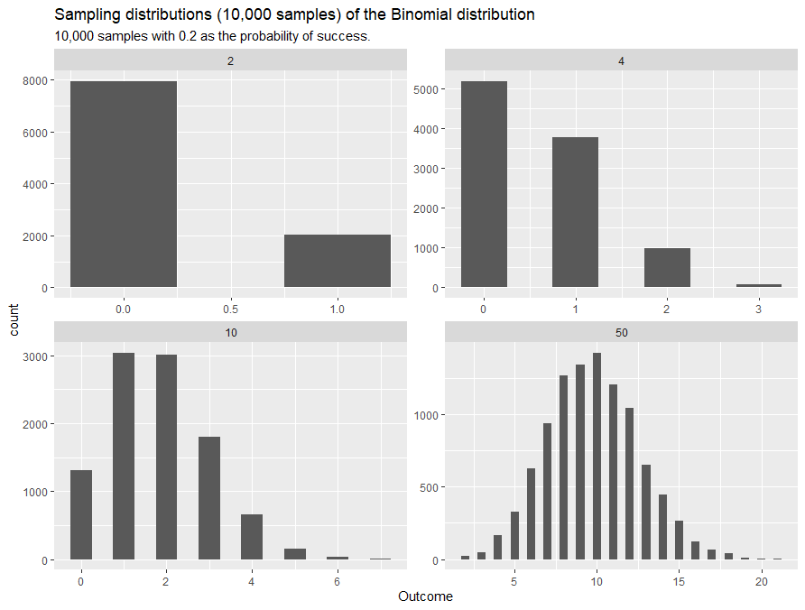
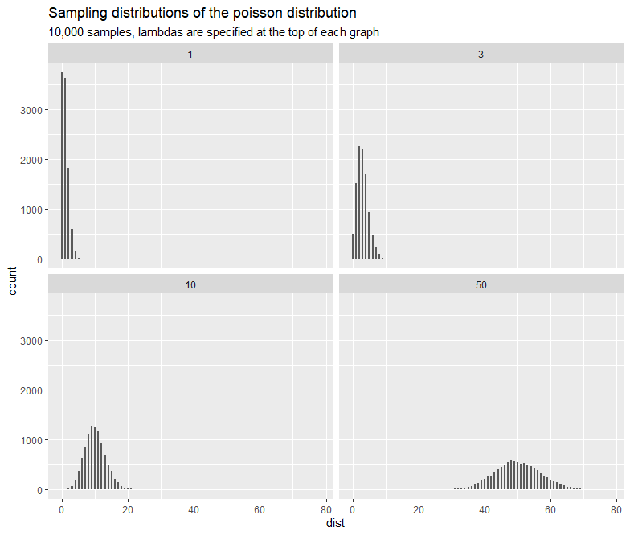

---
type: docs
author: ["Dataviz Team"]
title: "Probability Distributions"
thumbnail: 
description: Statistical Modeling Part 1 - In this chapter we will be exploring probability distributions by variable types.
date: "2021-03-18"
---  

import { HiOutlineLightBulb } from "react-icons/hi"

## Introduction
A **[random variable](https://www.stat.yale.edu/Courses/1997-98/101/ranvar.htm)** is a numerical representation (can be either a set of values or a function mapped to a continuous range) of an experiment's outcomes. A **[probability distribution](https://www.itl.nist.gov/div898/handbook/eda/section3/eda361.htm)** is a mathematical function that gives the probabilities for different possible outcomes of the experiment. Consider an experiment of drawing a ball three times with replacement from a urn which consist of seven reds balls and three blue balls. If a random variable **X** represents the total number of times we drawn a blue ball, then the set of values that **X** can be are:  {$0, 1, 2, 3$}. Then the probability distribution for the random variable **X** gives the probabilities for these outcomes to happen. For example, the chance of getting blue balls from the urn in all three drawn will be $(\frac{3}{10})^{3} = \frac{27}{1000} = 2.7\%$. If **Y** is a discrete random variable then it has a corresponding discrete probability distribution; If **Y** is a continuous random variable then its corresponding probability distribution will also be continuous.  

In practice, datasets can be described as samples of the population or outcomes of random variables (features that we have collected). Each dataset usually have two or more variables and each variable could have different probability distributions. It is often our interests to identify dataset's distribution so that we can make assumptions on dataset's nature and/or relationships between variables, and develop further work based on these assumptions.  
  
In this chapter we will be exploring probability distributions for common variable types such as binary, ordinal, nominal, and continuous. For each probability distribution (where possible) we will also give an example and tips on when to use.  
  

## Prerequisites
This chapter (Part 1) does not have strict requirements on what you should know, but it would be nice if you are familar with the following concepts:  

  

    Required 
    
None

  

  

    Recommended
    
Mean, Median, Mode, Range, Standard Deviation, Z-Score, Probability, Continuous/Discrete/Categorical variable

  

  

    Optional
    
Probability Mass Function, Probability Density Function

  

  

## Discrete
As mentioned in the introduction, a discrete random variable $X$ has a finite number of outcomes and the discrete probability distribution of $X$ is a space that describe the likelihood of occurrence of each outcomes. In this section we will learn common discrete probability distributions and what variable type they can match to. You might found the following definitions useful:  

  

    <b>Binary variables</b> are variables which has only two possible values, typical examples are Boolean - True or False, Yes or No, 0 or 1, type 1 or type 2, and many more. In addition, one might create a binary variable from an existing variable to find some useful insight. For example, dividing students into two groups based on whether they have taken a specifc course.  
  

  

    A <b>nominal variable</b> is a variable that has two or more unordered categories or groups. Examples of categorical variables are gender, age, hair colour, answers to True or False questions, faculties within the university, blood type, etc. 
  

  

    <b>Ordinal variables</b> are similar to nominal variables but now the order matters. For example, a survey might ask surveyees to rate something at a scale from 0 to 9.
  

  

    <b>Discrete variables</b> are numerical and countable, whereas the previous three variables were categorical (qualitative). Examples of discrete variables are daily average temperatures over a period of time, number of papers that a researcher has published, and the distance that a cyclist have cycled.
  

  

 

For each distribution we have created a graph containing subplots and you will see how the distribution response to the change of parameters.  We also recommend you visit the [distribution viewer](https://www.essycode.com/distribution-viewer/) website and as it would help you to explore different distributions dynamically.

### Bernoulli
A bernoulli distribution is a single Bernoulli trial (a random experiment with exactly two possible outcomes) in which the probability of success (True, 1, Yes) is $p$ and the probability of failure (False, 0, No) is $1-p$. Therefore, this distribution is a great match for an experiment in which the outcomes are binary variables (Yes or No, True or False). 

  <h2 className="mt-0 flex items-center"><HiOutlineLightBulb className="inline-block text-4xl mr-2" /> When to use?</h2>
  <ul className="my-0">
    <li>Binary or bimodal variable</li>
    <li>Ordinal variable</li>
  </ul>

### Binomial
A binomial distribution is a set of $n$ [independent and identically distributed](https://www.statisticshowto.com/iid-statistics/) Bernoulli trials with exactly two outcomes on every single trials, and the probability of success remains the same across all trials. You might find this distribution useful if you were interested in the number of times that a particular outcome has occured in a given number of trials. If you would like to see a proof of Bernoullis to a Binomial, [click here](https://math.la.asu.edu/~jtaylor/teaching/Fall2010/STP421/lectures/lecture11.pdf).  
  
**Multinomial**  
The multinomial distribution is a generalisation of the binomial distribution. Everything remains the same (including the number of trials and assumptions) except the multinomial experiment now has more than two possible outcomes. Consider a random experiment of drawing 5 balls with replacement from an urn containing 10 red balls, 5 blue balls, 3 yellow balls, and 1 green ball. We can use the multinomial distribution to work the probability of selecting exactly 3 red balls, 1 yellow ball, and 1 green ball.

  
*Sampling distribution of binomial distribution with four different possible outcomes and 0.2 as the probability of success*

  <h2 className="mt-0 flex items-center"><HiOutlineLightBulb className="inline-block text-4xl mr-2" /> When to use?</h2>
  
Providing that trials are independent, the number of trials is fixed, and the probability of success remains the same:

  <ul className="my-0">
    <li>Categorical variable</li>
    <li>There is a need to compute the probability of a specific outcome (multinomial for multiple outcomes) will occur over a fixed number of trials</li>
  </ul>

### Discrete Uniform
Given that the outcomes of a random variable $U$ is a set of $k$ numerical values and the probability of occurrence of each outcome is the same (i.e. $\frac{1}{k}$), then the probability distribution of the random variable $U$ is called the **discrete uniform distribution**. A fairly common example will be rolling a dice, where each side has equal probabilities.

  

The graph shown on above was generated from the discrete uniform distribution, however, as you might have observed the counts for each possible dice number are not equal when in theory the probability is the same for every number. But if the sample size is large enough (approaches infinity), then the counts will almost surely converge to $\frac{1}{6}$ by the [Law of large numbers](https://en.wikipedia.org/wiki/Law_of_large_numbers). At the same time, the sample mean and the sample variance will follows an approximate normal distribution by the **Central Limit Theorem** (we will discuss more on this in Part 5).  
  
  

  <h2 className="mt-0 flex items-center"><HiOutlineLightBulb className="inline-block text-4xl mr-2" /> When to use?</h2>
  <ul className="my-0">
    <li>Outcomes has equal probability of occurence</li>
    <li>Variable is countable and discrete</li>
  </ul>

### Poisson
The poisson distribution is use to model the counts of random events in a given time interval, providing that we have already know the average counts (the lambda $\lambda$ parameter in the probability mass function) of random events occured over that time interval. One example might be: we know the average number of students visiting the university website per hour on the exam results release day was 876, what is the probability of exactly 900 students visiting the website in a given hour? The answer is $0.96\%$. And we can also calculate the following probabilities:
- Less than 900 students: $78.7\%$
- More than 900 students: $20.3\%$

  <h2 className="mt-0 flex items-center"><HiOutlineLightBulb className="inline-block text-4xl mr-2" /> When to use?</h2>
  <ul className="my-0">
    <li>Model count data</li>
    <li>Prediction of rare events in a given time interval (providing that the mean is given)</li>
    <li>The mean and variance are equal</li>
  </ul>

  

### Negative Binomial
The negative binomial distribution is another discrete probability distribution for modeling count data and is used when the data appears to be overdispersion - the variance of data is significantly greater than the variance of the chosen distribution. If you have observed the variance in the poisson is greater than expected, then consider using this distribution. 

another application of the negative binomial distribution is for modeling the distribution of outcomes of a random variable $B$, where the outcomes are the number of bernoulli trials $r+k-1$ (regardless failure or successful) until the $k$th successful trials. The number of trials is not fixed and the probability of success remains the same.   

  <h2 className="mt-0 flex items-center"><HiOutlineLightBulb className="inline-block text-4xl mr-2" /> When to use?</h2>
  <ul className="my-0">
    <li>Model count data</li>
    <li>Variance is greater than expected, poisson does not work well in this case</li>
    <li>Interested in the number of trials required before the <b>k</b>th happens</li>
  </ul>

### Geometric
Suppose we have a sequence of independent trials (Bernoulli) with the probability of success $p$ in each trial, then the probability distribution of a random variable $G$, where its outcomes are the possible number of (failure) trials required until the first successful trial (in this case the number of total trials is not fixed), is called the geometric distribution. 

  <h2 className="mt-0 flex items-center"><HiOutlineLightBulb className="inline-block text-4xl mr-2" /> When to use?</h2>
  <ul className="my-0">
    <li>Model the number of trials until the first success</li>
    <li>An experiment consists a series of bernoulli trials</li>
  </ul>

## Continuous

### Gaussian Normal

### Uniform  

### Chi-squared  

### F-distribution 

### Exponential

### Cauchy

### Gamma

### Beta

