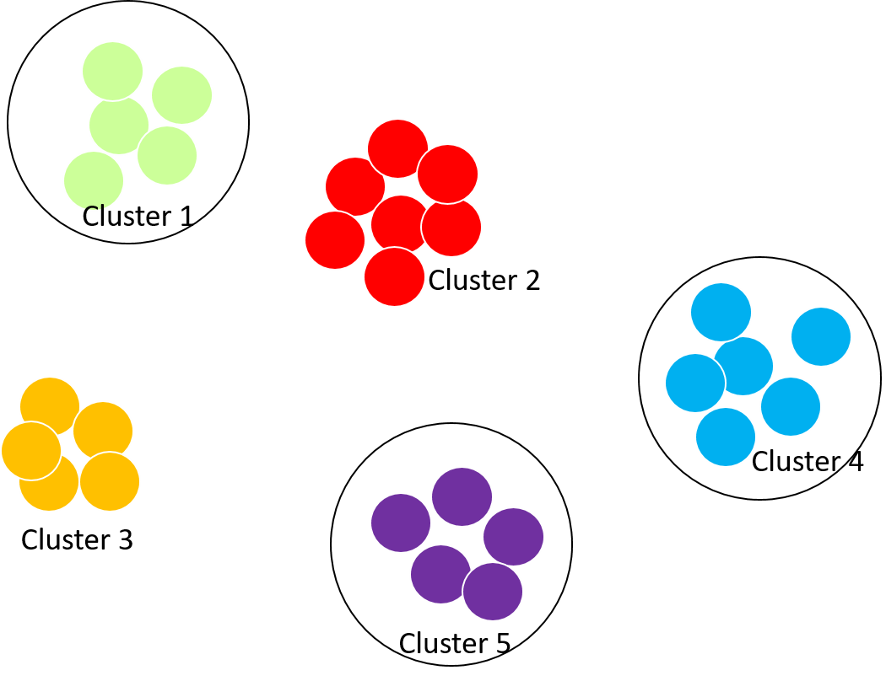

---
type: docs
author: ["Dataviz Team", "Jean Russell"]
title: "More random sampling methods"
description: Stratified, systematic, and cluster sampling methods.
date: 2021-03-18
---  

Note: This page is an option chapter of <Link to="/docs/18/03/2021/LearningPath-Statistical-Modeling-2">Statistical Modeling Part 2 - Sampling</Link>.  

## Random Sampling
Random sampling (or probability sampling) refers to nonsubjective sampling methods that apply some mechanism to ensure randomness. 
 
### Systematic
The systematic sampling method starts with a random starting point and selects individuals from the population with a periodic interval. For example, we start from the 2nd individual and choose every 10th individual (12th, 22nd, 32nd, ...) that are encountered until the end of the population or up to the target sample size. The interval is usually calculated as the number of populations divided by the sample size. The main advantage of the systematic sampling method over the simple random sampling method is the cost.
 
**Disadvantages**: Some populations may contain hidden patterns and we may be negligent and select them as samples.
 
### Stratified

  

The stratified sampling method aims to create a sample which is representable for every subgroup. The main idea is to divide the population into homogeneous subgroups and choose an equal number of samples from each subgroup using the simple random sampling methods. The stratified sampling method is suitable for survey subjects with a large population and large internal differences. Compared with simple random sampling and systematic sampling, when the sample size is the same, its sampling error is smaller; when the sampling error requirements are the same, it requires a smaller sample size.  

**Disadvantages**: you must have a good understanding of the overall situation of the population, otherwise it is impossible to make a good classification of subgroups. This is often difficult to achieve before actual investigations of the population.
 
### Cluster

  
*Clusters 1, 4, 5 are chosen*  

Cluster sampling refers to a sampling method that selects all samples from a certain number of clusters. For example, when inspecting the quality of a certain electrical part, instead of inspecting the electrical parts one by one, a number of boxes (each box contains several electrical parts) are randomly selected to conduct a comprehensive inspection of each box. Note that clusters share some characteristics. The selection of the clusters can be done by either simple random sampling or systematic sampling.
 
The application of the cluster sampling method is different from the stratified sampling method.
The stratified sampling method is suitable when a certain population contains several subgroups (or categories, levels) and subgroups have substantial differences from each other but exhibit small differences within the group. Conversely, go for cluster sampling when the difference between subgroups is not significant, and there is large variation within subgroups.
 
**Disadvantages**: due to the large differences between different groups, the sampling error caused by this is often greater than simple random sampling. Additionally, the sample is not widely distributed, and the representativeness of the sample to the population is relatively poor.  