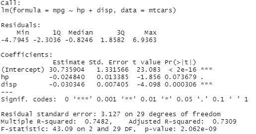
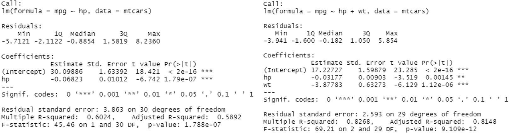

import { HiOutlineLightBulb } from "react-icons/hi";
import FlowChart from "../../visualisation/2021-08-04-Which-Statistical-Test-To-Use-For-Two-Variables/flowChart/flowChart";
import { ReactFlowProvider } from "react-flow-renderer";

## Introduction

Statistical (hypothesis) testing is a methodology that is used to determine whether there are significant differences between two or more understanding of the data (hypotheses or models) that has been sampled. The significance test is one of the most commonly used methods of hypothesis testing and the most basic form of statistical inference. The process of hypothesis testing is shown on the diagram below:

  
_The process of hypothesis testing - by Dr. Jean Russell_

Commonly used hypothesis test methods are T-test, F-test, and Pearson's Chi-squared Test. These tests are called paramateric tests because the hypothesised model parameterise the underlying distributions differently (for example, Gaussian/normal distribution has two parameters - mean and standard deviation).

The basic idea of hypothesis testing is the principle of 'rare events' - where an event is extremely unlikely to happen in an experiment, and the idea of contradiction. The testing starts with a null hypothesis (usually denoted as $H_{0}$). the null hypothesis is always the hypothesis that assumes the simpler parameterisation of the model, or the hypothesis we believe to be false. The hypothesis $H_{0}$ should be rejected if the observed sample is classified as a rare event, otherwise the hypothesis should be accepted. In all cases, there will also be a hypothesis $H_{1}$ called the alternative hypothesis, which is effectively the opposite of our hypothesis $H_{0}$. A clear understanding or definition of your null hypothesis and alternative hypothesis will help you interpret the significant result.

Performing a test usually consists the following steps:

1. Set the test hypothesis (or null hypothesis) and denote it as $H_{0}$, so the alternative hypothesis will be $H_{1}$.
2. Set the test level (or the significance level) $\alpha$, usually taken as 0.05 or 0.01. The value represents the probability of the null hypothesis being incorrectly rejected, given that the null hypothesis is true (or simply, the probability of the observed sample being a rare event).
3. Choose a suitable statistical test.
4. Based on the size of the statistic and the p-value obtained from the test, determine whether to accept or reject the null hypothesis. If the p-value (probability of the observed value being as a rare event) is less than $\alpha$ then we can reject $H_{0}$. Otherwise in the case of $p > \alpha$ we accept $H_{0}$.

In part 4 we will be looking at common hypothesis test method and their application in linear models. You can download the R script file [here](./script.R).

We have also prepared a flowchart helps you to choose a statistical test for comparing two variables. Please click the button below to start.

<ReactFlowProvider>
  <FlowChart />
</ReactFlowProvider>

<br />

## Prerequisites

<div className="bg-white shadow-md p-3 md:p-5 rounded-3xl text-base text-black border-1 border-gray-50">
  <div>
    <span className="py-1 px-2 bg-shefYellow text-black hover:bg-yellow-400 transition duration-300 cursor-pointer text-base font-semibold rounded-md mr-3">
      Required
    </span>
    <p className="mt-2">None</p>
  </div>
  <div className="mt-6">
    <span className="py-1 px-2 text-white bg-shefGreen hover:bg-green-700 transition duration-300 cursor-pointer text-base font-semibold rounded-md mr-3">
      Recommended
    </span>
    <p className="mt-2">
      Part 3 of learning path, F distribution, Student's t distribution
    </p>
  </div>
  <div className="mt-6">
    <span className="py-1 px-2 text-white bg-shefBlue hover:bg-blue-900 transition duration-300 cursor-pointer text-base font-semibold rounded-md mr-3">
      Optional
    </span>
    <p className="mb-0 mt-2">None</p>
  </div>
</div>{" "}

<br />{" "}

## Formulating the Hypotheses for testing

## Z-test

A Z-test is a hypothesis test based on normal distribution that investigate the significance difference between two group mean with the following assumptions:

- large sample size (over 30)
- samples are independent
- populations follows normal distribution
- variances are known

There is no built-in function in R for calculating z-test, however, you can work it out using means and variances for each sample group and refer to the standard normal table.

## T-test

The T-test is a hypothesis test that investigate the significance difference between two groups with the following assumptions:

- samples are independent
- populations follows normal distribution
- data are categorical or continuous
- homogeneity of variance (meaning variances are equal among independent samples), depending on what t-test you use. Though the [Welch's t-test](https://en.wikipedia.org/wiki/Welch%27s_t-test) doesn't require this. Whereas the Levene's test and Student's t-test requires this assumption to be true
- sample size is not large

The test calculates the t-value according to [Student's t distribution](https://en.wikipedia.org/wiki/Student%27s_t-distribution) and if the t-value close to zero then it suggests there isn't a significant difference between two groups. There are three types of T-test:

1. **One-sample t-test** - use for comparing a single group against a target value.
2. **Two-sample t-test** - use for comparing groups sampled from two different population
3. **Paired t-test** - comparing groups sampled from the same population

In addition to three types of T-test we have mentioned, you might also need to consider whether to use a **one-tailed test** or a **two-tailed test**. The t-distribution looks similar to the normal distribution and it has two tails, and in most of the t-test we use two-tailed tests by default and test both the negative and positive differences. For example, say we want to test whether the population mean equals to 30, in this case a two-tailed test is used. If we were interested in the case when the population mean greater than or equal to 30, then a one-tailed test would be more suitable as we are not interested in the other side (the population mean is less than 30).

Example R code:

```r
# Two-tailed t-test (unpaired)
t.test(
  treatment1,
  treatment2,
  alternative = "two.sided",
  var.equal = FALSE
)
```


[Click here](https://www.sthda.com/english/wiki/t-test-formula) to see t-test formula.

## F-test

F-test is a test that the statistical value (or f value) obeys the [F-distribution](https://en.wikipedia.org/wiki/F-distribution) (this is the sampling distribution for ratio of variances - $\frac{\textrm{between-group variance}}{\textrm{within-group variance}}$) under the null hypothesis $H_{0}$. It is usually used to analyse a statistical model that uses more than one parameter to determine whether all or part of the parameters in the model are suitable for estimating the population. In short, the F-test compares nested models fit to the same dataset by comparing variances of models. The assumptions for data will be similar to the one in T-test:

- data are normally distributed
- data are independent from each other
- sum of squares follows $\chi^{2}$ distributions

Example R code:

```r
var.test(
  age20,
  age25,
  ratio = 1,
  conf.level = 0.95,
  alternative = "two.sided"
)
```


There are other tests we can also use to test for homogeneity of variance:

- Brown-Forsythe - use median instead of the mean, good for non-normality data
- Bartlett (least robust, use to test equal variances among samples)
- Levene - good for symmetric, moderate-tailed distributions. An alternative for Bartlett
- Chi-Square - use for comparing the variance of a population against a target value

## Linear models

A practical application of hypothesis testing is in linear models. Linear regression is a statistical analysis technique that uses the least square regression function to model the relationship between a continuous response variable and one or more independent predictor (or explanatory) variables. This function is a linear combination of one or more model parameters called regression coefficients. Functions that have only one predictor variable are called simple regression, and functions with more than one predictor variable are called multiple regression. In linear regression, the data is modeled using a linear predictive function, and unknown model parameters are also estimated through the data. These models are called linear models.

A simple regression looks something like the following:

$$
Y_{i} = \alpha + \beta_{1}X_{1i} + \beta_{2}X_{2i} + \epsilon_{i}
$$

where $i=1,2,...,n$, $\alpha$ is the Y intercept, $\beta_{1}X_{1i}$ and $\beta_{2}X_{2i}$ are linear components, and the $\epsilon_{i}$ is the (normally distributed) random errors.

In addition to prediction using linear models, we are also concerned with the quality of estimates of parameters and the distribution of errors and residuals. In this section, we are going to see some use cases of t-test and f-test in linear models.

### T-test

If we were creating a linear model from a dataset and print a summary of the details, we will be getting outputs like this:

```r
# use the built-in dataset mtcars
lm2 <- lm(mpg ~ hp + disp, mtcars)

summary(lm2)
```



Notice that for each variable there are corresponding t-statistic and p-value ($Pr(>|t|)$). But what are we testing? In a linear model we are testing the null hypothesis that the coefficient $\beta{j}$ of variable $X{ji}$, is equal to zero. In the picture on above, our estimate of `disp` has a p-value that significantly smaller than 0.05 (the default significance level) which means we have sufficient evidence to reject the null hypothesis that the coefficient equals to zero, meaning we can keep the `disp` variable for th model. On the other hand, the variable `hp` has a p-value of 0.73679 which suggests we do not have strong evidence to reject the null hypothesis. Then a naive final model would be

$$
mpg = 30.73 - 0.03disp
$$

The $R^{2}$ score shows how well the regression fitted to data, the closer to 1 the better. The f-statistic in the output tells us whether the current model is better than the intercept-only model (i.e. setting all variable's coefficients to zero). In this case, the p-value suggests we can reject the null hypothesis that all coefficients are equal to zero.

### ANOVA

Analysis of variances or ANOVA extends from t-test and is used to test the significance of the difference between the means of two or more samples (that may come from different groups). Due to the influence of various factors, there is variability in data obtained from sampling. The causes of variation can be divided into two basic sources:

- **Between-group variation** - Differences caused by experimental conditions like different treatments. It is expressed by the total sum of the sum of squared deviations between the mean value of the variable in each group and the grand mean.
- **Within-group variation** - Differences caused by measurement errors or differences between individuals. These errors are random errors. They are expressed by the sum of the sum of squared deviations between the mean in each group and the value of the variable within the group.

The total variances will be variances from between-group plus variances from within-group. [Click here](https://people.richland.edu/james/lecture/m170/ch13-1wy.html) to see formula for calculation of these variances.

Assumptions:

- samples are independent
- homogeneity of variances between samples
- experimental errors are normally distributed

There are several types of ANOVA but one-way ANOVA and two-way ANOVA are the most common ones which assess differences between a continuous variable and one predictor variable, and differences between a continuous variable and two predictor variables, respectively. Now, let's look at how we can use ANOVA with f-tests to compare two linear models.

Suppose I have the following two models, where the second linear model has a additional variable we would like to include:

```r
lm1 <- lm(mpg ~ hp , mtcars)
lm2 <- lm(mpg ~ hp + gear, mtcars)

summary(lm1)
summary(lm2)
```



From the summaries on above we can see the variable `gear` with a positive coefficient is a good addition to the model (somewhat suggests cars with more gears have better fuel economy). Now we can use the anova function to see which model provides the best fit of the data.

```r
anova(lm1, lm2)
```


From the result we can see that the sum of squares has reduced over 30%, and the p-value suggesting we can easily reject the null hypothesis that the ratio of between-group variance and within-group variance is not equal to one (which assess the variability of means in each group), therefore, this additional variable `gear` have significantly improved the model and we can happily accept the new variable into our model.

## Next step

In this part of the learning path we have scratched the surface of statistical testing and seen two common hypothesis testing methods and their application in linear models. For more comprehensive materials on this topics, please refer to materials in the **Recommended reading** section. In <Link to="/docs/12/04/2021/LearningPath-Statistical-Modeling-5">part 5</Link> we will introduced you to the **Central Limit Theorem** which is a very important theorem in statistics, and is also the reason why we can make assumptions about the underlying distribution of samples in parametric tests.

## Recommended reading

[Seeing Theory - Frequentist Inference](https://seeing-theory.brown.edu/frequentist-inference/index.html#section1)  
[Hypothesis Testing](https://ocw.jhsph.edu/courses/methodsinbiostatisticsii/PDFs/lecture15.pdf)  
[Another hypothesis Testing material](https://www.ucl.ac.uk/~uctp41a/b203/lecture4.pdf)  
[T-test](https://www.stats.ox.ac.uk/~massa/Lecture%2010.pdf)  
[Maths behind linear models](https://math.nyu.edu/~cfgranda/pages/OBDA_fall17/notes/linear_models.pdf)  
[ANOVA](https://bookdown.org/ndphillips/YaRrr/anova.html)

## Sidenote

Statistical (hypothesis) testing is a methodology in **frequentist inference** (often compared with bayesian inference). The major difference between the **frequentist inference** and **bayesian inference** (both are type of [statistics inference](https://www.bristol.ac.uk/medical-school/media/rms/red/4_ideas_of_statistical_inference.html)) lies in how they interpret the parameter space (i.e. all possible values of parameters we're trying to estimate). The frequentist approach considering that there are unique true constant parameters, the observation data is generated under these parameters. Since it is not known which values the parameters are, the maximum likelihood estimation (MLE) and confidence interval are introduced to estimate parameters in the parameter space. Whilst the bayesian approach considered that the parameter itself has a probability distribution, thus parameters might not be unique. Each value in the parameter space has some probability to be the parameter used by the real model so prior distribution and posterior distribution are introduced to find out the probability of each parameter value in the parameter space.

---

When you use test functions in R you will often see _confidence interval_ included in your results with a certain percentage. A confidence interval estimates a range of possible values which is very likely to include population mean. If you look closely at the formula of the confidence interval then you will see it calculates variations around the sample mean. A common misunderstanding of confidence interval is to interpret it as the probability of the population mean will fall within the interval. However, the actual meaning of the percentage is the probability that the interval produced will contain the population mean. For example, if we have a 99% confidence interval then we are confident that we will see the population mean fall within the interval in 99 out of 100 times of construction of confidence intervals. Whereas the misunderstanding put confidence on a particular confidence interval.
