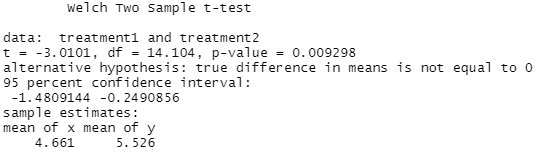
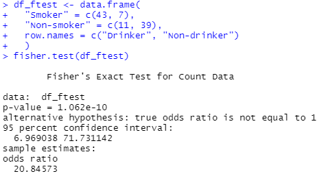
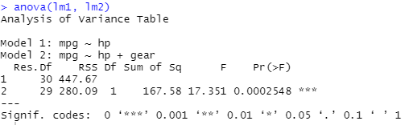
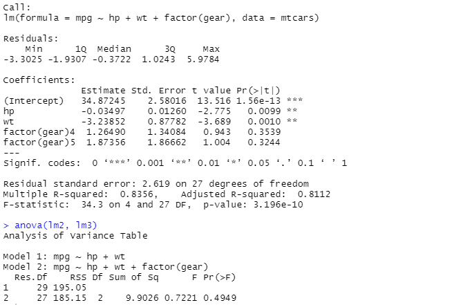

import { HiOutlineLightBulb } from "react-icons/hi";
import FlowChart from "../../visualisation/2021-08-04-Which-Statistical-Test-To-Use-For-Two-Variables/flowChart/flowChart";
import { ReactFlowProvider } from "react-flow-renderer";

## Introduction

Statistical (hypothesis) testing is a methodology that is used to determine whether there are significant differences between two or more understanding of the data (hypotheses or models) that has been sampled. The significance test is one of the most commonly used methods of hypothesis testing and the most basic form of statistical inference. The process of hypothesis testing is shown on the diagram below:

  
_The process of hypothesis testing - by Dr. Jean Russell_

Commonly used hypothesis test methods are T-test, F-test, and Pearson's Chi-squared Test. These tests are called paramateric tests because the hypothesised model parameterise the underlying distributions differently (for example, Gaussian/normal distribution has two parameters - mean and standard deviation).

The basic idea of hypothesis testing is the principle of 'rare events' - where an event is extremely unlikely to happen in an experiment, and the idea of contradiction. The testing starts with a null hypothesis (usually denoted as $H_{0}$). the null hypothesis is always the hypothesis that assumes the simpler parameterisation of the model, or the hypothesis we believe to be false. The hypothesis $H_{0}$ should be rejected if the observed sample is classified as a rare event, otherwise the hypothesis should be accepted. In all cases, there will also be a hypothesis $H_{1}$ called the alternative hypothesis, which is effectively the opposite of our hypothesis $H_{0}$. A clear understanding or definition of your null hypothesis and alternative hypothesis will help you interpret the significance of the result.

Extending from the diagram shown on above, there are a number of important steps throughout the testing:

1. Specify the null hypothesis and the alternative hypothesis clearly in English. Think about what you want to be true and what you consider to be false. What difference would there be in the numbers if the alternative hypothesis was true rather than false?
2. Choose a suitable statistical test. This depends on hypotheses you have established previously. A clear hypothesis should give you a clue on what test to use. For example, t-test can be used to test the difference between two means, or test whether a regression coefficient is to be included in the model. Use t-test as a first go if you are not sure.
3. Check if distributional assumptions for the test are satisfied on the data. Generally, you should be fine with tests assuming normality as long as standard deviations do not vary hugely with the group, but if any of the distributional assumptions are violated then you need to reconsider a different test. For example, use a non-parametric test, or maybe transform the dependent (outcome) variable. Beware that what you are testing will be reformulated by doing this.
4. If all distributional assumptions are met then you can start to look at the p-value for the test and the coefficients in the model e.g., the different means in ANOVA or the regression coefficients.

In part 4 we will be looking at common hypothesis test methods and their application in linear models.

We have also prepared a flowchart to help you to choose a statistical test for comparing two variables. Click the button below to open the flowchart.

<ReactFlowProvider>
  <FlowChart />
</ReactFlowProvider>

<br />

## Prerequisites

<div className="bg-white shadow-md p-3 md:p-5 rounded-3xl text-base text-black border-1 border-gray-50">
  <div>
    <span className="py-1 px-2 bg-shefYellow text-black hover:bg-yellow-400 transition duration-300 cursor-pointer text-base font-semibold rounded-md mr-3">
      Required
    </span>
    <p className="mt-2">None</p>
  </div>
  <div className="mt-6">
    <span className="py-1 px-2 text-white bg-shefGreen hover:bg-green-700 transition duration-300 cursor-pointer text-base font-semibold rounded-md mr-3">
      Recommended
    </span>
    <p className="mt-2">
      Part 3 of learning path, F distribution, Student's t distribution
    </p>
  </div>
  <div className="mt-6">
    <span className="py-1 px-2 text-white bg-shefBlue hover:bg-blue-900 transition duration-300 cursor-pointer text-base font-semibold rounded-md mr-3">
      Optional
    </span>
    <p className="mb-0 mt-2">None</p>
  </div>
</div>

<br />

## Formulating the Hypotheses for testing

There is never one hypothesis in statistics; they always come in pairs: a null and an alternative. When you formulate a hypothesis you normally actually start with the **alternative hypothesis**. The way to find these alternative hypotheses is to look at what sort of evidence you would see as bolstering the idea that you wish to explore. For instance:

- If we were exploring whether Sheffield or Hallam students were more likely to attend events during Varsity, we would be interested in the difference in number attending. Specifically we would be interested if there was a clear majority of students from either university.
- If we were interested in whether a new treatment for Covid worked then we would be interested in whether it performed better than the current one.
- If we were exploring what type of hospitality venues did better in the city centre then we may be interested in a difference in the difference in revenue. Then we would be interested in differences between revenues at different venues.

The **null hypothesis** is however, the hypothesis that says what happens if the data is totally boring. It is usually more precise than the alternative. So the null hypotheses are for those scenarios above:

- There is no difference between the number of students attending from Sheffield and those from Hallam.
- The new treatment for Covid performs the same as the previous treatment.
- There is no difference between types of venue in the revenue they bring in.

The nulls are simple and exact, they also usually assume what we are interested in exploring does not exist. It is therefore possible to have sets of hypotheses that are more than pairs. This typically happens in linear regression and multifactor ANOVA.

## How Hypotheses affect the Study Design

There are a number of ways that having specified your hypotheses that will help you design your study. You need to make sure that you have robust ways of measuring your outcome variables. These may be using a tried and tested method of gathering data or developing a new one. You also need to measure or encode correctly into the data any comparison that is important to your hypotheses. Basically if you are wanting to measure the difference between two or more groups then you must collect data from every group. I If you have not recorded the correct data either missed a group or a variable then no matter how fancy your experiment is it will not answer those questions.

Further, if you have some idea of what sort of difference is of interest then it is possible to calculate a sample size. You can get an idea of what might be of interest from previous studies. This is useful because often the process carried out to gather the data is the most expensive part of the study and quite often increases per subject. You need to gather as few as possible without risking missing an important result because you have gathered too few. If you collect too few then you may need to consider sequential designs which means if the result is not significant then you carry on collect more results. This is beyond the scope of this learning path and if you interested more about sequential designs, there are plenty of resources online.

Most studies have several hypotheses although some have a principle pair of hypotheses that will determine whether a study is a success or a failure. Technically, with each test you wish to carry out means that you should increase the sample size. There is no standard adjustment for this. The graph below assumes that you are making a Bonferroni adjustment for multiple tests and gives an idea how much the sample size might need to grow by if you are carrying out more than one test.

  
Figure 1. _Sample size required for one or more tests._

## Two Group T-test

The T-test is a hypothesis test that investigate the significance difference between two groups with the following assumptions:

- Samples are independent;
- Coefficients follows normal distribution;
- depndent (outcome) variable is continuous, scalar, or discrete;
- homogeneity of variance (meaning variances are equal among independent samples), depending on what t-test you use. Though the [Welch's t-test](https://en.wikipedia.org/wiki/Welch%27s_t-test) doesn't require this. Whereas the Levene's test and Student's t-test required this assumption to be true. There is a form of the Student&apos;s T-test that adjusts the degree of freedom (d.f., i.e. the number of parameters we can vary freely) to overcome this problem.
- sample size is not large.

The test calculates the t-value according to [Student's t distribution](https://en.wikipedia.org/wiki/Student%27s_t-distribution) and if the t-value close to zero then it suggests the difference is insignificant. There are many types of T-test but we listed the most common three tests:

1. **One-sample t-test** - use for comparing a single simple against a target value.
2. **Two-sample t-test** - use for comparing groups sampled from two different population.
3. **Paired t-test** - comparing groups sampled from the same population.

The t-distribution looks similar to the normal distribution and it has two tails, and in most of the t-tests we use the two-tailed test by default and test both the negative and positive differences. You may wonder the difference between the t-distribution and the normal distribution, and this difference is illustrated by the following image:

<a
  title="Skbkekas, CC BY 3.0 &lt;https://creativecommons.org/licenses/by/3.0&gt;, via Wikimedia Commons"
  href="https://upload.wikimedia.org/wikipedia/commons/4/41/Student_t_pdf.svg"
  rel="noopener noreferrer"
  target="_blank"
>
  
</a>
<i>
  Figure. Comparison between the Normal distribution (v=+infinity) and
  t-distributions. Source: Wikimedia Commons
</i>

`v` is the degrees of freedom (for the Two-group T-test this number is two less than the number of samples) and when the d.f. of the t-distribution approaches $+ \infty$, the t-distribution is effectively the same as the standard normal distribution. In general, the t-distribution has less height than the normal distribution with larger tails, which means the likelihood of values distributed away from the mean is higher. The t-test can be used for hypotheses such as are boys better readers than girls, are random selected parts from a factory equally good as the required specification, and whether the effect of the two drugs on the treatment of hypertension are equal. For comparison between groups, you need to calculate the mean and variance for each group.

The following figure is an example of the Welch two sample t-test (performed using R) which is using an adjust degrees of freedom method and there is no standard error for each mean. In here we are testing whether the effect of two treatments are equal - as suggested by the alternative hypothesis. Since the p-value is less than 0.05, we can safely reject the null hypothesis and conclude that the true difference between the two treatment is not equal to zero, i.e. the effect of two treatments are not equal.



[Click here](https://www.sthda.com/english/wiki/t-test-formula) to see t-test formulas.

## Oneway ANOVA F-test

F distribution - the sampling distribution for ratio of variances - $\frac{\textrm{between-group variance}}{\textrm{within-group variance}}$, was developed by R.A. Fisher who also developed the F-test. However, the F-distribution may be used to test other things such as in Levene&apos;s F-test which tests equality of variance between two groups. F-test also commonly used for assess whether a variable is good for a statistical model or not by comparing variances of models with and without the variable. The assumptions for F-test:

- Coefficients follows normal distribution;
- Samples are independent or dependent depending on the f-test you are using;
- Sum of squares follows $\chi^{2}$ distributions.

  
_Figure 2. An example of F-test for finding relationship between drinking and smoking._

In the _Figure 2_ we uses the F-test to find out whether drinking and smoking go together, the data (beware that this data is mocked) is a 2x2 table indicating whether the individual drink and/or smoke:

|             | Smoker | Non-smoker |
| ----------- | ------ | ---------- |
| Drinker     | 43     | 7          |
| Non-Drinker | 11     | 39         |

For example, the value on the first row and the first column means 43 people who is a drinker but also a smoker.

Since the p-value is significant less than 0.05, this tells us that the drinking and smoking are closely related.

There are other tests we can also use to test for homogeneity of variance:

- Brown-Forsythe - Use median instead of the mean, good for non-normality data.
- Bartlett - Least robust, use to test equal variances among samples.
- Levene - Good for symmetric, moderate-tailed distributions. Only appropriate for T-Test as it compares two variances i.e. one from each group.
- Chi-Square - Use for comparing the variance of a population against a target value.

## Linear models

Another practical application of hypothesis testing is in linear models. In the previous chapter we have introduced the <Link to="docs/03/09/2021/LearningPath-Statistical-Modelling-3#regression">linear regression</Link> models, which is a linear combination of one or more model coefficients called regression coefficients. Functions that have only one predictor variable are called simple regression, and functions with more than one predictor variable are called multiple regression. In linear regression, the data is modelled using a linear predictive function, and unknown model coefficients are also estimated through the data.

A simple regression looks something like the following:

$$
Y_{i} = \alpha + \beta_{1}X_{1i} + \beta_{2}X_{2i} + \epsilon_{i}
$$

where $i=1,2,...,n$, $\alpha$ is the Y intercept, $\beta_{1}X_{1i}$ and $\beta_{2}X_{2i}$ are linear components, and the $\epsilon_{i}$ is the (normally distributed) random errors with **mean zero**.

In addition to prediction using linear models, we are also concerned with the quality of estimates of coefficients and the distribution of errors and residuals. The least squares method is a common regression analysis method for finding the best fit for a set of data points.

  
_Linear least squares (Source: Krishnavedala, CC BY-SA 3.0 <https://creativecommons.org/licenses/by-sa/3.0>, via Wikimedia Commons)_

From the figure above you can see lines between each data point adn the line of best fit, this distance shows the variability of the current model and we use it to calculate the sum of squared error (SSE), which is the sum of the squared distance from each data point to the mean (of all data points). This variance will also be used in the next section (as part of he within-group variation) when we comparing two different models.

### Comparing Two Different Models in Linear regression

From time to time we would have come up with different linear models and of course we would like to find one model that best describes the data. An useful technique for comparing two different models in linear regression is Analysis of Variances (ANOVA). We can use ANOVA to find the variability between two models by testing the two sources of variances:

- **Between-group variation** - Differences caused by experimental conditions like different treatments. It is expressed by the total sum of the sum of squared deviations between the mean value of the variable in each group and the grand mean.
- **Within-group variation** - Differences caused by measurement errors or differences between individuals. These errors are random errors. They are expressed by the sum of the sum of squared deviations between the mean in each group and the value of the variable within the group.

> [Click here](https://people.richland.edu/james/lecture/m170/ch13-1wy.html) to see formula for calculation of these variances.

The ratio of these two variances $\frac{variance_{between}}{variance_{within}}$ (two sums of squares) results in an F-statistic. The calculation brings the F-statistics together with the number of degrees of freedom and we can reduce to a p-value we can infer which model is better.

To use ANOVA for linear regression, the data must conform to the following assumptions:

- Samples are independent.
- Variables must be continuous, although you can convert categorical variables into dummy varibles (see next section).
- Homogeneity of variances between samples.
- Experimental errors are normally distributed.

You may have heard phrases like one-way ANOVA or two-way ANOVA and the difference between them is the number of independent variables we are considering - as also suggested by their name. Of course, you can have three-way ANOVA, four-way ANOVA, etc..

So how do we do ANOVA for linear regression models? Here we are using a dataset `mtcar` from [R dataset](https://www.rdocumentation.org/packages/datasets/versions/3.6.2/topics/mtcars) as an example which contains eleven different variables for thirty-two cars. Suppose we have the following two models for finding out variables which affects fuel consumption (in `mpg`) of cars, where the second linear model has a additional variable `wt` (weight of cars) we would like to include:

```r
lm1 <- lm(mpg ~ hp , mtcars)
lm2 <- lm(mpg ~ hp + wt, mtcars)

summary(lm1)
summary(lm2)
```

  
_Summaries of two linear models._

From the summaries on above we can see the variable `wt` (weight in 1000 lbs) with a positive coefficient is a good addition to the model (somewhat suggesting cars with less weight have better fuel economy). Now let's use the `anova` function to see which model provides the best fit of the data.

```r
anova(lm1, lm2)
```

  
_Output from the anova function._

From the _Analysis of Variance Table_ we can see that the sum of squares has reduced over 30% (from `447` to `280`), and the p-value (significantly less than `0.05`) suggesting we can easily reject the null hypothesis that the ratio of between-group variance and within-group variance is not equal to one (which assess the variability of means in each group), therefore, this additional variable `gear` improved the model and we can accept the new variable into our model.

### Dummy Variables for normal ANOVA with Linear Regression

Sometimes we may want to include categorical variables in the models but these models cannot be compared simply using ANOVA because of the [simpson paradox](https://en.wikipedia.org/wiki/Simpson%27s_paradox). Categorical variables usually have two or more categories and we generally refer each variable as _factor_ and each category as _level_.
Dummy variables take values of zero or one, and we need to create $n-1$ dummy variables for a categorical variable that has $n$ categories. E.g. For a variable indicating whether there is rain on a certain date, we can create a dummy variable where `1` represents a rainy day and `0` represents a sunny day. In the `mtcar` dataset cars have gears ranging from 3 to 5, therefore we can create two variables indicating whether the car has four gears or five gears. But why do we not need a third variable for three gears? This is because we can deduce whether a car has three gears from the previous two dummy variables (i.e. when both dummy variables are equal to zero); we would have collinearity if we introduced a variable for cars with three gears. Note that this method of creating dummy variables is also suitable for conducting T-test.

The following figure shows the effect of the `gear` variable on the second linear models that we have created earlier. The model now becomes

$$
mpg ~ hp + mt + 4gears + 5gears
$$

  
_Effect of dummy variables_

The p-values for dummy variables are noticeable larger than 0.05 which suggesting the `gear` variable is not suitable for predicting the fuel economy of a particular car. At the bottom of the figure we can see the ANOVA also rejecting the new variable. Therefore, we can conclude the `gear` variable has no special meaning to `mpg`.

## What's next?

In this part of the learning path we have scratched the surface of statistical testing and seen two common hypothesis testing methods and their application in linear models. For more comprehensive materials on this topics, please refer to materials in the **Recommended reading** section. In <Link to="/docs/12/04/2021/LearningPath-Statistical-Modeling-5">part 5</Link> we will introduced you to the **Central Limit Theorem** which is a very important theorem in statistics, and is also the reason why we can make assumptions about the underlying distribution of samples in parametric tests.

## Recommended reading

- [Seeing Theory - Frequentist Inference](https://seeing-theory.brown.edu/frequentist-inference/index.html#section1)
- [Hypothesis Testing](https://ocw.jhsph.edu/courses/methodsinbiostatisticsii/PDFs/lecture15.pdf)
- [Another hypothesis Testing material](https://www.ucl.ac.uk/~uctp41a/b203/lecture4.pdf)
- [T-test](https://www.stats.ox.ac.uk/~massa/Lecture%2010.pdf)
- [Maths behind linear models](https://math.nyu.edu/~cfgranda/pages/OBDA_fall17/notes/linear_models.pdf)
- [ANOVA](https://bookdown.org/ndphillips/YaRrr/anova.html)

## Sidenote

Statistical (hypothesis) testing is a methodology in **frequentist inference** (often compared with bayesian inference). The major difference between the **frequentist inference** and **bayesian inference** (both are type of [statistics inference](https://www.bristol.ac.uk/medical-school/media/rms/red/4_ideas_of_statistical_inference.html)) lies in how they interpret the parameter space (i.e. all possible values of parameters we're trying to estimate). The frequentist approach considering that there are unique true constant parameters, the observation data is generated under these parameters. Since it is not known which values the parameters are, the maximum likelihood estimation (MLE) and confidence interval are introduced to estimate parameters in the parameter space. Whilst the bayesian approach considered that the parameter itself has a probability distribution, thus parameters might not be unique. Each value in the parameter space has some probability to be the parameter used by the real model so prior distribution and posterior distribution are introduced to find out the probability of each parameter value in the parameter space.

---

When you use test functions in R you will often see _confidence interval_ included in your results with a certain percentage. A confidence interval estimates a range of possible values which is very likely to include population mean. If you look closely at the formula of the confidence interval then you will see it calculates variations around the sample mean. A common misunderstanding of confidence interval is to interpret it as the probability of the population mean will fall within the interval. However, the actual meaning of the percentage is the probability that the interval produced will contain the population mean. For example, if we have a 99% confidence interval then we are confident that we will see the population mean fall within the interval in 99 out of 100 times of construction of confidence intervals. Whereas the misunderstanding put confidence on a particular confidence interval.
