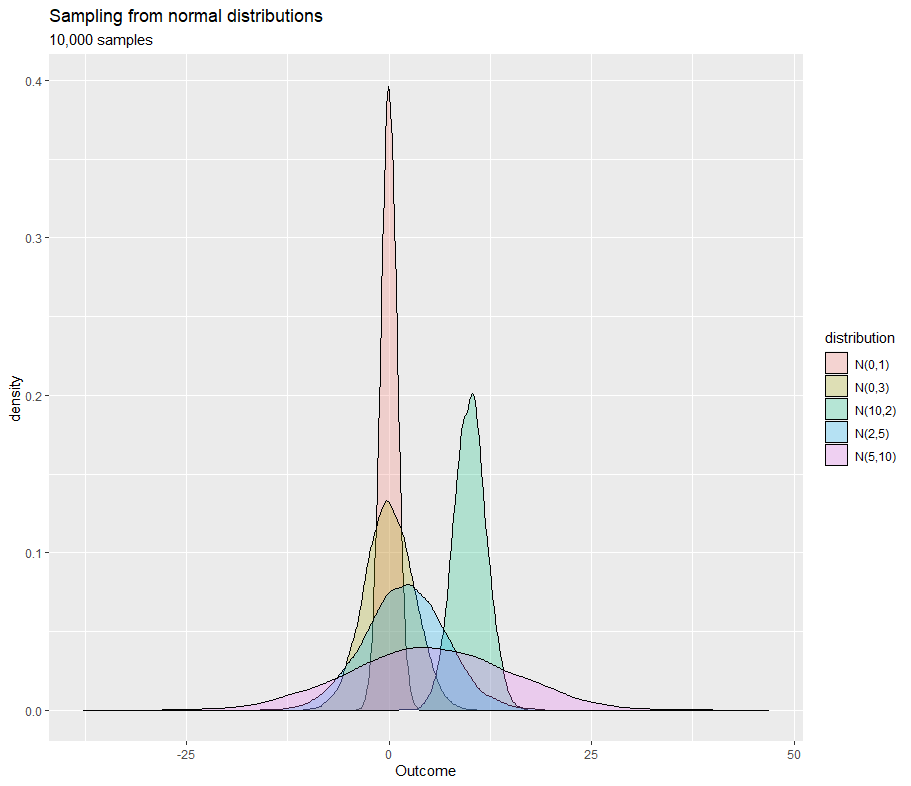
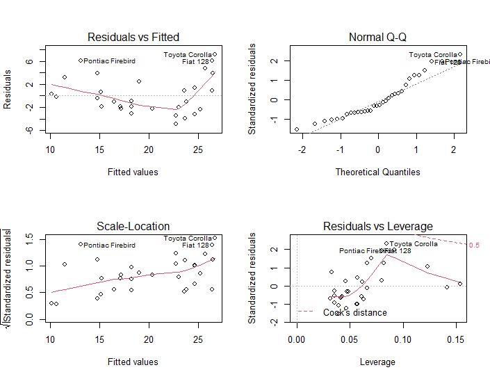

With the CLT, even if we do not know about the distribution of the population, we can now use the average of sample means and sample standard deviations from samples to get an approximate value of population mean and standard deviation. Thus, we can use statistics from Gaussian distributions to calculate confidence intervals and perform hypothesis testing. And the requirement for sample size here is acceptable to most of the experiments, no less than 30 will do!  
 
To give you a better idea visually, try [this website](http://onlinestatbook.com/stat_sim/sampling_dist/) that provides a simulation which lets you explore various aspects of sampling distributions. You will soon find out that for any statistics (mean, variance, range etc.) of the distribution, it will follow the Gaussian distribution given a large enough sample is taken.  



Performing hypothesis testing requires several assumptions to be true and we can apply statistical methods regardless of the distribution of population thanks to the Central Limit Theorem. But this is not always the case for another important assumption - homogeneity of variance. As mentioned in part 4, the homogeneity of variance assumption assumes within-group variances are equal across independent groups. For example, if we were creating a model for exploring the effect of drinking alcohol on weight and we have sampled two groups of people (drinking alcohol or not) from a same population, then we would want the variance of weight for each group to be very close together, because data with high variability would not be suitable neither for construction of a regression model nor make inferences. Additionally, violation of homogeneity of variance can lead to a higher false positive rate (rejection of a null hypothesis when it is true).  

The image below shows an example of four diagnostic plots for testing assumptions in a model including the normality and homogeneity of variance.


```r
par(mfrow=c(2,2))
plot(lm(mpg ~ disp, mtcars))
```



See the following points for a simple explanation of each graph:
- Residual vs Fitted: indicates how well data fitted into the model. These points should scattered equally in each side of a horizontal line 
- Normal Q-Q: distribution of errors, straight line if normally distributed
- Scale-Location: if equal variances holds, then points (residuals) should be equally scattered around a horizontal near-straight line
- Residuals vs Leverage: Indicates influence of each point on the model, the closer to red dash lines the greater influence that point has on the model  
 
In <Link to="/docs/14/04/2021/LearningPath-Statistical-Modeling-6">part 6</Link> we will be exploring the relationships between mean and variance for some distributions, solutions for data that do not satisfy the homogeneity of variance, and more on residuals.


## Recommended reading
[History of the Central Limit Theorem](https://en.wikipedia.org/wiki/Central_limit_theorem#History)  
[Galton Board / Bean machine](https://en.wikipedia.org/wiki/Bean_machine)  
[Proofs](https://www.cs.toronto.edu/~yuvalf/CLT.pdf)  
[Homogeneity of Variance Test in R](https://www.geeksforgeeks.org/homogeneity-of-variance-test-in-r-programming/)


