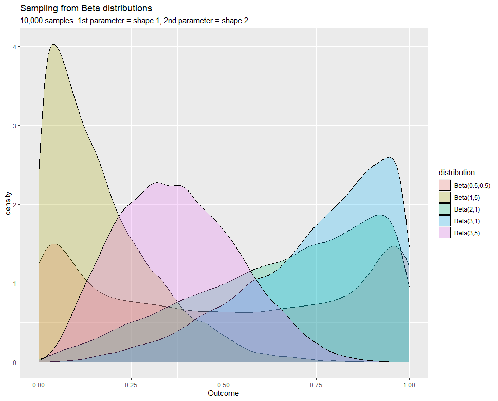
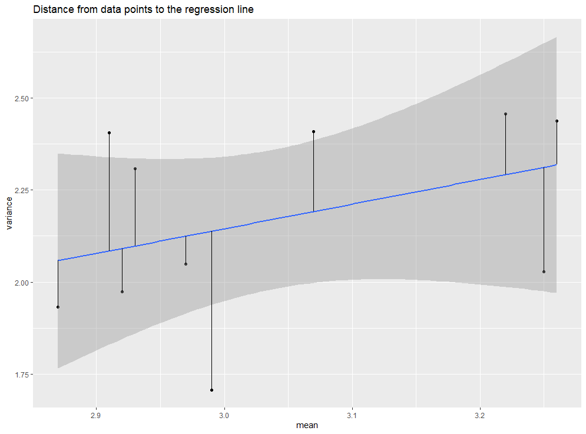
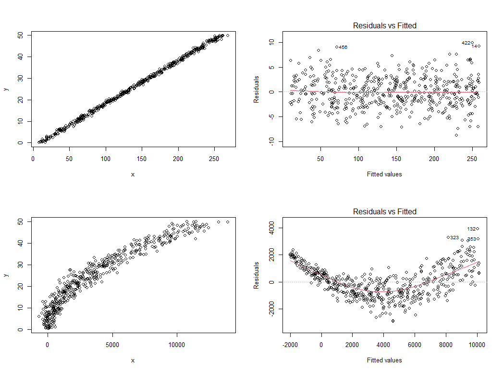

---
type: docs
author: ["Dataviz Team", "Jean Russell"]
title: "Models and Distributions"
description: Statistical Modeling Part 6 - Models and Distributions
date: 2021-04-14
published: false
---  


Statistical models are non-deterministic. Therefore, in a statistical model some variables do not have specific values either because they are random or due to there are deterministic elements that are unknown to us. In both cases, we model these variables using probability distributions that we think that could have generated the population and formulating statistical models around it. A statistical model is usually considered as a family of probability distributions where the parameters are unknown and we are interested in using data to estimate these parameters. To give you a more clearer image, let's consider a simple regression model looks something like the following: 

$$
y_{i} = \alpha + \beta_{1}x_{i} + \epsilon_{i}
$$

If we assume $\epsilon_{i} \sim N(0, \sigma^{2})$ or in another word $\epsilon_{i}$ is normally distributed with mean $0$ and variance $\sigma^{2}$, then the random variable $Y$ (a set of values $y_{i}$) is distributed according to a Gaussian distribution with mean $\alpha + \beta_{1}X$ and variance $\sigma^{2}$. Then we would need to estimate these parameters using [Ordinary Least Squares](https://en.wikipedia.org/wiki/Ordinary_least_squares). Of course, if you are using the `lm()` function in R then estimation of parameters is done automatically. Note that the estimation is not always unique, therefore these combinations of parameters allow distribution in different shapes which are all in the same family. 

  
*Figure 1. A family of beta distribution with two shape parameters*  


The major limitation of statistical models is that the parameters are usually specified in such a way that there are linear relationships only involved. By linear they means $y=f(g(x_{1}, x_{2}, ..., x_{n}))$ where $g(x_{1}, x_{2}, ..., x_{n})$ is a linear combination of $x_{1}, x_{2}, ..., x_{n}$; where $x_{1}, x_{2}, ..., x_{n}$ are the elements are associated with the parameters in the distribution. Nonlinear modelling does exist, however, it is neither well developed nor properly understood.

So in statistical modelling we are estimating/modelling the parameters of the distribution. For a poisson distribution we are actually modelling the mean, for the bernoulli distribution the probability of a true value, for a Gaussian distribution both the mean and standard deviation (although the standard deviation generally modelled as a constant). In previous materials we generally assume the homogeneity of variance but this might not be case for some data. In this case the model (also modeling variance) will become nonlinear unless the mean is then held constant.  


## Mean vs Variance
As we have mentioned before, all statistical models are idealised. There isn't a probability distribution that will make a perfect approximation to our data. In fact, the relationship between change in mean and change in variance for any model is far more important in large datasets than the actual distribution of individual data points. Nevertheless, different distributions have different relationships between mean and variance, and sometimes this relationship can be seen in a mean versus variance graph.  

  
*Figure 2. Mean vs Variance graphs for distributions*  

Graphs shown in Figure 2 shows the sample mean versus sample variance graphs for Gaussian, Binomial, Poisson and Gamma distribution with a thousands random generated samples. The line of best fit for each subgraph is also an indication of the relationship:
- Normal - points scattered randomly and the horizontal line suggesting there isn't a obvious relation between the mean and variance
- Binomial - in a binomial distribution the sample mean is always greater than the variance because variance $=$ $q$ $\times$ mean where $q$ is the probability of failure (which is less than 1). In our graph most of the mean is greater than variance
- Poisson - theoretically the mean should equal variance, and this is also the case for our line of best fit. There are certainly some outliers but the confidence interval (shaded area) remains narrow indicating high confidence level
- Gamma - we generally have variance $=$ $\theta$ $\times$ mean where $\theta$ is the scale parameter (or the inverse of rate parameter $\beta$). In this case our $\theta$ is $\frac{5}{3}$ (or 1.66666667), and we can see the line follows this equation
 
There are other distributions that we have not mentioned here, but you can always find the corresponding mean and variance online.  


## Residuals
Residuals are differences between predicted values (on the line of best fit) and observations (sample data points), the graph shown below illustrates such distances from y-coordinates of sample data points to the regression line for a linear model.

  
*Figure 3. Distances from data points to the regression line*  

Residuals are calculated as the predicted value minus the data value. So if the sample data point is below the regression line, then its residual will be negative.  
 
The reason that we study residuals is to assess whether the model we are creating is a good fit for sample data. Recall that statistical models are non-deterministic and models generally divided into two parts:
- deterministic - constants such as $\alpha$ and explanatory variables $\beta_{i}$
- non-deterministic - random errors or something unknown to us
 
The deterministic part should capture as much as information about what causes variation in the response variable and this information should not be in the non-deterministic part. If explanatory variables lack explanatory power, you'll likely to see many outliers on the graph. The graph shown above is an example of a good model where data points are randomly scattered around the regression line, indicating deviations from the line are mostly to be caused by some random errors.  
 
A common way to assess the residuals is to look at the residual vs fitted graph. This graph can be generated when plotting the `lm()` function in R as shown below:  

```r
plot(lm(y ~ x), 1)
```

  
*Figure 4. Residual vs Fitted plot for two different population*  

The first column in Figure 4 shows the scatter plot for samples from two different populations and the second column shows sample's residual vs fitted plot. The first residual vs fitted plot is an example of what a good model should look like - a near-perfect straight line with data points scattered randomly without any patterns around the line. Whereas the second residual vs fitted plot shows a U-shape pattern which suggesting there is something that were not captured by the model, in this case we may need to consider approaches such as adding a new explanatory variable, interaction between variables, or go for non-linear models (for example add a quadratic term).  
 
Another application of the residual vs fitted plot is to assess the homogeneity of variance. Figure 5 shows residual vs fitted plot for samples from two different populations. The first sample satisfies the homogeneity of variance because data points are scattered around the straight line and with approximately equal distance in both sides of the line. The second sample comes with higher residuals as we move towards the right hand side, this suggests data points are moving away from the mean.


  
*Figure 5. Homogeneity vs Heterogeneity*  

A natural question to ask is what if the model does not satisfy the homogeneity of variance and normality assumption. If Gaussian distribution is not suitable, consider use other distributions. You can look at the relationship between sample means and sample variances and may observe some characteristics of other distributions. Additionally, use statistical tests and plots such as Residual vs Fitted, Scale-Location, and Residuals vs Leverage to make further assessments. If you cannot find a distribution that fits well to your data, then consider non-parametric methods which make no assumption about the underlying distribution of data.


## Recommended reading
[Non Parametric Data and Tests](https://www.statisticshowto.com/probability-and-statistics/statistics-definitions/parametric-and-non-parametric-data/)  
[A Gentle Introduction to Non-Parametric Statistics](https://www.youtube.com/watch?v=xA0QcbNxENs)


