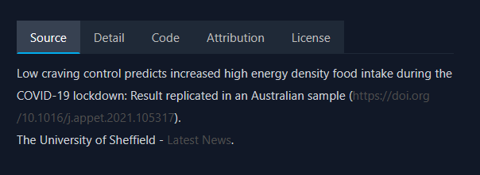
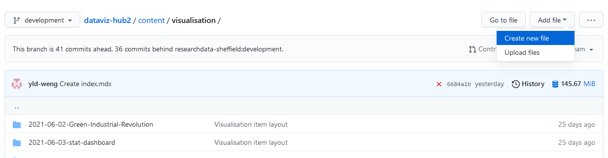
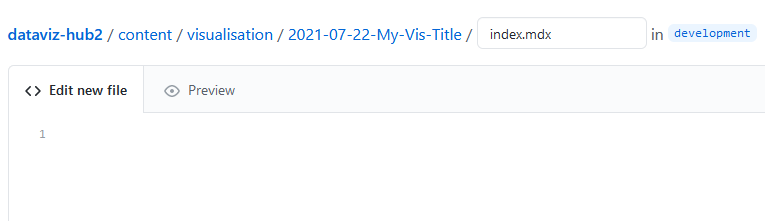
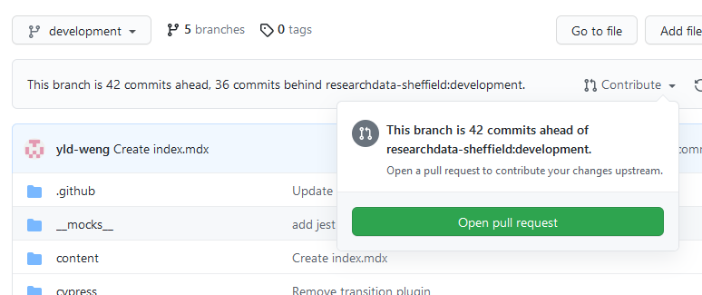
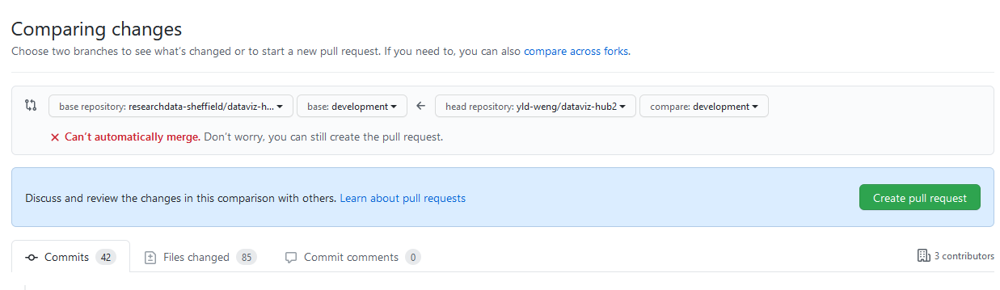

## Note

Thank you for considering contributing visualisations to Dataviz.Shef! We are committed to <a href="https://www.sheffield.ac.uk/openresearch/university-statement-open-research">open research</a> so there are a couple of things to bear in mind before you proceed:

- Are you willing to make your code open sourced for the visualisation?
- Are other people able to access the data?
- Are you willing to include some simple guidance on how to reproduce the visualisation?
- Are your resources licensed?

If you could answer yes to most of the questions above, please go to the next section.

## Setup

The setup process is identical to the one in [contributing blog post][contributeblogpost]. You will need to install [git](https://git-scm.com/) and [Nodejs](https://nodejs.org/en/), and have a GitHub account in order to preview and submit your visualisation. Once you've set up, open git bash and run `gatsby develop` in the base directory. Now you can view the site at `http://localhost:8000/`. The website will be reloaded automatically on changes. Press `Ctrl + C` (`Command + C` on macOS) if you want to stop the server running locally. Your visualisation item page will be located at `http://localhost:8000`.

Alternatively, skip the setup and follow the steps below if you do not wish to use command line tools. The difference is that you would not be able to preview the page and would have to upload files manually on GitHub.

## Add files

Go to the directory `dataviz-hub2/content/visualisation` and create a new folder with a name of the format `YYYY-MM-DD-this-is-my-title`. The folder name will be used when creating the page url. Within this new folder, add all required files to display your visualisation such as thumbnail and javascript files. Then create a new text file and name it `index.mdx`.

If you haven't set up, create a new folder anywhere in your machine and follow the steps.

## Edit index.mdx

MDX is a variant of the MD format that allows us to write JSX in markdown files. This website uses MDX to provide interactive experience to users while preserving the benefit of using markdown. This is an example of the file:

```html
---
frontmatter...
---

visualisation code...

<VisPagination mdx="{props.mdx}"> ... </VisPagination>

<VisDetail mdx="{props.mdx}" />

export const dataArray = [ ... ]

<VisDiv>
  <Tab data="{dataArray}" />
</VisDiv>
```

Let's dive in to see how each component works.

### Frontmatter

Frontmatter is the first section you will need to define in the `index.mdx` file. This section is used to specify important properties for the visualisation.

An example of the frontmatter (make sure you also include `---`):

```mdx
---
type: visualisation
author: [Author One, Author Two]
title: My title for the visualisation
thumbnail: ./thumb.png
category: [Library]
tag: [Contribute, Visualisation, Example]
description: This is my description for the visualisation.
date: 2021-06-24
pngImagePath: relative-local-path.png
svgImagePath: image/relative-local-path.svg
svgExternalImagePath: https://example.org/image.svg
pngExternalImagePath: https://example.org/image.png
rowSpan: 2
columnSpan: 2
---
```

The following table listed all properties you can specify:

| Property             | Required  | Description                                                                                            |
| :------------------- | :-------: | :----------------------------------------------------------------------------------------------------- |
| type                 |     Y     | This must be entered as `visualisation`.                                                               |
| author               |     Y     | Use squared bracket if there are more than one author.                                                 |
| title                |     Y     | Title for your visualisation.                                                                          |
| thumbnail            | Recommend | Local path (in your directory) for your thumbnail. This will be displayed on visualisation pages.      |
| category             |     Y     | Categories for your visualisation, usually the name of your faculty/department.                        |
| tag                  |     Y     | Tag for your visualisation.                                                                            |
| description          | Recommend | A good description help people better understand your visualisation.                                   |
| date                 |     Y     | Format: `YYYY-MM-DD`                                                                                   |
| template             |           | Set it to `"custom"` if you want to customise the style of the page                                    |
| pngImagePath         |           | Local path (in your directory) of the visualisation in PNG format.                                     |
| svgImagePath         |           | Local path (in your directory) of the visualisation in SVG format.                                     |
| svgExternalImagePath |           | External path (url) of the visualisation in SVG format.                                                |
| pngExternalImagePath |           | External path (url) of the visualisation in PNG format.                                                |
| rowSpan              |           | Default: `1`. The number of rows this visualisation will occupy on visualisation pages.                |
| columnSpan           |           | Default: `1`. Max: `4`. Similar to `rowSpan` but in column-wise.                                       |
| featured             |           | Set it to `true` if this is a featured visualisation.                                                  |
| d3                   |           | Path of D3 documents to include. See [contribute blog posts][contributeblogpost] for more information. |
| published            |           | If the visualisation is not ready in production yet, set this to `true`                                |

If this is the first time you contributing something to the website, it is necessary to add your name and avatar to the file `author.json` located at dataviz-hub2/src/data, otherwise author info will not be shown on the page (and the website will produce errors). Format:

```json
...
},  // Make sure you've added comma after the previous right curly bracket
{   // Start with left curly bracket
  "name": "New Author",
  // The exact same name you've put in the mdx file, use the same name for all mdx files you created
  "avatar": "../images/author/default.jpg",
  // If you want to add your own avatar, place it under the /src/images/author folder and replace "default.jpg" with your image name
} // No comma
```

### Add visualisation

Regardless of the type of visualisation (except iframe) you are adding, remember to set `id="visualisation"` on the parent element of the visualisation, this allows the website to capture your visualisation as images. If what you have created does not fall into the types listed here, please get in touch to discuss options.

#### Image

If you want to add an image, you can use the following code:

```html
<VisDiv>
  
</VisDiv>
```

The `<VisDiv>` tag has a default maximum width of `550px` and will centre anything inside it. To change the maximum width, add

```html
style={{maxWidth: 'px'}}
```

to `VisDiv` with the desired width before `px`.

#### D3

See [contribute blog posts][contributeblogpost] for more information. The general principle is to create a SVG element with specified id (for example, visualisation) in the `index.mdx` file, then add elements to the SVG element in a separate file.

#### React packages

You have created visualisations using a React visualisation package? That's great! You can wrap the visualisation in a React component then import it in the `index.mdx` file. This process can be break down into the following steps:

1. Install the package using `npm install package-name`.
2. Create a react component that includes your visualisation in a separate file called `visualisation.jsx` (any name will do). Don't forget to set `id="visualisation"` on the component.
3. Import the visualisation in `index.mdx`.

An example visualisation of this use case is - [Increased snack intake in UK and Australia](https://github.com/researchdata-sheffield/dataviz-hub2/tree/development/content/visualisation/2021-06-24-Increased-snack-intake-in-UK-and-Australia).

#### Web applications

If you have created any interactive web applications or javascript visualisations that is hosted on other website, you can embed them using `<iframe>`:

```html
<iframe
  width="100%"
  height="700px"
  src="https://ylwshef.shinyapps.io/Which-Politicians-Receive-Abuse/"
/>
```

### Visualisation pagination

The next step is to add pagination and utility buttons for your visualisation. All you need is one line code as shown below:

```html
---
frontmatter
---

<VisDiv> visualisation code </VisDiv>

<VisPagination mdx="{props.mdx}" />
```

The `mdx={props.mdx}` ensures the details of the current page are passed to the _VisPagination_ component. Make sure code for visualisation always comes before other elements in the `index.mdx` file.

### Embed code

Every visualisation item page contains an 'embed code' button which allows visitors to copy the code snippet and embed the visualisation elsewhere. It would be really helpful if you could add extra details to make this possible.

To make embed code available, we need to make some changes to the pagination component. In here we open the _Vispagination_ tag and insert the _EmbedCode_ tag:

```html
<VisPagination mdx="{props.mdx}">
  <EmbedCode />
</VisPagination>
```

#### Image

If you want people to embed the image in the current directory, pass one of image properties in the frontmatter to the _EmbedCode_ like this:

```html
<EmbedCode localPath="svgExternalImagePath" />

# options: # svgExternalImagePath | svgImagePath # pngExternalImagePath |
pngImagePath
```

If the image is elsewhere and is not included in any of the image properties, use the `url` attribute:

```html
<EmbedCode url="https://example.com/my-image.svg" />
```

Then this component will convert to something like the following:

```html
<a href="https://dataviz-shef.ac.uk/my-url" target="_blank">
  
</a>
```

#### Iframe

If your visualisation is an interactive web application or a component hosted elsewhere, we can use _iframe_ to embed another HTML document. In this case, we need to pass `"iframe"` to the `type` attribute:

```html
<EmbedCode url="https://example.com/some-page" type="iframe" />
```

The final output:

```html
<a href="https://dataviz-shef.ac.uk/my-url" target="_blank">
  <iframe width="100%" height="550px" src="https://example.com/some-page" />
</a>
```

<br />
<hr />

In both types we have an addition attribute `height` (default: 550px) can specify, which determine the height of embedded element:

```html
<EmbedCode url="https://example.com/some-page" type="iframe" height="700px" />
```

<br />
<hr />

#### Custom code

If you want to customise the output seen by visitors, insert your code snippet in between the _EmbedCode_ tag and pass `true` to the `custom` attribute:

```html
<EmbedCode custom="{true}">
  <a href="https://dataviz.shef.ac.uk/page-url">
    
  </a>
</EmbedCode>
```

Note that any other attributes passed to the _EmbedCode_ do not have any effects if `custom` is set to `true`.

### Visualisation details

In the item page we can display several information (description, author details, tags, categories) about the visualisation using the _VisDetail_ tag:

```html
...

<VisPagination mdx="{props.mdx}"> ... </VisPagination>

<VisDetail mdx="{props.mdx}" />
```

if you wish to not display certain information, consider using the following attributes and pass `false` to them:

```html
# default: true # Tags and categories are grouped into displayTag
<VisDetail
  mdx="{props.mdx}"
  displayDescription="{true}"
  displayAuthor="{false}"
  displayTag="{false}"
/>
```

### Open Source

This community encourages an open research culture and adheres to the FAIR (findable, accessible, interoperable, reusable) principle. Therefore, it would be wonderful if you could include as many details about the visualisation as possible. You can choose to use the visualisation tab component, or simply write information in plain text.

#### Visualisation tabs

We have prepared a tab component for you to organise information for the visualisation, but of course this is non-compulsory.



The tab component receives an array of data objects and maps each data object to a tab. The first step is to create a data array like the following in the `index.mdx` file:

```js
export const dataArray = [
  {
    title: "Source",
    content: `Low craving control predicts increased high energy density food intake during the COVID-19 lockdown: Result replicated in an Australian sample (<a href="https://doi.org/10.1016/j.appet.2021.105317">https://doi.org/10.1016/j.appet.2021.105317</a>). <br/> The University of Sheffield - <a href="https://www.sheffield.ac.uk/news/more-half-brits-snacked-more-lockdown">Latest News</a>.`
  },
  {
    title: "Detail",
    content: `The <a href="https://nivo.rocks/marimekko/">marimekko</a> component (similar to a bar chart) is used for this visualisation for extra dimensions.`
  },
  {
    title: "Code",
    content: `This visualisation is created using React.`
  },
  {
    title: "Attribution",
    content: `Images used here such as flags and snack were downloaded from <a href="https://uxwing.com/">uxwing.com</a>.`
  },
  {
    title: "License",
    content: `This is covered by a Creative Commons license (<a href="https://creativecommons.org/licenses/by-sa/4.0/">CC BY-SA 4.0</a>).`
  }
];
```

The data array starts with `export const` then followed by the array name `dataArray`. There are five objects in the data array corresponding to five tabs. Each object has two properties and is wrapped by a pair of curly brackets. `title` is the tab name, and `content` is the text visitors will see under the tab name. You can write html in the content but note that it must be one line only - use `<br/>` for line break instead of press enter.

Once you have prepared the data, pass the data array to the _Tab_ component:

```html
export const dataArray = [ ... ]

<VisDiv>
  <Tab data="{dataArray}" />
</VisDiv>
```

### Submit

Once you are happy with your visualisation page, create a [pull reqeuest](https://github.com/researchdata-sheffield/dataviz-hub2/pulls) to merge your commits!

If you haven't set up a local development environment, go ahead to the GitHub [repository](https://github.com/researchdata-sheffield/dataviz-hub2) and click the `Fork` button on the top right of the page. Then go to the forked repository by click your profile icon on the top right and click _Your repositories_. Go to the repository and continue to navigate to `content/visualisation`. Since we cannot create a folder without a new file, click the `Create new file` button as shown in the image below:



Copy the name of the folder you have created in previous steps into the box with the placeholder `Name your file...`, followed by a slash and `index.mdx`. Then copy all the text in your local `index.mdx` to the editor below.



Once that's done, scroll to the bottom of the page and click `commit new file`. The webpage will then bring you to the new folder and you can now upload all other files in your local machine.

If all goes well, go to the repository's main page (by click `Code` on the top left) and open a pull request.



Make sure the base repository is `researchdata-sheffield/dataviz-hub2/development` and the head repository will be the branch you are working on.



After you have created a pull request, we will review your submission and make it live!

[contributeblogpost]: https://dataviz.shef.ac.uk/docs/22/03/2020/contribute-blog-post
