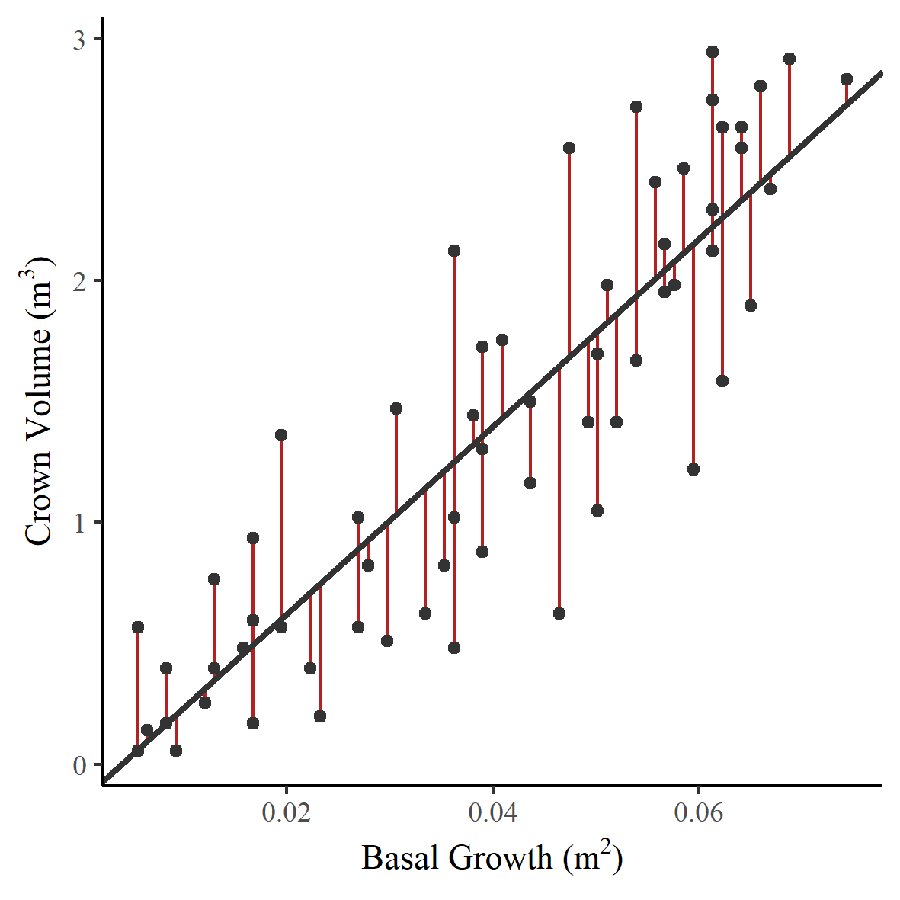
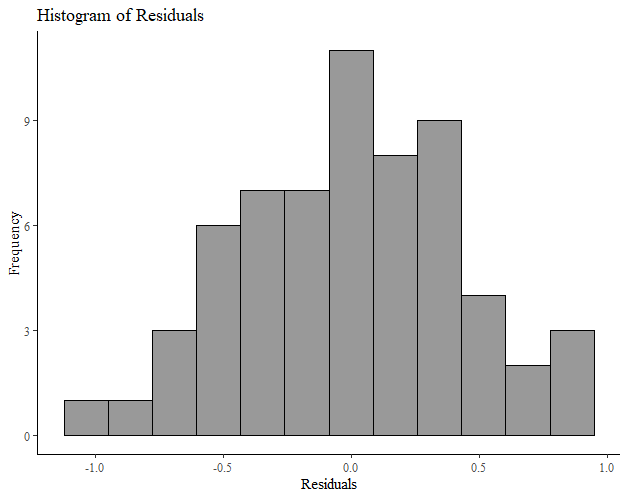
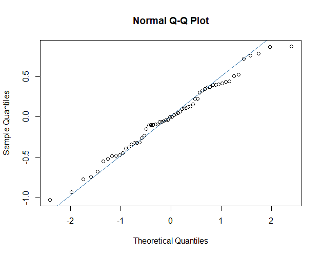
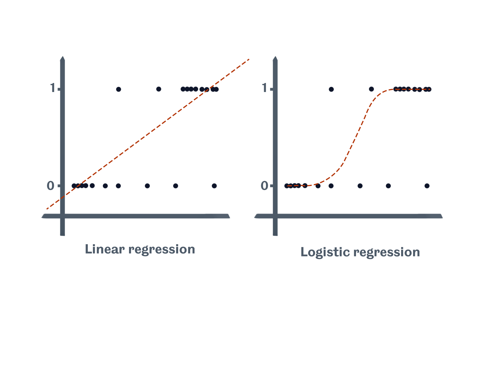
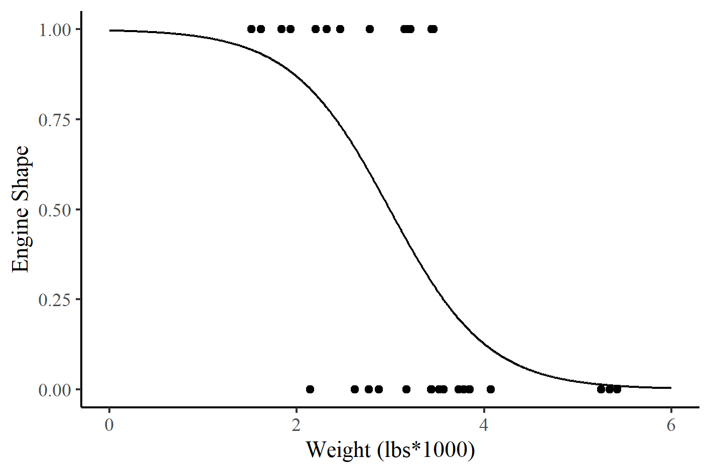

## Introduction

Much of modern research is interested in the relationship between variables.
A statistical model is a formal representation of this relationship that lets us test a relationship or predict the value of an unknown based on the value of a known quantity.

The purpose for which the model is created and the data used will significantly influence how the model is interpreted.
Experimental scientists may assume a causal relationship between the variables, for example, plant growth rate based on the application of fertilises.
Others may be interested in the relationship between variables; how one may vary given changes in the other.
For example, a meteorologist may predict how much precipitation a region may get based on atmospheric pressure.

There are numerous statistical models; they can be as simple as fitting a regression line between two continuous variables or as complex as a weather forecast, which require a high specification supercomputer to run.
In all cases, models attempt to capture changes in a variable based on known relationships.
No model can do this perfectly. A statistical model is just an assumption.
In all instances, there will be unexplainable variation or ‘noise’ accompanying our models.
David Spiegelhalter describes models as maps of terrain.
Not an image of the terrain.
An important distinction, too often, models are not shown the proper amount of scepticism they deserve.
With this in mind, let’s look at some powerful yet simple statistical models used frequently in modern research.

## Prerequisites

  

    
      Required
    
    

      <Link to="/docs/18/03/2021/LearningPath-Statistical-Modeling-1">
        Probability Distributions
      </Link>
    

  

  

    
      Recommended
    
    

      Mean, Median, Mode, Range, Standard Deviation, Z-Score
    

  

  

    
      Optional
    
    
None

  

## Regression

Linear models, as the name suggests, assumes a linear relationship between one or more independent variables and a single dependent variable. Linear regression is a useful and very popular statistical modelling tool.
It lets us investigate relationships between variables and make predictions about the value of the dependent variable given the value of the independent variable or variables.
The three most common linear regression models you’re likely to encounter are simple Linear regression, multiple linear regression, and Logistic regression.

### Simple linear regression

Simple linear regression is used on occasions with just two continuous variables. A straight line is fit through the data, which represents the linear relationship between the two variables.
There are a number of ways to estimate this linear relationship; by far, the most common method is ordinary least squares. This method seeks to fit a line that minimises the sum of the squared residuals.
A residual is the vertical distance from the observed value to the regression line - or, specifically, a measure of the noise between the actual points and the line. That may sound a little alien; it’s easiest to understand when it’s presented graphically. So let’s jump into a case study.

#### Example

In 1994 Avery and Burkhart used linear regression to predict whether the growth of a tree trunk (change in basal width) could be used to predict the change in total volume of the trees canopy (crown volume).
Figure 1 shows a scatter plot of crown volume against basal growth with a fitted regression line. The residuals are shown as vertical red lines.
Each data point has an associated residual; it is the sum of these squared values that the least-squares regression method seeks to minimise.

_Figure 1 - Change in basal width and crown volume with a fitted least-squares regression line._

#### What does this model tell us?

So we have a fitted model. But what does it tell us? In Figure 1, I’ve shown you a fitted regression line on a graph, many with be familiar with this.
However, as we know, a model is a mathematical representation of the relationship between the two variables.
Two coefficients can summarise this line: the slope of the line and the value on the y axis where the line intercepts.
Table 1 shows a typical output from a linear regression model.

|              | Estimate | Std. Error | Z value | Pr\(>\|z\|\) |
| ------------ | -------- | ---------- | ------- | ------------ |
| (Intercept)  | -0.1544  | 0.1256     | -1.229  | 0.224        |
| Basal Growth | 38.7929  | 2.8232     | 13.741  | <2e-16       |

_Table 1 - Output from a simple linear regression model_

We can use the gradient of the regression line to make assumptions about the value of a dependent variable based on the independent variable.
In our example, this is the change in crown volume of our trees, depending on the change in basal growth. You may see the gradient of the regression line referred to as the regression coefficient.
In our example, the regression coefficient is 38.8, so for an increase of 1m2 in basal growth, we could expect to see an increase of 38.8 m3 in crown volume. The interpretation of this gradient does vary depending on the study.
For example, if we were to assume a causal relationship, this gradient would instead represent the change in crown volume if we increased the basal growth by 1m2 in a controlled experiment.
Of course, this does not apply here as we can’t control this change.

As we discussed at the start of this post, models are not perfect.
You can see from Figure 1 that the points are scattered around the regression line.
The model lets us estimate the change in crown volume based on the change in basal growth; it does not provide the exact value.

### Model assumptions

When using regression techniques, it’s important to remember that there is are a list of assumptions that the mathematical model makes about our data.
These assumptions are listed in a helpful handbook for commonly used statistical tests, which can be found [here.](https://www.statstutor.ac.uk/resources/uploaded/tutorsquickguidetostatistics.pdf)
Each of the assumptions below are preceeded by the assumption that you have a good understanding of your independent variables.

#### _Independent observations_

This assumption states that there should be no correlation between successive values; data shouldn’t have an underlying link or cluster.
For example, data collected over time may have an underlying seasonal component. We can test the independence of observations with a Durbin Watson test.

#### _Residuals should be normally distributed_

The residuals of our model are normally distributed. This is an interesting one, often you will find it stated that the data should be normally distributed.
This is not the case. A perfectly fitting linear model would still have variation in the dependent variable. This is the variation due to the model.
When this variation from the model is removed, you are left with the residuals.
It is the residuals of the model that should be normally distributed. The residual values are the observed values minus the predicted values from the model.
There are a number of ways we might check for normality of our residuals, we can do this graphically, by plotting them as a histogram and looking for a characteristic bell shape (Figure 2), or by using a Q-Q (quantile - quantile) plot (Figure 3)

_Figure 2 - A histogram of residuals_

_Figure 3 - A quantile-quantile plot of residuals_

#### _A linear relationship between the dependent variable and the independent variable_

This is relatively self-explanatory; you can investigate this simply with a scatter plot. You are likely to be familiar with the cigar shape of variables that have a linear relationship.

#### _Homoscedasticy_

Now, this is a complex word for a simple assumption. Homoscedasticity means ‘equal scatter’. In terms of our model, this means that our residuals should have no systematic change.
We can check this by plotting our residuals against our predicted values. A strong pattern would be a cause for concern.

#### _No outlying variables that have a substantial influence on the fit_

Outlying variables can have a big impact on our linear models as whatever method we use to fit our line will try to reduce a very large residual error.
So just a few outlying data points can have an unduly large influence on our regression line.
These outliers are typically when the independent variable value is exceptionally large or small compared to other values in the data set.
To check that there are no outlying variables that are influencing the position and slope of our least-squares line, we can look at Cook’s distance and leverage for each point.
For more information about Cook's distance and levarge points I can reccomend [this article.](https://www.statology.org/how-to-identify-influential-data-points-using-cooks-distance/)

## Multiple linear regression

As you might imagine, multiple linear regression is used in those instances where there is more than one independent variable.
The principles are remarkably similar to that of simple linear regression. However, we have more information! We can use multiple linear regression to improve our models by investigating how multiple independent variables influence our dependent variable.

A classic example of multiple regression is how different factors affect the birth weight of a baby.
In our example, the weight of the baby will be our dependent variable. The duration of gestation and the height of the mother will be our independent variables.  
Let’s start by plotting our data. Nothing fancy, we’ll just take a look.

We can see that birthweight and gestation are correlated; gestation is likely to be a good predictor.  
The relationship isn’t as strong between birth weight and the height of the mother. It may still be a valuable piece of information.
When we run our linear model to include the second independent variable, the same principles apply.
The least-squares model finds the best mathematical representation of the relationship by fitting a plane to our data, and attempting to minimise the error.
And just like linear regression, the model returns a table of outputs, summarising the model.

|                 | Estimate | Std. Error | Z value | Pr\(>\|z\|\) |
| --------------- | -------- | ---------- | ------- | ------------ |
| (Intercept)     | -6.025   | 1.759      | -3.452  | 0.00146      |
| Gestation       | 0.151    | 0.025      | 6.015   | 4.94e-07     |
| Mother’s Height | 0.021    | 0.010      | 2.037   | 0.04853      |

_Table 2 - Output from Multiple linear regression_

The interpretation of the results is a little different. Once again, we have an intercept, which tells us where our plane intersects the y-axis.
The slope coefficient for each of the independent variables estimates the change in our dependent variable for every unit change in the independent.
In our example, our model tells us that there is a 0.151kg increase in birthweight for every additional week of gestation.
For every additional centimetre in the mother’s height, an additional 0.021kg increase in birthweight can be expected.

You will note that each of the independent variables also has p value. This column tells us whether each of the independent variables are significant predictors.
For example, in our first instance, the value tells us whether the complex model, using both Gestation length and Mother’s height, is more effective than a model that only uses mother’s height.
The significant p value tells that it most certainly is more effective to use both variables.

On a final note, multiple linear regression is often used when a researcher would like to adjust for the influence other variables, often called confounders.
This can be a difficult concept to grasp; a confounder is another variable that may influence the value of the dependent variable and the independent variables within the study.
For example, let’s say you were studying the number of people getting sunburnt. You found that the rate of ice cream consumption is significantly correlated to the number of sunburns.
However, of course, warmer weather will influence both ice cream consumption and the number of sunburns.
Therefore hot weather is certainly a confounding variable if we were modelling the relationship between ice cream consumption and sunburns.
This is a silly example, of course, but it demonstrates a very important point. Controlling for these confounders comes with experience and a good deal of subject knowledge.

#### Dummy variables

When performing multiple linear regression, like simple linear regression, our dependent variable must be continuous.
However, our independent variables can be expanded to include categorical variables. They do require some special preparation.
To use a categorical variable, we must recode them into dummy variables. I won’t go into this here, but see [this Stat Trek post](https://stattrek.com/multiple-regression/dummy-variables.aspx) for more information about how to prepare categorical variables and include them in multiple linear regression models.

### Model Assumptions

All of the assumptions that are made for simple linear regression apply to multiple linear regression, with the additional assumption that none of the independent variables in the model should be highly related. This can be tested very easily by checking that none are highly correlated.

## Logistic regression

Logistic regression is used when the dependent variable is binary; that is, a categorical variable with only two values.
Think of situations like yes or no, true or false and so forth. We can use logistic regression to predict the probability that a value will be one of two categories based on the value of an independent variable.

Why can’t we just use linear regression? There several of reasons why linear regression isn’t appropriate for a binary dependant variable.
The most prominent is that linear regression could predict a value that is greater than true or less than false. And this is, of course, impossible.
Logistic regression, on the other hand, takes into account these limits. The sketch below shows how linear regression may lead us to make impossible assumptions with our model, while logistic regression fits an S-shaped curve to our data.

#### Example

This may sound strange, so let’s think of a case study. We’ll use R’s popular ‘Motor Trend Car Road Tests’ dataset to look at the relationship between engine shape and the weight of the vehicle.
Our binary dependent variable will be engine shape, specifically, ‘v-shaped’ and ‘straight’. If a vehicle has a v-shaped (vs) engine, it will be coded with a value of 0, and if it has a straight engine, it will have a value of 1.
The independent variable for this example is weight in 1000lbs (forgive the imperial measures, it’s an American dataset). Figure 4 shows the two varibales with a fitted logistic regression line.

_Figure 4 - Engine shape and car weight with a fitted logistic regression line._

#### What does this model tell us?

So we have our model, represented graphically above, but what can we do with it. Logistic regression is interpreted differently to linear regression.
As we mentioned above the curve represents the probability that a car has straight shaped engine based on the weight of the car.
So there is a high probability that a light car, weighing under 2000lbs, will have a straight engine. Whereas, there is a small probability that a car that weighs over 5000lbs will have a straight engine.
The probability of a car weighing approximately 3000lbs, having a straight engine is approximately 50%.

As we know from linear regression, the line on our chart is just a representation of a mathematical product.
Just like with linear regression, we can produce a table of coefficients for our logistic regression model. Table 3 shows our summary.
You’ll see that, just like linear regression, we have an intercept value and a coefficient of the slope of the line.

|             | Estimate | Std. Error | Z value | Pr\(>\|z\|\) |
| ----------- | -------- | ---------- | ------- | ------------ |
| (intercept) | 5.7147   | 2.3014     | 2.483   | 0.01302      |
| Weight      | -1.9105  | 0.7279     | -2.625  | 0.00867      |

_Table 3 - Typical output from logistic regression_

But how do we get these if we have an S-shaped line?
Well, while Figure 4 above is what we typically associate with logistic regression, these coefficients are calculated by transforming the y axis from probability to the log of the odds.
Doing so turns our S-shaped line into a straight line that is symmetrical around 0. Odds are simply the ratio of something happening, to something not happening.
In our example, the odds of having a straight engine, over the odds of having a VS engine.
In logistic regression, we use the log of these odds as it creates a more symmetrical distribution about 0.
I won’t show you the equation, but if you’d like to learn more about the logit function and how probability is converted into log(odds) then I can recommend this excellent [StatQuest video.](https://www.youtube.com/watch?v=ARfXDSkQf1Y)

In our example, we can use these coefficients to make assumptions about our data.
The intercept is the value on the y axis when the weight of the vehicle is 0. So if we have a vehicle that weighs nothing, the log(odds of a straight shaped engine) is 5.7.
As with linear regression, the coefficient of the slope of the line tells us what is likely to happen with every unit change in our independent variable.
In this instance, for every unit change in vehicle weight, the log(odds of a straight shaped engine) is -1.9.
